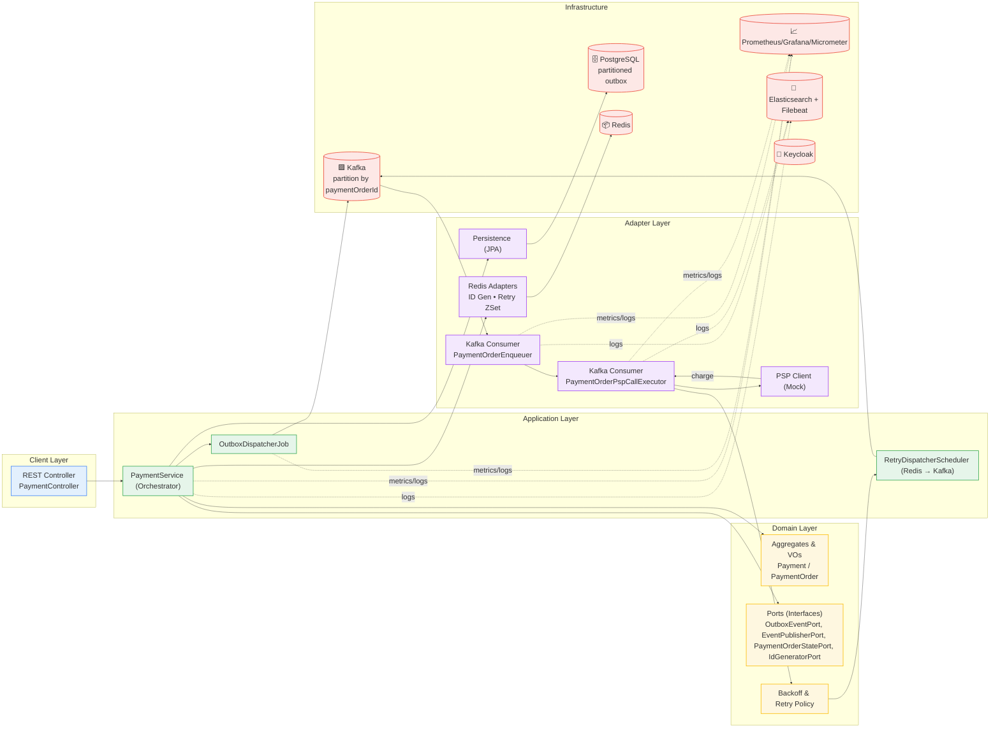

# 🛒 ecommerce-platform-kotlin

A **modular**, **event-driven**, and **resilient** eCommerce backend prototype built with **Kotlin** and **Spring Boot
**, demonstrating how to design a high-throughput system (like Amazon or bol.com) using **Domain-Driven Design (DDD)**
and **Hexagonal Architecture**.

> 🚧 Currently focused on the `payment-service` and its async counterpart `payment-consumers`. Other contexts (order,
> wallet, shipment) are planned.

---

## 📌 Overview

This project simulates a real-world multi-seller eCommerce platform where:

- A single order may contain products from multiple sellers.
- Each seller must be paid independently (one `PaymentOrder` per seller).
- Payment flow handles failures, retries, PSP timeouts, and eventual consistency.
- All communication is **decoupled via Kafka**.
- **Observability** and **fault tolerance** are built-in from day one.

---

## 🔍 Why This Project Exists

- Showcase scalable architecture choices in high-volume systems.
- Demonstrate mastery of **DDD**, **modularity**, **event choreography**, and **resilience patterns**.
- Enable others to contribute and learn by building well-structured components.

---

---

## 📁 Project Structure

This repo uses a **multi-module** layout to keep concerns clear and evolvable.

- `payment-domain` – pure domain model, events, mappers, ports.
- `payment-application` – app services (orchestration), schedulers, use cases.
- `payment-infrastructure` – auto-config, adapters (JPA, Redis, Kafka, PSP), Micrometer, logging.
- **Deployables**
    - `payment-service` – synchronous API + Outbox dispatcher.
    - `payment-consumers` – async executors: `PaymentOrderEnqueuer`, `PaymentOrderPspCallExecutor`, retry scheduler.

> Infra & packaging: Helm charts for both deployables and shared platform config. See `charts/` and `infra/` for values,
> scripts, and secrets templates.

For deeper details, see **[docs/architecture.md](./docs/architecture.md)** and *
*[docs/folder-structure.md](./docs/folder-structure.md)**.  
Quick start: **[docs/how-to-start.md](./docs/how-to-start.md)**.

---

## ✅ Current Focus: `payment-service` + `payment-consumers`

**Responsibilities**

- Create `Payment` and per-seller `PaymentOrder`s; generate IDs via Redis.
- Persist **outbox** rows atomically with DB writes.
- **OutboxDispatcherJob** reliably publishes `payment_order_created` to Kafka.
- `payment-consumers`:
    - **PaymentOrderEnqueuer**: consumes `payment_order_created`, prepares/validates work.
    - **PaymentOrderPspCallExecutor**: performs bounded-latency PSP calls and emits follow-up events.
    - **RetryDispatcherScheduler**: uses Redis ZSet for backoff & re-enqueue.
- Status checks for long-tail confirmations.
- End-to-end traceability via **EventEnvelope** (`eventId`, `traceId`, `parentEventId`, `paymentOrderId`).

---

## 🧱 Architecture Principles

### Domain-Driven Design (DDD)

- Layers: **domain**, **application**, **adapter**, **config**; IO only through **ports**.

### Hexagonal Architecture

- Ports abstract persistence, messaging, cache, and PSP; adapters implement them.

### Event-Driven

- Kafka topics **partitioned by `paymentOrderId`** to preserve per-order ordering and scale horizontally.

### Outbox Pattern

- PostgreSQL outbox **partitioned by time** (e.g., half-hour buckets) to keep writes fast and cleanup cheap.

### Observability

- **Micrometer → Prometheus → Grafana**, curated dashboards (PSP latency, outbox throughput/backlog, consumer lag).
- **Structured JSON logs** (trace-friendly) shipped via Filebeat → Elasticsearch; search by `eventId`, `traceId`,
  `parentEventId`, `paymentOrderId`.

### Resilience

- PSP calls guarded by **timeouts** and **executor isolation**.
- **Equal-jitter backoff** retries in Redis ZSet + scheduled dispatcher.
- DLQs supported; transactional Kafka writes where appropriate.

---

## 🔩 Tech Stack

| Component     | Technology                                    |
|---------------|-----------------------------------------------|
| Language      | Kotlin (JDK 21)                               |
| Framework     | Spring Boot 3.x                               |
| Messaging     | Kafka (partitions by `paymentOrderId`)        |
| DB            | PostgreSQL (partitioned outbox) + JPA         |
| Cache/Queue   | Redis (ID Gen, retry ZSet)                    |
| Auth          | Keycloak (OAuth2 Resource Server)             |
| Logging       | Logback JSON + MDC + Filebeat → Elasticsearch |
| Observability | Micrometer + Prometheus + Grafana             |
| Deploy        | Docker, Helm charts, Kubernetes               |

---

## 📦 Modules

| Module                   | Status     | Description                                     |
|--------------------------|------------|-------------------------------------------------|
| `payment-domain`         | ✅ Active   | Pure domain model, events, ports                |
| `payment-application`    | ✅ Active   | Use-cases, schedulers, orchestration            |
| `payment-infrastructure` | ✅ Active   | Auto-config + adapters (JPA, Redis, Kafka, PSP) |
| `payment-service`        | ✅ Active   | API + Outbox dispatcher                         |
| `payment-consumers`      | ✅ Active   | Async executors (Enqueuer, PSP Call, Retry)     |
| `common`                 | ✅ Active   | Shared contracts, envelope, logging             |
| `order-service`          | 🕒 Planned | Emits order-created                             |
| `wallet-service`         | 🕒 Planned | Updates balances                                |
| `shipment-service`       | 🕒 Planned | Coordinates delivery                            |

---

## ⚙️ Deployment Highlights

- **Helm** charts in `charts/` for `payment-service`, `payment-consumers`, and shared `payment-platform-config`.
- Values in `infra/helm-values/*.yaml`; scripts in `infra/scripts/*.sh` (deploy all, port-forward, etc.).
- **HPA for `payment-consumers` uses consumer lag** (not CPU) to scale workers precisely when topics back up.
- `ServiceMonitor` resources wired for Prometheus scraping out of the box.

---

## 🧪 Testing Strategy

- Unit tests for domain logic and mappers.
- Integration tests with Testcontainers (Kafka, Redis, Postgres).
- Outbox & retry scheduler tests assert produced events and timing bounds.

---

## 🗺️ Roadmap (condensed)

- ✅ Repartition Kafka topics by **`paymentOrderId`** for strict per-order ordering.
- ✅ Split consumer into **Enqueuer** and **PSP Call Executor** to isolate PSP latency.
- ✅ Partition **outbox** tables in Postgres for O(1) purging and faster scans.
- ✅ Add **Prometheus/Grafana** dashboards and key **Micrometer** meters.
- ✅ Structured JSON logging + Elasticsearch searchability (event/trace correlation).
- ✅ Helmized deployables + lag-based **HPA** for `payment-consumers`.
- 🔜 Harden DLQ/poison pill handling and circuit breakers.
- 🔜 OpenTelemetry tracing end-to-end (gateway → service → consumers → PSP).
- 🔜 Read models for payment queries; secure all APIs under OAuth2.
- 🔜 Move cross-cutting metrics to decorators/AOP to simplify services.

---

If you have ideas, issues, or want to contribute, open a PR or start a discussion. 🚀
