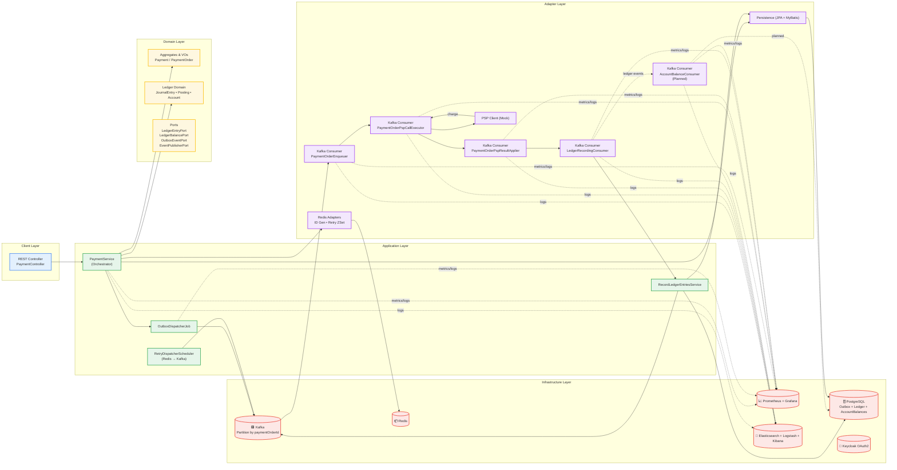

# 🛒 ecommerce-platform-kotlin

A **modular**, **event-driven**, and **resilient** eCommerce backend prototype built with **Kotlin + Spring Boot**, demonstrating how to design a high-throughput payment and ledger system using **Domain-Driven Design (DDD)**, **Hexagonal Architecture**, and **exactly-once event flows**.

> 🧩 Focused on the `payment-service`, `payment-consumers`, and `ledger` flows.  
> Future modules: `order`, `wallet`, and `shipment`.

---

## 🚀 Quick Start

For local setup and deployment on Minikube:  
👉 **[docs/how-to-start.md](./docs/how-to-start.md)**

---

## 📌 Overview

This project simulates a real-world multi-seller eCommerce platform where:

- A single order may contain products from multiple sellers
- Each seller is paid independently (one `PaymentOrder` per seller)
- Payments flow through a PSP simulation with retries and exponential backoff (equal jitter)
- Successful PSP results trigger **double-entry ledger postings** with full audit trail
- All communication is **decoupled via Kafka** using transactional producers/consumers
- **Observability** (Prometheus + Grafana, ELK Stack) and **fault tolerance** (Outbox pattern, DLQ handling) are built in from day one
- **Account balance aggregation** is planned for near-term implementation

---

## 🧩 Highlights

### ✨ Implemented

- **Event-Driven Architecture** - Complete PSP → Ledger pipeline with strict ordering per payment (partitioned by `paymentOrderId`)
- **Outbox Pattern** - PostgreSQL-partitioned outbox for reliable DB→Kafka publishing with exactly-once semantics
- **Retry Mechanism** - Redis ZSet-backed retry scheduler with exponential backoff and equal jitter (MAX_RETRIES = 5)
- **Double-Entry Ledger** - `LedgerRecordingConsumer` enforces balanced accounting (debits = credits) with idempotency
- **Monitoring & Observability** - Unified Prometheus + Grafana dashboards + ELK stack for logs and tracing
- **Dead Letter Queues** - Automatic DLQ routing for unrecoverable messages with reconciliation workflows

### 🔜 Planned

- **AccountBalanceConsumer** - Aggregate balances from ledger entries for real-time queries and analytics
- **AccountBalanceCache** - Redis-backed cache for low-latency balance lookups
- **LedgerReconciliationJob** - Daily integrity checks and balance verification

---

## 📚 Documentation

- **[Architecture Guide](./docs/architecture.md)** - High-level system design and patterns
- **[Architecture Details](./docs/architecture-internal-reader.md)** - Deep dive into implementation
- **[How to Start](./docs/how-to-start.md)** - Local setup and Minikube deployment
- **[Folder Structure](./docs/folder-structure.md)** - Module organization and naming conventions

---

## 🏗️ Architecture Diagram



---

## 🎯 Key Design Decisions

### Event Flow
```
HTTP Request → DB (Payment + Outbox) → Kafka → PSP Processing → Ledger Recording
```

1. **Outbox Pattern** - Events written atomically with domain state in PostgreSQL
2. **Partition-by-Aggregate** - All events keyed by `paymentOrderId` for ordering guarantees
3. **Redis Retry Queue** - Exponential backoff with equal jitter prevents thundering herds
4. **Double-Entry Ledger** - Every transaction balances (debits = credits) with audit trail
5. **Dead Letter Queues** - Unrecoverable failures routed to `.DLQ` topics for manual handling

### Resilience & Reliability

- **Exactly-Once Semantics** - Kafka transactions + idempotent handlers ensure no duplicate processing
- **Retry Strategy** - MAX_RETRIES = 5 with exponential backoff (1s → 30s capped at 60s)
- **Observability** - Structured JSON logs with `traceId`, `eventId`, and `parentEventId` propagation
- **Partitioning** - PostgreSQL outbox uses 30-minute range partitions for scalability

---

## 🧪 Testing

- **297 tests** with 100% pass rate
- **Unit tests** use MockK for Kotlin-native mocking
- **Integration tests** use Testcontainers for PostgreSQL and Redis
- **Separation** - `*Test.kt` for unit tests, `*IntegrationTest.kt` for integration tests

---

## 🛠️ Tech Stack

| Component | Technology |
|-----------|-----------|
| **Language** | Kotlin 1.9 |
| **Framework** | Spring Boot 3.2 |
| **Database** | PostgreSQL 15 with partitioning |
| **Cache** | Redis 7 |
| **Messaging** | Apache Kafka 3.5 |
| **Monitoring** | Prometheus + Grafana |
| **Logging** | ELK Stack (Elasticsearch, Logstash, Kibana) |
| **Auth** | Keycloak (OAuth2/JWT) |
| **Orchestration** | Kubernetes + Helm |
| **Testing** | MockK, SpringMockK, Testcontainers |

---

## 📊 Metrics & Monitoring

**Key Metrics:**
- `outbox_event_backlog` - Pending events to publish
- `redis_retry_zset_size` - Current retry queue size
- `psp_calls_total{result}` - PSP call success/failure rates
- `psp_call_latency_seconds` - PSP response time (p50, p95, p99)
- `kafka_consumergroup_lag` - Consumer lag per partition
- `outbox_dispatched_total` - Events successfully published

**Grafana Dashboards:**
- Payment Processing Overview
- Consumer Lag Tracking
- Outbox Throughput
- PSP Latency & Error Rates

**Kibana Search:**
```kibana
traceId:"abc123" AND eventMeta:"PaymentOrderPspCallRequested"
```

---

## 🔄 Retry & Resilience Strategy

**Exponential Backoff Formula:**
```
delay = min(random_between(base * 2^(attempt-1) / 2, base * 2^(attempt-1)), max)
```

**Example Delays:**
- Attempt 1: 1,000 - 2,000ms (~1.5s)
- Attempt 2: 2,000 - 4,000ms (~3s)
- Attempt 3: 4,000 - 8,000ms (~6s)
- Attempt 4: 8,000 - 16,000ms (~12s)
- Attempt 5: 16,000 - 60,000ms (~30s capped at 60s)

**Dead Letter Queue:**
- After MAX_RETRIES = 5, messages routed to `${topic}.DLQ`
- Monitored via Grafana with alerts (>100 messages in 5 minutes)
- Manual replay and reconciliation workflows

---

## 🚀 Getting Started

See **[docs/how-to-start.md](./docs/how-to-start.md)** for detailed setup instructions.

**Quick Start:**
```bash
# Start Minikube cluster
./infra/scripts/bootstrap-minikube-cluster.sh

# Deploy infrastructure (Kafka, PostgreSQL, Redis, monitoring)
./infra/scripts/deploy-all-local.sh

# Build and deploy services
./infra/scripts/build-and-push-payment-service-docker-repo.sh
./infra/scripts/deploy-payment-service-local.sh
./infra/scripts/deploy-payment-consumers-local.sh

# Port forward for local access
./infra/scripts/port-forwarding.sh
```

---

## 📄 License

This project is a demonstration/learning prototype. See [LICENSE](./LICENSE) for details.

---

**Built with ❤️ using Kotlin, Spring Boot, and Domain-Driven Design**