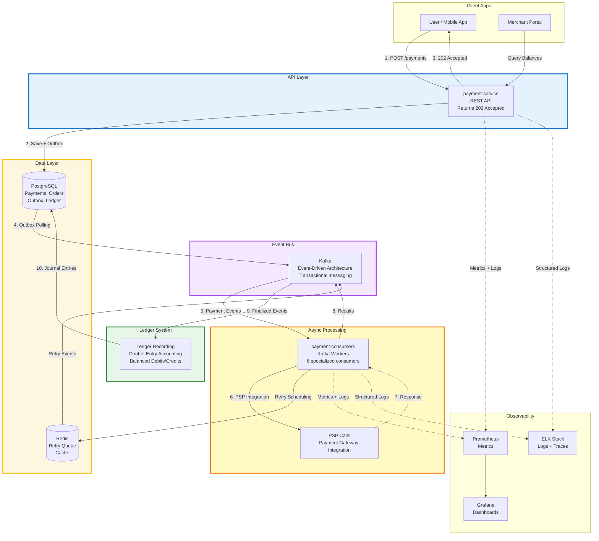

# 🛒 ecommerce-platform-kotlin

> 💳 **Event-Driven Payments Platform Prototype**
>
> A high-throughput, resilient, Kotlin + Spring Boot system inspired by PSPs like Adyen and Stripe.
> Featuring outbox pattern, double-entry ledger, retries, observability, and Domain-Driven modular design.

---

A **modular**, **event-driven**, and **resilient** eCommerce backend prototype built with **Kotlin + Spring Boot**, demonstrating how to design a high-throughput payment and ledger system using **Domain-Driven Design (DDD)**, **Hexagonal Architecture**, and **exactly-once event flows**.

- A single order may contain products from multiple sellers
- Each seller is paid independently (one `PaymentOrder` per seller)
- Payments flow through a PSP simulation with retries and exponential backoff (equal jitter)
- Successful PSP results trigger **double-entry ledger postings** with full audit trail
- All communication is **decoupled via Kafka** using transactional producers/consumers
- **Observability** (Prometheus + Grafana, ELK Stack) and **fault tolerance** (Outbox pattern, DLQ handling) are built in from day one
- **Account balance aggregation** is planned for near-term implementation

> 🧩 Completed main `payment-service`, `payment-consumers`, and `ledger` flows.  
> 🔨 Currently working on **AccountBalanceConsumer and AccountBalanceCache** - Aggregate balances from ledger entries with Redis caching ([Issue #119](https://github.com/dcaglar/ecommerce-platform-kotlin/issues/119))  
> 🔜 Future modules: `accounting-service`, `wallet-service`, `order`, `shipment`

---



---

## 🚀 Quick Start

For local setup and deployment on Minikube:  
👉 **[docs/how-to-start.md](https://github.com/dcaglar/ecommerce-platform-kotlin/blob/main/docs/how-to-start.md)**

---

## 📚 Documentation

- **[Architecture Guide](./docs/architecture.md)** – System design overview
- **[Architecture Details](./docs/architecture-internal-reader.md)** – Deep implementation guide
- **[How to Start](./docs/how-to-start.md)** – Local setup and Minikube deployment
- **[Folder Structure](./docs/folder-structure.md)** – Module organization and naming conventions

---

## 🗂️ Repository Layout

```bash
ecommerce-platform-kotlin/
├── payment-domain/           # Core domain model, value objects, events
├── payment-application/      # Application services, schedulers, orchestrations
├── payment-infrastructure/   # Adapters (Kafka, Redis, DB, PSP) + auto-config
├── payment-service/          # REST API, Outbox Dispatcher
├── payment-consumers/        # Kafka consumers (Enqueuer, Executor, Ledger, Retry)
├── common/                   # Shared contracts, event envelope, logging
├── charts/                   # Helm charts for deployment
├── infra/                    # Local infra scripts (Minikube, monitoring, Keycloak)
└── docs/                     # Architecture & how-to guides
```

---

## 📊 Observability Highlights

- **Prometheus metrics** for latency, retries, PSP call success rates, and consumer lag
- **Grafana dashboards** preconfigured in `infra/helm-values/`
- **ELK stack integration** for JSON-structured logs, searchable by `traceId`, `eventId`, or `paymentOrderId`
- Example Kibana query:
```kibana
traceId:"abc123" AND eventMeta:"PaymentOrderPspCallRequested"
```

---

## 📄 License

This project is a demonstration/learning prototype.  
See [LICENSE](./LICENSE) for details.

---

**Built with ❤️ using Kotlin, Spring Boot, and Domain-Driven Design.**
