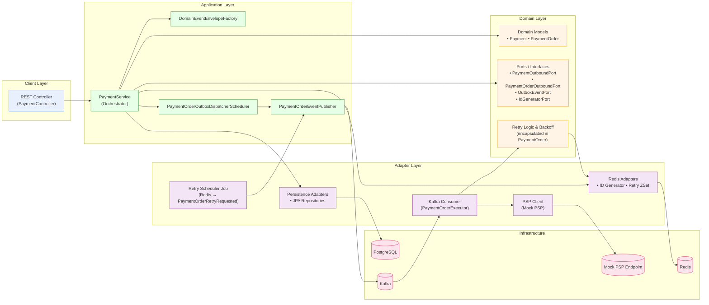

# 🛒 ecommerce-platform-kotlin

A **modular**, **event-driven**, and **resilient** eCommerce backend prototype built with **Kotlin** and **Spring Boot
**, demonstrating how to design a high-throughput system (like Amazon or bol.com) using **Domain-Driven Design (DDD)**
and **Hexagonal Architecture**.

> 🚧 Currently focused on the `payment-service` module. Other modules (like order, wallet, and shipment) are planned for
> future development.

---

## 📌 Overview

This project simulates a real-world multi-seller eCommerce platform where:

- A single order may contain products from multiple sellers.
- Each seller must be paid independently.
- Payment flow must handle failures, retries, and PSP timeouts robustly.
- All communication is decoupled using Kafka events.
- Observability and fault tolerance are built-in from day one.

---

## 🔍 Why This Project Exists

- Showcase scalable architecture choices in high-volume systems.
- Demonstrate mastery of **DDD**, **modularity**, **event choreography**, and **resilience patterns**.
- Enable others to contribute and learn by building well-structured components.

---



## Project Structure

This project follows a modular multi-module Maven layout designed for scalability and maintainability.

For detailed folder and package structure, see [docs/folder-structure.md](./docs/folder-structure.md).  
For architectural principles and deployment plans, and detailed diagrams
see [docs/architecture.md](./docs/architecture.md).

## ✅ Current Focus: `payment-service`

Handles the full lifecycle of payment processing for multi-seller orders:

### 🌐 Responsibilities

- Generate and persist `Payment` and multiple `PaymentOrder`s (one per seller).
- Use Redis for ID generation (payment and paymentOrder).
- Create outbox events for Kafka: `payment_order_created`.
- Consume `payment_order_created` events and process via a mock PSP.
- Retry failed payments with backoff (via Redis).
- Schedule delayed status checks.
- Emit follow-up events like `payment_order_succeeded`, `retry_requested`, `status_check_scheduled`.
- Gracefully recover Redis ID state on startup.
- All domain changes live in the payment-service.

---

## 🧱 Architecture Principles

### ✅ Domain-Driven Design (DDD)

- Clear separation of `domain`, `application`, `adapter`, and `config` layers.
- Domain logic isolated and testable; all IO abstracted via ports.

### ✅ Hexagonal Architecture

- Adapters implement ports and isolate external dependencies.
- Prevents domain leakage and encourages modular evolution.

### ✅ Event-Driven Communication

- Kafka events drive all workflows.
- Events wrapped in custom `EventEnvelope` with traceability (`traceId`, `parentEventId`).

### ✅ Observability

- Structured JSON logs with `logstash-logback-encoder`.
- MDC context propagation.
- Metrics planned with Prometheus/Micrometer.
- Full event traceability via logging and Elasticsearch.

### ✅ Resilience Patterns

- Redis ZSet for short-term retry queue.
- PostgreSQL + scheduled jobs for long-term status checks.
- Retry, backoff, dead letter queues (DLQ) supported.
- Redis-backed ID generation with crash recovery.
- Mock PSP simulates network delays, failures, and pending states.

---

## 🔩 Tech Stack

| Component     | Technology                    |
|---------------|-------------------------------|
| Language      | Kotlin (JDK 21)               |
| Framework     | Spring Boot 3.x               |
| Messaging     | Kafka                         |
| DB            | PostgreSQL + JPA              |
| Caching       | Redis                         |
| Auth          | Keycloak (OAuth2)             |
| Logging       | Logback + JSON + MDC          |
| Observability | Prometheus + Micrometer       |
| Testing       | Testcontainers (Redis, Kafka) |

---

## 📦 Modules (Maven Multi-Module)

| Module             | Status     | Description                         |
|--------------------|------------|-------------------------------------|
| `payment-service`  | ✅ Active   | Multi-seller payment orchestration  |
| `common`           | ✅ Active   | Shared contracts, envelope, logging |
| `order-service`    | 🕒 Planned | Will emit order-created events      |
| `wallet-service`   | 🕒 Planned | Track balances per seller           |
| `shipment-service` | 🕒 Planned | Delivery coordination               |

---

## 🚧 Roadmap

## Roadmap

Updated Roadmap (Containerization moved up, dual outbox event support)
• 🟦 1. Enforce Controlled Construction for Domain & Event Classes✅
Make constructors for Payment, PaymentOrder, and EventEnvelope<T> private or protected.
Require creation via factory methods (e.g., PaymentFactory, DomainEventEnvelopeFactory).
Refactor usage across all modules.
• 🟩 2. Align Entity Instantiation with Domain Factories✅
Use factory/mapping methods for all JPA/entity reconstruction.
Keep domain and persistence logic separate.()
• 🟨 3. Complete Structured Logging and ELK Stack Setup ✅
JSON logs, traceability, Kibana dashboards.
• 🟧 4. Implement and Refactor Retry Payment Logic in PaymentOrder✅
Move retry/backoff logic into the domain model.
Use Redis ZSet and a scheduled job for retry scheduling.✅
-log retry as a searchable event.
• 🟫 5. Add Elasticsearch Read Model for Payment Queries
Enable fast search/filter by payment/order.
• 🟥 6. Build Monitoring Dashboards and Basic Metrics (Prometheus/Grafana)
Expose essential service metrics for operations.
• 🟦 7. Containerize Spring Boot Apps
Write Dockerfile(s), test with Docker Compose.
Ensure profiles/secrets are runtime-injectable.
• 🟩 8. Implement Dual Outbox Event Tables/Flows
Separate Payment-level and PaymentOrder-level outbox tables.
Implement outbox polling/dispatch for both.
Ensure causal event flow and idempotency.
• 🟨 9. Enable Basic Kubernetes Deployment (Docker Desktop/Minikube)
Write and test deployment/service YAML.
Verify health in a local k8s cluster.
• 🟧 10. Build Dummy Wallet and Shipment Services
Event choreography across bounded contexts.
• 🟫 11. Add OAuth2 Security to All APIs
Integrate Keycloak (or Auth0).
Add token validation to all REST endpoints.
• 🟥 12. Harden Retry and DLQ Handling
Add DLQ topic(s) and alerting on failures.
Ensure resilience for transient errors.
• 🟦 13. Implement Node Affinity & Resource Management for K8s
Set resource requests/limits, node selectors.
• 🟩 14. Add Alerting and Advanced Monitoring
Slack/email alerts for key events/errors.
SLO/SLA tracking.
• 🟨 15. Scale Kafka Consumers (Horizontal Concurrency Tuning)
Enable more consumer instances for high throughput.

Basic CI/CD with GitHub Actions

## 🧪 Testing Strategy

- Unit tests for domain and mappers
- Integration tests with Redis and Kafka using Testcontainers
- Outbox dispatch and retry scheduler tests with event assertions

---

## 🚀 Getting Started

```bash
git clone https://github.com/dcaglar/ecommerce-platform-kotlin.git
cd ecommerce-platform-kotlin
docker-compose up -d
cd payment-service
./mvnw spring-boot:run