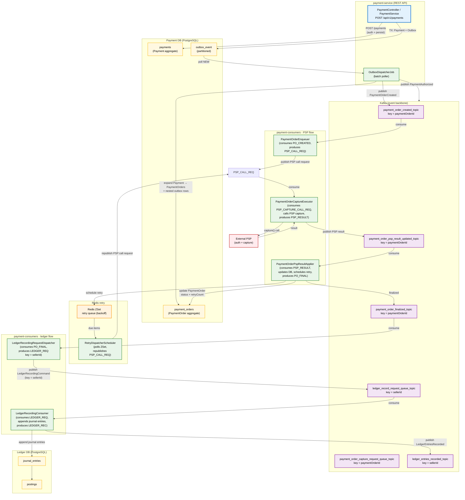
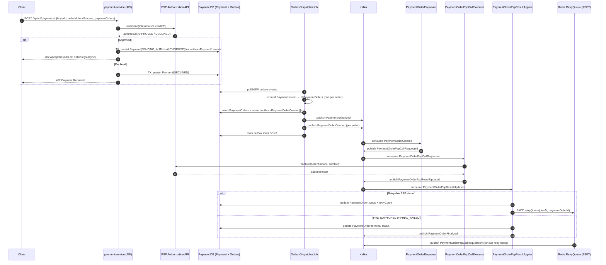
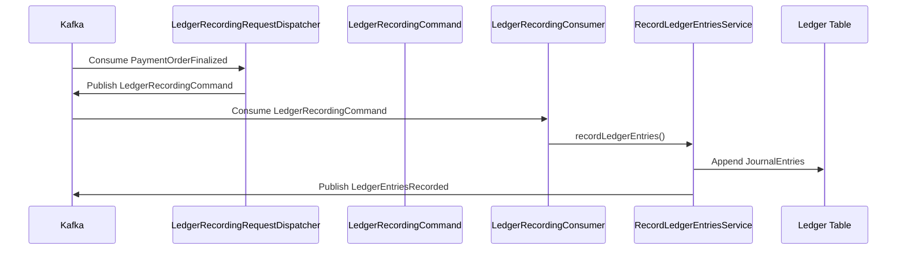
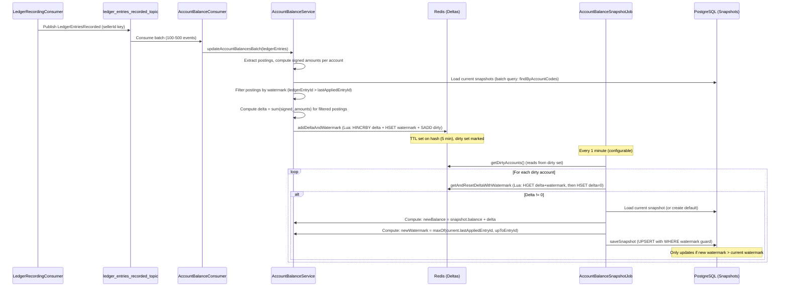

# 🛒 ecommerce-platform-kotlin

# 📦 ecommerce-platform-kotlin
### Event-Driven Payments & Ledger Infrastructure for Multi-Seller Platforms

This project is a **technical showcase** demonstrating how large multi-entity platforms (Uber, bol.com, Amazon Marketplace, Airbnb) structure their payment and accounting flows. The system models the financial primitives that appear in every Merchant-of-Record (MoR) or marketplace environment, where all business events reduce to three fundamental money movements:

- **Pay-ins** — shopper → platform (authorization + capture)
- **Internal reallocations** — platform → internal accounts (fees, commissions, settlements)
- **Pay-outs** — platform → sellers or external beneficiaries

Rather than simulating a single business model, the platform implements a **small but realistic subset** of the flows used in production systems: synchronous authorization, multi-seller decomposition, asynchronous capture pipelines, idempotent state transitions, retries, and **double-entry ledger recording**. The goal is not to be feature-complete, but to demonstrate **sound architectural design**, correctness guarantees, and event-driven coordination across bounded contexts.

At the domain layer, the system follows **DDD principles** with clear aggregate boundaries (`Payment`, `PaymentOrder`, `Ledger`). Each event (authorization, capture request, PSP result, finalization, journal posting) is immutable and drives the next step in the workflow. At the architecture level, the system uses **hexagonal architecture**, the **outbox pattern**, **Kafka-based orchestration**, and **idempotent command/event handlers** to guarantee exactly-once processing across distributed components. Payment and ledger flows are completely asynchronous, partition-aligned, and fault-tolerant by design.

From an engineering standpoint, the project demonstrates how to structure a modern, cloud-ready financial system using a production-grade stack: **Kotlin**, **Spring Boot**, **Kafka**, **PostgreSQL**, **Redis**, **Liquibase**, **Docker**, and **Kubernetes**. It highlights practical system-design concerns such as resiliency, retries with jitter, consumer lag scaling, partitioning strategy, deterministic Snowflake-style ID generation, and observability through Prometheus/Grafana and structured JSON logs.

This repository is intended for **backend engineers, architects, and SREs** who want to understand how MoR platforms implement correct financial flows, balance eventual consistency with strict accounting rules, and design event-driven systems that scale under real-world load.

#### Architecture Diagram

#### Payment  Flow Sequence Diagram

#### Ledger Record Sequence Flow

#### Balance Flow Sequence

---

## 🚀 Quick Start

For local setup and deployment on Minikube:  
👉 **[docs/how-to-start.md](https://github.com/dcaglar/ecommerce-platform-kotlin/blob/main/docs/how-to-start.md)**

## 📚 Documentation

- **[Architecture Details](./docs/architecture-internal-reader.md)** – Deep implementation guide
- **[How to Start](./docs/how-to-start.md)** – Local setup and Minikube deployment
- **[Folder Structure](./docs/folder-structure.md)** – Module organization and naming conventions

**Built with ❤️ using Kotlin, Spring Boot, and Domain-Driven Design.**
