# 🛒 ecommerce-platform-kotlin

A **modular**, **event-driven**, and **resilient** eCommerce backend prototype built with **Kotlin** and **Spring Boot
**, demonstrating how to design a high-throughput system (like Amazon or bol.com) using **Domain-Driven Design (DDD)**
and **Hexagonal Architecture**.

> 🚧 Currently focused on the `payment-service` module. Other modules (like order, wallet, and shipment) are planned for
> future development.

---

## 📌 Overview

This project simulates a real-world multi-seller eCommerce platform where:

- A single order may contain products from multiple sellers.
- Each seller must be paid independently.
- Payment flow must handle failures, retries, and PSP timeouts robustly.
- All communication is decoupled using Kafka events.
- Observability and fault tolerance are built-in from day one.

---

## 🔍 Why This Project Exists

- Showcase scalable architecture choices in high-volume systems.
- Demonstrate mastery of **DDD**, **modularity**, **event choreography**, and **resilience patterns**.
- Enable others to contribute and learn by building well-structured components.

---



```mermaid
flowchart LR
subgraph Client Layer
A["REST Controller<br/>(PaymentController)"]:::controller
end

subgraph Application Layer
B["PaymentService<br/>(Orchestrator)"]:::service
C[DomainEventEnvelopeFactory]:::service
D[PaymentOrderOutboxDispatcherScheduler]:::service
E[PaymentOrderEventPublisher]:::service
end

subgraph Domain Layer
F["Domain Models<br/>• Payment  • PaymentOrder"]:::domain
G["Ports / Interfaces<br/>• PaymentOutboundPort<br/>• PaymentOrderOutboundPort<br/>• OutboxEventPort<br/>• IdGeneratorPort"]:::domain
H["Retry Logic & Backoff<br/>(encapsulated in PaymentOrder)"]:::domain
end

subgraph Adapter Layer
I["Persistence Adapters<br/>• JPA Repositories"]:::adapter
J["Redis Adapters<br/>• ID Generator  • Retry ZSet"]:::adapter
K["Kafka Consumer<br/>(PaymentOrderExecutor)"]:::adapter
M["Retry Scheduler Job<br/>(Redis → PaymentOrderRetryRequested)"]:::adapter
N["PSP Client<br/>(Mock PSP)"]:::adapter
end

subgraph Infrastructure
DB[(PostgreSQL)]:::infra
REDIS[(Redis)]:::infra
KAFKA[(Kafka)]:::infra
PSP_API[(Mock PSP Endpoint)]:::infra
end

%% Relationships
A --> B
B --> F
B --> J
B --> I
B --> G
B --> C
B --> D
D --> E
E --> KAFKA
M --> E
KAFKA --> K
K --> N
K --> H
H --> J
I --> DB
J --> REDIS
N --> PSP_API

%% Styling
classDef controller   fill:#e8f0fe, stroke:#4b7bec, stroke-width:1px;
classDef service      fill:#e6ffe6, stroke:#43a047, stroke-width:1px;
classDef domain       fill:#fff4e6, stroke:#f39c12, stroke-width:1px;
classDef adapter      fill:#f3e5f5, stroke:#8e24aa, stroke-width:1px;
classDef infra        fill:#fce4ec, stroke:#d81b60, stroke-width:1px;

class A controller
class B,C,D,E service
class F,G,H domain
class I,J,K,M,N adapter
class DB,REDIS,KAFKA,PSP_API infra
```

## Project Structure

This project follows a modular multi-module Maven layout designed for scalability and maintainability.

For detailed folder and package structure, see [docs/folder-structure.md](./docs/folder-structure.md).  
For architectural principles and deployment plans,  and detailed  diagrams see [docs/architecture.md](./docs/architecture.md).

## ✅ Current Focus: `payment-service`

Handles the full lifecycle of payment processing for multi-seller orders:

### 🌐 Responsibilities

- Generate and persist `Payment` and multiple `PaymentOrder`s (one per seller).
- Use Redis for ID generation (payment and paymentOrder).
- Create outbox events for Kafka: `payment_order_created`.
- Consume `payment_order_created` events and process via a mock PSP.
- Retry failed payments with backoff (via Redis).
- Schedule delayed status checks.
- Emit follow-up events like `payment_order_succeeded`, `retry_requested`, `status_check_scheduled`.
- Gracefully recover Redis ID state on startup.
- All domain changes live in the payment-service.

---

## 🧱 Architecture Principles

### ✅ Domain-Driven Design (DDD)

- Clear separation of `domain`, `application`, `adapter`, and `config` layers.
- Domain logic isolated and testable; all IO abstracted via ports.

### ✅ Hexagonal Architecture

- Adapters implement ports and isolate external dependencies.
- Prevents domain leakage and encourages modular evolution.

### ✅ Event-Driven Communication

- Kafka events drive all workflows.
- Events wrapped in custom `EventEnvelope` with traceability (`traceId`, `parentEventId`).

### ✅ Observability

- Structured JSON logs with `logstash-logback-encoder`.
- MDC context propagation.
- Metrics planned with Prometheus/Micrometer.
- Full event traceability via logging and Elasticsearch.

### ✅ Resilience Patterns

- Redis ZSet for short-term retry queue.
- PostgreSQL + scheduled jobs for long-term status checks.
- Retry, backoff, dead letter queues (DLQ) supported.
- Redis-backed ID generation with crash recovery.
- Mock PSP simulates network delays, failures, and pending states.

---

## 🔩 Tech Stack

| Component     | Technology                    |
|---------------|-------------------------------|
| Language      | Kotlin (JDK 21)               |
| Framework     | Spring Boot 3.x               |
| Messaging     | Kafka                         |
| DB            | PostgreSQL + JPA              |
| Caching       | Redis                         |
| Auth          | Keycloak (OAuth2)             |
| Logging       | Logback + JSON + MDC          |
| Observability | Prometheus + Micrometer       |
| Testing       | Testcontainers (Redis, Kafka) |

---

## 📦 Modules (Maven Multi-Module)

| Module             | Status     | Description                         |
|--------------------|------------|-------------------------------------|
| `payment-service`  | ✅ Active   | Multi-seller payment orchestration  |
| `common`           | ✅ Active   | Shared contracts, envelope, logging |
| `order-service`    | 🕒 Planned | Will emit order-created events      |
| `wallet-service`   | 🕒 Planned | Track balances per seller           |
| `shipment-service` | 🕒 Planned | Delivery coordination               |

---

## 🚧 Roadmap

## Roadmap

📋 Updated Roadmap (with containerization earlier)
Updated Roadmap with Outbox Event Split
1.	Complete structured logging and ELK stack setup (done)
2.	Implement and refactor retry payment logic in PaymentOrder
3.	Add Elasticsearch read model for payment queries
4.	Build monitoring dashboards and basic metrics (Prometheus/Grafana)
5.	Containerize Spring Boot apps
•	Write Dockerfile for payment-service (and others)
•	Test locally with Docker Compose
•	Ensure profiles/secrets can be injected at runtime
6.	Implement dual outbox event tables/flows
•	Separate Payment-level and PaymentOrder-level outbox tables
•	Implement outbox polling/dispatch for both
•	Ensure causal event flow and idempotency
7.	Enable basic Kubernetes deployment (Docker Desktop/Minikube)
•	Write deployment.yaml/service.yaml
•	Deploy and verify app health
8.	Build dummy wallet and shipment services
9.	Enforce EventEnvelope encapsulation (DDD Factory pattern)
•	Forbid direct construction; require DomainEventEnvelopeFactory
•	Audit/refactor across modules
10.	Add OAuth2 security to all APIs
•	Integrate with Keycloak (or Auth0)
•	Add token validation to REST endpoints
11.	Harden retry and DLQ handling
12.	Implement node affinity/resource management for K8s
13.	Add alerting and advanced monitoring
14.	Scale Kafka consumers (horizontal concurrency tuning)


Basic CI/CD with GitHub Actions

## 🧪 Testing Strategy

- Unit tests for domain and mappers
- Integration tests with Redis and Kafka using Testcontainers
- Outbox dispatch and retry scheduler tests with event assertions

---

## 🚀 Getting Started

```bash
git clone https://github.com/dcaglar/ecommerce-platform-kotlin.git
cd ecommerce-platform-kotlin
docker-compose up -d
cd payment-service
./mvnw spring-boot:run