# 🛒 ecommerce-platform-kotlin

A **modular**, **event-driven**, and **resilient** eCommerce backend prototype built with **Kotlin** and **Spring Boot
**, demonstrating how to design a high-throughput system (like Amazon or bol.com) using **Domain-Driven Design (DDD)**
and **Hexagonal Architecture**.

> 🚧 Currently focused on the `payment-service` module. Other modules (like order, wallet, and shipment) are planned for
> future development.

---

## 📌 Overview

This project simulates a real-world multi-seller eCommerce platform where:

- A single order may contain products from multiple sellers.
- Each seller must be paid independently.
- Payment flow must handle failures, retries, and PSP timeouts robustly.
- All communication is decoupled using Kafka events.
- Observability and fault tolerance are built-in from day one.

---

## 🔍 Why This Project Exists

- Showcase scalable architecture choices in high-volume systems.
- Demonstrate mastery of **DDD**, **modularity**, **event choreography**, and **resilience patterns**.
- Enable others to contribute and learn by building well-structured components.

---

```mermaid
%%{init: { 
  "themeVariables": { "fontSize": "32px", "nodeTextSize": "32px" }, 
  "flowchart": { "nodeSpacing": 80, "rankSpacing": 90 },
  "theme": "default"
}}%%
flowchart LR
%% SRE-Style Custom Palette
    classDef controller fill: #e3f0fd, stroke: #4285F4, stroke-width: 3px;
    classDef service fill: #e6f5ea, stroke: #34A853, stroke-width: 3px;
    classDef domain fill: #fef7e0, stroke: #FBBC05, stroke-width: 3px;
    classDef adapter fill: #f3e8fd, stroke: #A142F4, stroke-width: 3px;
    classDef infra fill: #fde8e6, stroke: #EA4335, stroke-width: 3px;
    classDef legend fill: #fff, stroke: #aaa, stroke-width: 1px;
    subgraph Legend [Legend: Layer Color Coding]
        L1[Controller: Blue]:::controller
        L2[Service: Green]:::service
        L3[Domain: Yellow]:::domain
        L4[Adapter: Purple]:::adapter
        L5[Infra: Red]:::infra
    end

    subgraph Client_Layer ["Client Layer"]
        A["REST Controller<br/>(PaymentController)"]:::controller
    end

    subgraph Application_Layer ["Application Layer"]
        B["PaymentService<br/>(Orchestrator)"]:::service
        C[DomainEventEnvelopeFactory]:::service
        D[PaymentOrderOutboxDispatcherScheduler]:::service
        E[PaymentOrderEventPublisher]:::service
    end

    subgraph Domain_Layer ["Domain Layer"]
        F["Domain Models<br/>• Payment • PaymentOrder"]:::domain
        G["Ports / Interfaces<br/>• PaymentOutboundPort<br/>• PaymentOrderOutboundPort<br/>• OutboxEventPort<br/>• IdGeneratorPort"]:::domain
        H["Retry Logic & Backoff<br/>(in PaymentOrder)"]:::domain
    end

    subgraph Adapter_Layer ["Adapter Layer"]
        I["Persistence Adapters<br/>• JPA Repositories"]:::adapter
        J["Redis Adapters<br/>• ID Generator • Retry ZSet"]:::adapter
        K["Kafka Consumer<br/>(PaymentOrderExecutor)"]:::adapter
        M["Retry Scheduler Job<br/>(Redis → PaymentOrderRetryRequested)"]:::adapter
        N["PSP Client<br/>(Mock PSP)"]:::adapter
    end

subgraph Infrastructure_Layer ["Infrastructure"]
DB[(🗄️ PostgreSQL)]:::infra
REDIS[(📦 Redis)]:::infra
KAFKA[(🟪 Kafka)]:::infra
PSP_API[(💳 Mock PSP Endpoint)]:::infra
end

%% Relationships
A --> B
B --> F
B --> J
B --> I
B --> G
B --> C
B --> D
D --> E
E --> KAFKA
M --> E
KAFKA --> K
K --> N
K --> H
H --> J
I --> DB
J --> REDIS
N --> PSP_API

Legend --- Client_Layer
```

## Project Structure

This project follows a modular multi-module Maven layout designed for scalability and maintainability.

For detailed folder and package structure, see [docs/folder-structure.md](./docs/folder-structure.md).  
For architectural principles and deployment plans, and detailed diagrams
see [docs/architecture.md](./docs/architecture.md).
For quick start instructions, see [docs/how-to-start.md](./docs/how-to-start.md).

## ✅ Current Focus: `payment-service`

Handles the full lifecycle of payment processing for multi-seller orders:

### 🌐 Responsibilities

- Generate and persist `Payment` and multiple `PaymentOrder`s (one per seller).
- Use Redis for ID generation (payment and paymentOrder).
- Create outbox events for Kafka: `payment_order_created`.
- Consume `payment_order_created` events and process via a mock PSP.
- Retry failed payments with backoff (via Redis).
- Schedule delayed status checks.
- Emit follow-up events like `payment_order_succeeded`, `retry_requested`, `status_check_scheduled`.
- Gracefully recover Redis ID state on startup.
- All domain changes live in the payment-service.

---

## 🧱 Architecture Principles

### ✅ Domain-Driven Design (DDD)

- Clear separation of `domain`, `application`, `adapter`, and `config` layers.
- Domain logic isolated and testable; all IO abstracted via ports.

### ✅ Hexagonal Architecture

- Adapters implement ports and isolate external dependencies.
- Prevents domain leakage and encourages modular evolution.

### ✅ Event-Driven Communication

- Kafka events drive all workflows.
- Events wrapped in custom `EventEnvelope` with traceability (`traceId`, `parentEventId`).

### ✅ Observability

- Structured JSON logs with `logstash-logback-encoder`.
- MDC context propagation.
- Metrics planned with Prometheus/Micrometer.
- Full event traceability via logging and Elasticsearch.

### ✅ Resilience Patterns

- Redis ZSet for short-term retry queue.
- PostgreSQL + scheduled jobs for long-term status checks.
- Retry, backoff, dead letter queues (DLQ) supported.
- Redis-backed ID generation with crash recovery.
- Mock PSP simulates network delays, failures, and pending states.

---

## 🔩 Tech Stack

| Component     | Technology                    |
|---------------|-------------------------------|
| Language      | Kotlin (JDK 21)               |
| Framework     | Spring Boot 3.x               |
| Messaging     | Kafka                         |
| DB            | PostgreSQL + JPA              |
| Caching       | Redis                         |
| Auth          | Keycloak (OAuth2)             |
| Logging       | Logback + JSON + MDC          |
| Observability | Prometheus + Micrometer       |
| Testing       | Testcontainers (Redis, Kafka) |

---

## 📦 Modules (Maven Multi-Module)

| Module             | Status     | Description                         |
|--------------------|------------|-------------------------------------|
| `payment-service`  | ✅ Active   | Multi-seller payment orchestration  |
| `common`           | ✅ Active   | Shared contracts, envelope, logging |
| `order-service`    | 🕒 Planned | Will emit order-created events      |
| `wallet-service`   | 🕒 Planned | Track balances per seller           |
| `shipment-service` | 🕒 Planned | Delivery coordination               |

---

## 🚧 Roadmap

Roadmap

Updated Roadmap (Containerization moved up, dual outbox event support, Kafka partitioning milestone added):
• 🟦 1. Enforce Controlled Construction for Domain & Event Classes✅
• 🟩 2. Align Entity Instantiation with Domain Factories✅
• 🟨 3. Complete Structured Logging and ELK Stack Setup ✅
• 🟧 4. Implement and Refactor Retry Payment Logic in PaymentOrder✅
• 🟧 5. Use Redis ZSet and a scheduled job for retry scheduling.✅
• 🟦 6. Containerize Spring Boot Apps.✅
• 🟥 7. Build Monitoring Dashboards and Basic Metrics (Prometheus/Grafana)
Metrics and Monitoring
• Prometheus Redis Exporter:
For real SRE-style monitoring, run Redis Exporter with Prometheus.
• It gives you:
• 🟩 7.5. Kafka Partitioning by Aggregate ID (paymentOrderId)
• Repartitioned all payment-order event topics by aggregateId (paymentOrderId) to guarantee per-order event ordering.
• Enables safe horizontal scaling (one consumer per partition) and preserves state machine transitions for each payment
order.
• Simplified consumer logic and minimized risk of subtle, order-dependent bugs in orchestration flows.
• Key lesson: Scalability, parallelism, and correctness require infrastructure-level event ordering—this milestone marks
robust event choreography in a high-throughput, distributed system.
• 🟩 8. Implement Dual Outbox Event Tables/Flows
• 🟨 9. Enable Basic Kubernetes Deployment (Docker Desktop/Minikube)
• 🟧 10. Build Dummy Wallet and Shipment Services
• 🟫 11. Add Elasticsearch Read Model for Payment Queries
• 🟫 12. Add OAuth2 Security to All APIs
• 🟥 13. Harden Retry and DLQ Handling
• 🟦 14. Implement Node Affinity & Resource Management for K8s
• 🟩 15. Add Alerting and Advanced Monitoring
• 🟨 16. Scale Kafka Consumers (Horizontal Concurrency Tuning)
• 🟨 17. Implement Circuit Breaker Patterns
• 18- Move Micrometer-related logic out of business classes. Use AOP/decorator.

## 🧪 Testing Strategy

- Unit tests for domain and mappers
- Integration tests with Redis and Kafka using Testcontainers
- Outbox dispatch and retry scheduler tests with event assertions

---

