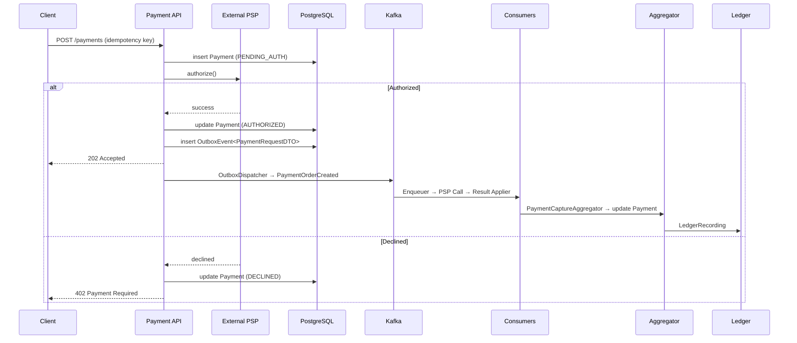

# ADR-006 & ADR-007 — Design Evolution and Payment Authorization & Capture Refinement (Unified Version)

## Background

Earlier versions of the system mixed responsibilities between acting as a **Payment Service Provider (PSP)** (e.g. Adyen or Stripe) and as a **Merchant of Record (MoR)** (e.g. Uber or Amazon).  
The platform directly persisted payments and emitted outbox events before verifying that a shopper’s card had been authorized.  


---

## Key Decisions

| Area | Before | After                                                                                   |
|------|---------|-----------------------------------------------------------------------------------------|
| **System Role** | Combined PSP + MoR (inconsistent) | Acts solely as Merchant of Record                                                       |
| **Auth Timing** | Payment persisted before authorization | PSP authorization done synchronously before emitting any events                         |
| **Outbox Event Creation** | Immediate (pre-auth) | Deferred until PSP authorization success                                                |
| **Capture Flow** | Combined in sync webflow | Asynchronous per seller via Kafka euther auto-triggered or manual, for now default auto |
| **Retry Logic** | Same for all PSP calls | Auth = synchronous, no retry; Capture = Redis ZSET with jitter                          |
| **Domain Model** | Weak invariant boundaries | Payment (buyer-level) & PaymentOrder (seller-level) strictly separated                  |
| **Status Model** | Flat | Distinct lifecycle states for Payment and PaymentOrder                                  |

---

## Revised Architecture Overview

### 0 Web/API Layer (ASynchronous CAptire per paymentorderid)

1. **POST /payments/{payment-id}/capture
    - Validate request checks if capture is valid, and from correct auth
    - Generate an `idempotency_key` not sure
    - Persist a OoutboxEvent<PaymentCaptureCommand>.

### 1️⃣ Web/API Layer (Synchronous Authorization)

1. **POST /payments**
   - Validate request.
   - Generate an `idempotency_key` (`hash(orderId + buyerId + amount)`).
   - Persist `Payment(status = PENDING_AUTH)`.
2. **Call PSP.authorize()** synchronously:
   - On success → update Payment to `AUTHORIZED`, persist one `OutboxEvent<PaymentAuthorized>`.
   - On failure → update Payment to `DECLINED`, stop processing.
3. **Respond to client:**
   - `202 Accepted` (Authorized) or `402 Payment Required` (Declined).

### 2️⃣ Outbox Dispatcher
Process 2 type of OutboxEvent
  1- OutboxEvent<PaymentAuthorized>:
    - Picks up `OutboxEvent<PaymentAuthorized>`.
    - Persist individual `PaymentOrder`(status=INITIATED_PENDING) for each line in payload
    - Persist  `OutboxEvent<PaymentOrderCreated>` in outbox table
    - Publishes to Kafka (`payment_authorized` topic).
2- OutboxEvent<PaymentOrderCreated>:
- Picks up `OutboxEvent<PaymentOrderCreated>`.
- Generates individual `PaymentOrderCreated` from the outboxevent
- Publishes to Kafka (`payment_order_created` topic).
3- OutboxEvent<PaymentOrderCaptureCommand>:
- Picks up `OutboxEvent<PaymentOrderCaptureCommand>`.
- Generates individual `PaymentOrderCaptureCommand` from the outboxevent<PaymentOrderCaptureCommand>
- update status of paymentorder to capture_requested
- Publishes to Kafka (`payment_order_capture_request_queue_topic` topic)


### 3️⃣ PSP Capture Flow (Asynchronous)

- **PaymentOrderEnqueuer** → consumes `PaymentOrderCreated`,if auto-capture enabled(update paymentorder capture_initiated-> capture_requested, publish a `PaymentORderCaptureCommand`.) otherwise skip it
- **PaymentORderCaptureExecutor** → checks if status is capture_requested,performs PSP capture call per seller, applying retry/backoff.
- **PaymentOrderPspResultApplier** → updates DB, marks capture status, emits `PaymentOrderFinalized`.

### 4️⃣ Payment Capture Aggregation

- **PaymentCaptureAggregator** consumes `PaymentOrderFinalized(SUCCESSFUL_FINAL)`.
- Updates parent `Payment.capturedAmount` in DB.

### 5️⃣ Ledger and Accounting

•	Ledger flow listens to PaymentOrderFinalized(SUCCESSFUL_FINAL) events only.
•	Each event corresponds to a concrete financial movement between PSP, merchant, and internal accounts.
•	For each successful capture:
•	A JournalEntry is created via the domain factory (JournalEntryFactory.authAndCapture(...)).
•	Balanced Postings are inserted into ledger_entries.
•	Corresponding account balances (account_balances) are atomically updated with optimistic concurrency and idempotency.
•	PaymentCaptured is not a ledger trigger; it is purely an aggregate signal used for higher-level reconciliation, analytics, and downstream workflow orchestration.
•	A PaymentAuthorizedConsumer also listen paymentauthorized and will request a ledger for payment


---

## Domain Model Summary

### Payment (Buyer-Level Aggregate)

| State | Description |
|--------|--------------|
| `PENDING_AUTH` | Payment initialized before PSP call |
| `AUTHORIZED` | PSP authorized total funds |
| `DECLINED` | PSP declined transaction |
| `PARTIALLY_CAPTURED` | Some captures completed |
| `CAPTURED_FINAL` | All captures finalized → emits `PaymentCaptured` |

### PaymentOrder (Seller-Level Aggregate)

| State | Description |
|--------|--------------|
| `INITIATED_PENDING` | Created after PaymentAuthorized |
| `CAPTURE_REQUESTED` | Capture sent to PSP |
| `CAPTURED_FINAL` | Capture successful |
| `FINAL_FAILED` | Capture failed |

---

## Aggregator and Schema Extensions


### `payments`

```sql
ALTER TABLE payments
  ADD COLUMN captured_amount BIGINT NOT NULL DEFAULT 0,
  ADD COLUMN idempotency_key VARCHAR(128) UNIQUE NOT NULL,
  ADD COLUMN status VARCHAR(32) NOT NULL CHECK (
    status IN ('PENDING_AUTH','AUTHORIZED','PARTIALLY_CAPTURED','CAPTURED_FINAL','DECLINED')
  ),
  ADD COLUMN updated_at TIMESTAMP NOT NULL DEFAULT NOW();
```

---

## Idempotency & Retry Design

| Layer | Mechanism | Description |
|--------|------------|-------------|
| **HTTP Layer** | `Idempotency-Key` header | Prevents duplicate auth |
| **Database** | Unique `idempotency_key` | Returns existing Payment if retried |
| **PSP Auth** | No retry queue | Fail fast, user retries safely |
| **Capture Flow** | Redis ZSET + jitter backoff | Controlled PSP retry scheduling |
| **Aggregator** | Ledger PK | Prevents duplicate aggregation |

---

## Domain Invariants

| Rule | Enforced At |
|------|--------------|
| `Σ(PaymentOrder.amount) == Payment.totalAmount` | PaymentFactory |
| `capturedAmount ≤ totalAmount` | Domain + DB constraint |
| `currency consistency` | Domain validation |
| `status monotonic` | Domain transitions + SQL |
| `one capture per PaymentOrder` | Ledger PK |

---

## Event Model

| Event | Source | Description |
|--------|--------|-------------|
| `PaymentAuthorized` | Web/API | PSP authorization succeeded |
| `PaymentOrderCreated` | OutboxDispatcher | Seller capture workflow started |
| `PaymentOrderFinalized` | PSP executor | Capture completed |
| `PaymentCaptureProgressed` | Aggregator | Partial capture progress |
| `PaymentCaptured` | Aggregator | Buyer-level capture complete |

---

## Sequence Diagram



---

## Benefits

✅ Enforces real-world flow (auth → capture → settlement).  
✅ Aligns with Merchant-of-Record architecture.  
✅ Strengthens invariants and event boundaries.  
✅ Supports partial capture, retry, and reconciliation.  
✅ Enables fine-grained observability and traceability.  

---

## Status

✅ **Accepted — Implemented in Architecture v2.**  
Consolidates prior ADRs and formalizes the synchronous authorization and asynchronous capture model.
