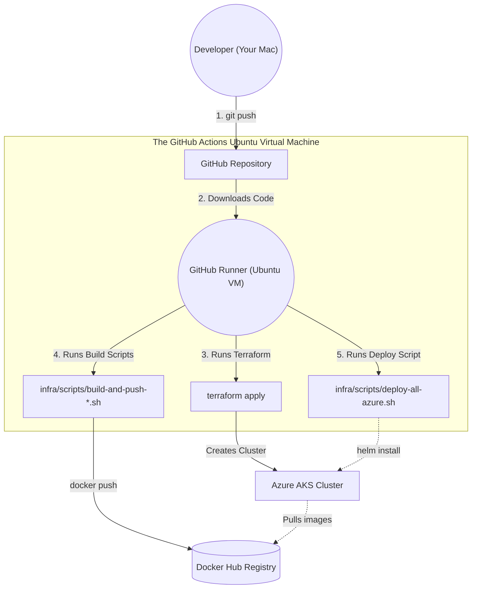

# Architecture Decision Record (ADR) & Azure Infrastructure Design

## 1. Title
**ADR-001: Ephemeral Load Testing Infrastructure on Azure Kubernetes Service (AKS)**

## 2. Context
We have built a high-performance, cell-based payment processing system. The local environment is heavily customized via Bash scripts and Helm value files. We need to port this exact architecture to Azure without breaking the existing local developer workflow.

## 3. Decision
We will clone and parameterize your existing bash scripts to create an identical, sibling deployment track for Azure. **The GitHub Actions pipeline will boot up a temporary Linux server in the cloud to execute your existing bash scripts on your behalf.**

## 4. Resource Allocation & Sizing
1. **System Node Pool (`Standard_D2s_v5` - 2 vCPU, 8 GB RAM)**
2. **Central Node Pool (`Standard_D8s_v5` - 8 vCPU, 32 GB RAM):** Pinned via `nodeSelector`.
3. **Edge Cell Node Pool (`Standard_D8s_v5` - 8 vCPU, 32 GB RAM):** Dedicated exclusively to the `payment-edge-cell` Pods.

## 5. Script and Configuration Strategy (The "Azure Profile")

We will mirror your local deployment structure perfectly:

### 5.1 Helm Values and Secrets (Same Folders)
Inside your *existing* `infra/helm-values` and `infra/secrets` folders, we will place a new file next to every `-local.yaml` file ending in `-azure.yaml` (e.g., `central-db-values-local.yaml` will live right next to `central-db-values-azure.yaml`).
* The `-azure.yaml` files will have larger connection pools, higher CPU limits, and the AKS `nodeSelector` values.

### 5.2 Bash Scripts (Same Folder)
Inside your *existing* `infra/scripts` folder, we will duplicate `deploy-all-local.sh` and its child scripts to end with `-azure.sh`. The Azure scripts will reference the `-azure.yaml` files.

## 6. Infrastructure as Code (IaC) & CI/CD Flow

> [!IMPORTANT]
> **WHERE DOES ALL THIS RUN?**
> When you click "Run workflow" in GitHub, GitHub boots up a temporary, free **Ubuntu Virtual Machine** in their cloud (called a "Runner"). 
> 
> GitHub downloads your code onto that Ubuntu VM. **Every single script (Terraform, Docker builds, and Bash scripts) is executed directly on that temporary GitHub Ubuntu VM**, not on your Mac, and not inside the AKS cluster! That Ubuntu VM acts as your "robot developer", doing exactly what you would do on your Mac terminal.



### The Step-by-Step CI/CD Execution:
1. **Creation:** You click "Run workflow" on `deploy-infra.yml` in GitHub Actions. GitHub boots up the temporary Ubuntu Runner.
2. **IaC Execution:** The Ubuntu Runner authenticates securely with Azure and runs `terraform apply`. Terraform uses the Azure API to physically rent the Virtual Machines and start the AKS Kubernetes cluster.
3. **Build & Push:** The Ubuntu Runner executes your existing `build-and-push-payment-service-docker-repo.sh` scripts. The Java code is compiled and the Docker images are built **directly on the Ubuntu Runner**. The Runner then pushes those built images to your Docker Hub.
4. **Application Deployment:** The Ubuntu Runner installs `helm` and `kubectl` on itself, downloads the `kubeconfig` from Azure, and then executes your `deploy-all-azure.sh` script. The bash script talks to the AKS Cluster's API and tells it to deploy your Helm charts.
5. **Teardown:** When finished, you run `destroy-infra.yml`. A new Ubuntu Runner boots up, runs `terraform destroy`, and deletes the Azure resources.

## 7. Status
**PROPOSED**

---

## 8. Detailed Infrastructure Walkthrough (Terraform Breakdown)

Because this ADR serves as our architectural blueprint, below is a detailed breakdown of the exact Terraform code we just wrote in Phase 2 (`infra/terraform/main.tf`). This documents *why* we configured Azure the way we did.

### 8.1 The Foundation: Resource Group, API Server, and Load Balancer
In Azure, everything must live inside a "Resource Group" (a logical folder). We define our Resource Group to live in `westeurope` (the Netherlands), guaranteeing the lowest possible latency for your testing.

We then define the `azurerm_kubernetes_cluster`. We give it a `dns_prefix` (e.g., `payloadtest`). This simply tells Azure to generate a unique API web address (like `payloadtest-xyz.hcp.westeurope.azmk8s.io`) so that your GitHub Actions pipeline knows exactly how to connect its `kubectl` commands to the cluster.

We use the `kubenet` network plugin because it is lightweight and free. Finally, we attach a `standard` Azure Load Balancer. 
* **Wait, does this replace Ingress-NGINX?** No! We still absolutely need your `ingress-nginx`. The Azure Load Balancer is just the physical metal router outside the cluster that catches raw internet traffic and provides your public IP address. It passes that raw traffic directly to your `ingress-nginx` pods, which then route the HTTP requests to your Java applications.

### 8.2 The System Node Pool (`systempool`)
**What is a Node Pool?** A Node Pool is simply a group of Virtual Machines that share the exact same hardware size and rules. Instead of managing 10 individual VMs, you create a single Node Pool, tell it what hardware size to use, and say "give me 3 of these." All VMs in that pool will be identical.

```hcl
default_node_pool {
  name       = "systempool"
  node_count = 1
  vm_size    = "Standard_D2s_v5"
  only_critical_addons_enabled = true
}
```
**The Detail:** Every AKS cluster requires at least one default node pool. We created a tiny 2-vCPU node. *(Note: You can tell it has 2 vCPUs because the number **2** is right in the name: `Standard_D2s_v5`)*.
**The "Why":** We set `only_critical_addons_enabled = true`. This is a crucial Azure feature. It tells Kubernetes: *"Do not allow ANY user applications to run here."* This guarantees that Kubernetes' own internal brain (CoreDNS, metrics, health probes) runs safely here without your high-throughput load tests accidentally crashing the cluster's internal networking.
*(Note: Does the GitHub Actions Runner run here? **NO!** The GitHub Runner is a completely separate server hosted by GitHub far away from Azure. The Runner is the one telling Azure to build this `systempool`!)*

### 8.3 The Central Node Pool (`centralpool`)
```hcl
resource "azurerm_kubernetes_cluster_node_pool" "central" {
  name                  = "centralpool"
  vm_size               = "Standard_D8s_v5"
  node_labels = { "pool" = "central" }
}
```
**The Detail:** We rent an 8-vCPU, 32GB RAM Virtual Machine. *(Note: The **8** in `Standard_D8s_v5` means 8 vCPUs!)* We explicitly label this VM with the sticker `pool=central`.
**The "Why":** Later, in Phase 4, we will update the Helm charts for Kafka, Redis, your Central DB, and the Central Relay to strictly look for VMs wearing the `pool=central` sticker. 
* **Virtual Isolation:** Even though they share this physical `Standard_D8s_v5` motherboard to save money, Kubernetes deploys them as completely isolated Pods. This means Kafka and Central DB will have completely different internal IPs and different virtual hostnames (e.g., `kafka.payment.svc.cluster.local` vs `central-db-postgresql.payment.svc.cluster.local`). They behave exactly as if they were on separate machines!

### 8.4 The Edge Autoscaling Pool (`edgepool`)
```hcl
resource "azurerm_kubernetes_cluster_node_pool" "edge" {
  name                  = "edgepool"
  vm_size               = "Standard_D8s_v5"
  enable_auto_scaling   = true
  min_count             = 1
  max_count             = 3
  node_labels = { "pool" = "edge" }
}
```
**The Detail:** We rent another 8-vCPU VM and label it `pool=edge`. We also turn on Azure's native VM autoscaler.
**The "Why":** Your `payment-edge-cell` Pods are massive. If your k6 load test pushes 1,000 RPS, your Pods will hit 100% CPU. When Kubernetes tries to spawn a *second* `payment-edge-cell` Pod, it won't fit on this VM. Because `enable_auto_scaling` is true, Azure will detect the traffic jam, automatically rent a *second* `Standard_D8s_v5` VM in the background, attach it to the cluster, and move your new Pod onto it. When the load test ends, Azure deletes the second VM to save you money!

---

## Append-Only Ledger Log

### 2026-06-11: Phase 1 - Script and Configuration Scaffolding Completed
**Action:** Cloned all local deployment environments into parallel Azure deployment environments.
**Details:**
- Copied all `infra/helm-values/*-local.yaml` to sibling `*-azure.yaml` files.
- Copied all `infra/secrets/*-local.yaml` to sibling `*-azure.yaml` files.
- Cloned `deploy-all-local.sh` and its child execution scripts (like `deploy-payment-platform-config.sh`) into `-azure.sh` variants.
- Ran a sed replacement to dynamically update the internal bash script references so that the new `-azure.sh` scripts exclusively load configurations from the `-azure.yaml` files.
**Result:** We now have a completely isolated Azure configuration track that perfectly mimics the local developer setup without breaking it.

### 2026-06-11: Phase 2 - Terraform Infrastructure as Code Created
**Action:** Scaffolded the Terraform configuration for the Azure Kubernetes Service (AKS).
**Details:**
- Created `infra/terraform/providers.tf` using the Azure Resource Manager (azurerm) provider.
- Created `infra/terraform/variables.tf` specifying `westeurope` and the Resource Group.
- Created `infra/terraform/main.tf` defining the AKS Cluster and the exact Node Pools we agreed upon:
  1. `systempool` (Standard_D2s_v5) for critical system pods.
  2. `centralpool` (Standard_D8s_v5) for Kafka and Central DB.
  3. `edgepool` (Standard_D8s_v5) with `enable_auto_scaling = true` (max 3 nodes) for the payment-edge-cells.
**Result:** We now have declarative IaC to instantly provision and tear down the exact cluster topology in Azure.

### 2026-06-11: Phase 3 - GitHub Actions CI/CD Pipeline Created
**Action:** Scaffolded the GitHub Actions workflows to fully automate the cloud infrastructure and deployments.
**Details:**
- Created `.github/workflows/deploy-infra.yml` containing the 3-step pipeline (Terraform, Docker Build & Push, Helm Deploy).
- Implemented an `environment: azure-loadtest` approval gate directly into the pipeline so that `terraform plan` must be manually approved by a human before `terraform apply` begins.
- Created `.github/workflows/destroy-infra.yml` to instantly tear down the cluster and stop billing.
**Result:** The cloud deployment is now 100% automated and protected by an approval gate.

### 2026-06-11: Phase 4 - Azure Configurations & Constraints Injected
**Action:** Modified the Azure configuration files to maximize hardware utilization and isolate workloads via NodeSelectors.
**Details:**
- Injected `nodeSelector: pool: central` into the Central DB, Kafka, Redis, Keycloak, and Central App Helm templates.
- Injected `nodeSelector: pool: edge` into the Payment Edge Cell Helm templates.
- Created `application-azure.yml` files across all microservices. Increased HikariCP connection pools to `60` (from `12`) and disabled verbose logging bottlenecks to prevent stdout thread locking under load.
- Increased the Kubernetes CPU limits in `payment-edge-cell-values-azure.yaml` to consume exactly 7.5 vCPUs per pod (3 for DB, 3 for App, 1.5 for Worker), perfectly matching the `Standard_D8s_v5` hardware boundaries.
**Result:** The cloud deployment will now flawlessly utilize 100% of the Azure hardware and completely isolate Edge traffic from Central traffic.
