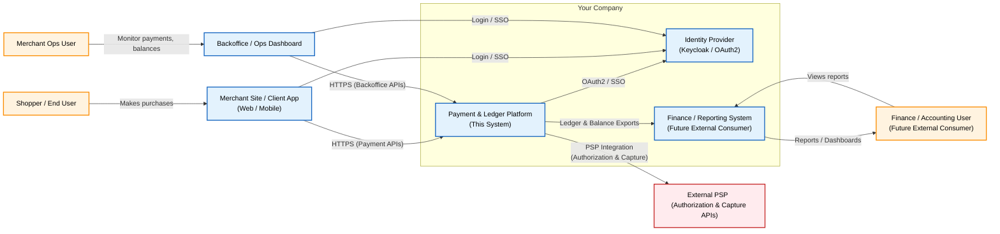
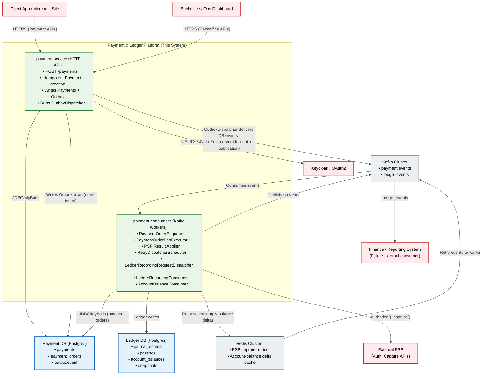
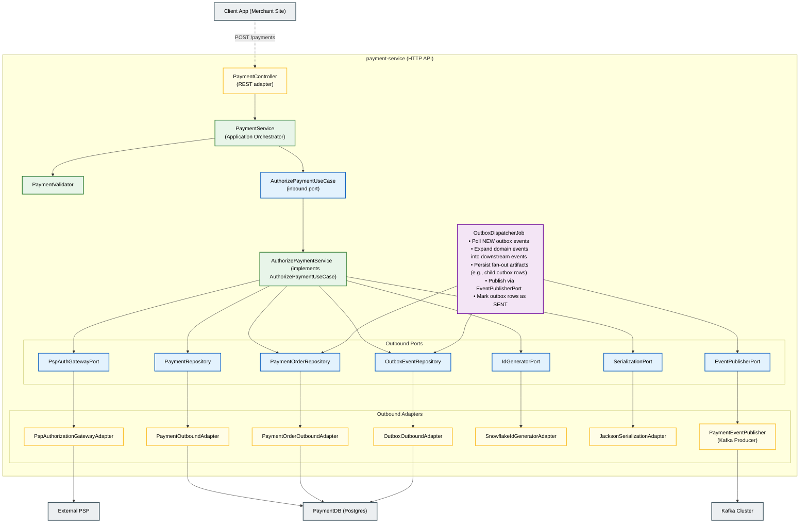

# Payment & Ledger Platform — Architecture Documentation
**Version:** 1.0  
**Audience:** Engineers, Interviewers, Architects, Auditors  
**Scope:** Payment orchestration, PSP integration, payment order processing, retries, and double-entry ledger.

---

# 0. Introduction

## 0.1 What is this system?
From this platform’s point of view, all business flows are expressed as combinations of:

- **Pay-ins**: money entering the platform from external parties (e.g., riders/shoppers)
- **Internal reallocations**: money moving between internal entities and accounts
- **Pay-outs**: money leaving the platform to external beneficiaries (e.g., drivers, sellers, tax authorities)

The platform does not encode any single marketplace or Merchant-of-Record model.
Instead, it provides a small and realistic set of financial primitives that large
multi-entity platforms (e.g., Uber, bol.com, Airbnb, Amazon Marketplace) commonly
use: authorization, capture, asynchronous processing, idempotent state transitions,
and double-entry ledger recording.

Only a representative subset is implemented — enough to demonstrate architectural
thinking, correctness guarantees, and event-driven workflow design without trying
to recreate a complete enterprise system.

- **Audience**: Backend engineers, SREs, architects, and contributors who need to
  understand the big picture.
- **Scope**: Payment + ledger infrastructure for multi-entity, MoR-style platforms,
  where external PSPs are used as gateways for pay-ins and pay-outs, and all
  flows are eventually captured in the ledger.
-

## 2 · Functional Requirements
This platform models **multi-seller Merchant-of-Record** financial flows. All business operations reduce to a combination of **pay-ins, internal reallocations, and pay-outs**, governed by strict financial invariants.

**Core Functional Invariants:**
1. **Single Shopper Authorization**
    - One PSP authorization (`pspAuthRef`) per shopper.
    - PSP never sees internal seller structure.

2. **Multi‑Seller Decomposition**
    - One `Payment` decomposes into multiple `PaymentOrder`s (one per seller).

3. **Independent Capture Pipeline**
    - Each seller capture runs asynchronously (auto‑capture or manual).
    - PSP only receives: `pspAuthRef + amount`.

4. **Seller‑Level Payout Responsibility**
    - Platform ensures receivable/payable correctness per seller.

5. **Double‑Entry Ledger as Source of Truth**
    - Every financial event (auth, capture, settlement, fees, commissions, payouts) must produce balanced journal entries.

6. **Payout‑Safe Accounting**
    - Sellers can only be paid out after required journal posting.

## 0.2 Goals
- High reliability and correctness
- Guaranteed consistency (no double-charging, no double-posting)
- Event-driven decoupling
- Payment-order level sharding
- Secure PSP integration
- Transparent observability

## 0.3 Out of Scope / Non-Goals
- Not a PSP
- Not a returns/refund platform
- Not a KYC/AML system
- Not a general marketplace backend

---

# 1. System Overview

## 1.1 High-Level Summary
- `/payments` → sync authorization
- Outbox ensures DB→Kafka consistency
- PaymentAuthorized expands into PaymentOrders
- PaymentOrder processing performed asynchronously via Kafka
- Retry logic uses Redis ZSET
- Finalization triggers ledger posting
- Ledger (double-entry) updates account balances

## 1.2 Key Design Principles
- Hexagonal architecture
- Domain-Driven Design
- Event-driven state transitions
- Outbox Pattern
- Double-entry ledger (append-only)
- Exactly-once / idempotent mutation everywhere
- Observability via trace IDs & event envelopes

---

# 2. C4 Model — Structural Views

%% RELATIONSHIPS

%% Client → payment-service
## 2.1 C1 — System Context Diagram
*Diagrams:*
- Actors (Shopper, Ops, Finance)
- Client/Merchant App
- Payment & Ledger Platform (this system)
- External PSP
- Keycloak
- Finance/Reporting (optional future)

---

## 2.2 C2 — Container Diagram (Runtime Architecture)
Containers included:
- **payment-service** (HTTP)
- **payment-consumers** (Kafka Workers)
- **Kafka Cluster**
- **Redis Cluster**
- **PaymentDB**
- **LedgerDB** (still same physical DB)
- **Keycloak**
- **PSP (external)**

---

### 2.3.1 payment-service (HTTP)
- `PaymentController`
- `PaymentApplicationService`
- `OutboxWriter`
- `OutboxDispatcher` (Scheduled Job)
- Repositories

## 2.3 C3 — Component Diagrams
payment-service

paymentorder processing pipeline

┌────────────────────────┐
│ Topic: PAYMENT_ORDER_CREATED
└──────────────┬─────────┘
│
▼
┌──────────────────────────────┐
│ PaymentOrderEnqueuer         │
│  - uses SerializationPort    │
│  - uses JacksonAdapter       │
└──────────────┬───────────────┘
│ emits CAPTURE_REQUEST
▼
┌────────────────────────┐
│ Topic: PAYMENT_ORDER_CAPTURE_REQUEST
└──────────────┬─────────┘
│
▼
┌────────────────────────────────────┐
│ PaymentOrderCaptureExecutor        │
│  - PspCaptureGatewayPort → Adapter │
│  - EventPublisherPort → Adapter    │
└──────────────┬────────────────────┘
│ calls PSP
▼
┌───────────────┐
│ External PSP   │
└──────┬────────┘
│ PSP result
▼
┌────────────────────────┐
│ Topic: PSP_RESULT_UPDATED
└──────────────┬─────────┘
│
▼
┌─────────────────────────────────────────────┐
│ PaymentOrderPspResultApplier                │
│  - PaymentOrderModificationPort → Adapter   │
│  - RetryQueuePort → RedisAdapter            │
│  - EventPublisherPort → KafkaAdapter        │
└──────────────┬───────────────┬─────────────┘
│final           │retry
│                │
▼                ▼
┌────────────────┐   ┌───────────────┐
│ FINALIZED event│   │ Redis ZSet     │
└───────┬────────┘   │ (retry queue) │
│            └───────┬────────┘
▼                    │
┌─────────────────────────────┐
│ LedgerRecordingDispatcher   │
│  - EventPublisherPort       │
└───────┬────────────────────┘
▼
┌────────────────────────────────────┐
│ Topic: PAYMENT_ORDER_FINALIZED     │
└────────────────────────────────────┘

                 Redis retry loop
                 ─────────────────

Redis ZSet (retryAt)
│
▼
┌──────────────────────────┐
│ RetryDispatcherScheduler │
│  - RetryQueuePort        │
│  - EventPublisherPort    │
└───────────────┬──────────┘
│ emits CAPTURE_REQUEST again
▼
Topic: PAYMENT_ORDER_CAPTURE_REQUEST

### 2.3.2 payment-consumers (Kafka Workers)
- `PaymentOrderEnqueuer`
- `PaymentOrderCaptureExecutor`
- `PaymentOrderPspResultApplier`
- `RetryDispatcherScheduler`
- `StatusCheckScheduler` (if used)
- `LedgerRecordingRequestDispatcher`
- `LedgerRecordingConsumer`
- `AccountBalanceConsumer`
- Shared components:
    - `KafkaTxExecutor`
    - `IdGenerator`
    - `EventEnvelopeFactory`

### 2.3.3 ledger module components (optional future)
- `LedgerPostingService`
- `AccountBalanceService`

> Insert per-container component diagrams

---

# 3. Domain Model (DDD)

## 3.1 Aggregates

### **Payment**
- id, buyerId, orderId, totalAmount
- state: `PENDING_AUTH → AUTHORIZED/DECLINED`
- emits: `PaymentAuthorized`

### **PaymentOrder**
- one per seller
- states:
    - `INITIATED_PENDING`
    - `CAPTURE_REQUESTED`
    - `RETRY_PENDING`
    - `PENDING_STATUS_CHECK`
    - `CAPTURE_SUCCEEDED_FINAL`
    - `CAPTURE_FAILED_FINAL`
- emits:
    - `PaymentOrderCreated`
    - `PaymentOrderPspResultUpdated`
    - `PaymentOrderFinalized`

### **LedgerEntry & JournalEntry**
- Debit/Credit posting
- Append-only
- idempotent posting logic

### **AccountBalance**
- seller-level
- stored snapshots
- Redis deltas

---

## 3.2 Domain Events
- `PaymentAuthorized`
- `PaymentOrderCreated`
- `PaymentOrderCaptureCommand`
- `PaymentOrderPspResultUpdated`
- `PaymentOrderFinalized`
- `LedgerRecordingCommand`
- `LedgerEntriesRecorded`

---

## 3.3 Value Objects
- `Amount`
- `Currency`
- `SellerId`
- `PaymentId`, `PaymentOrderId`
- `RetryAttempt`
- `TraceId`

---

# 4. Consistency & Transaction Boundaries

## 4.1 Payment Creation (ACID)
- Payment + Outbox<PaymentAuthorized> inserted atomically

## 4.2 Outbox Dispatch (At-Least-Once → Idempotent)
- Outbox table polled by OutboxDispatcher
- Each event published to Kafka exactly once
- Outbox row marked SENT after Kafka TX commit

## 4.3 Payment Order State Updates
- All via `updateReturningIdempotent`
- No double-finalization
- No state rollback

## 4.4 Ledger Posting
- Append-only
- Each JournalEntry validated (sum debits == sum credits)
- Idempotent posting with conflict detection

---

# 5. Dynamic Behavior — System Flows

## 5.1 Payment Authorization Flow
- `/payments` → PSP.authorize()
- update Payment
- Outbox<PaymentAuthorized>

## 5.2 Outbox Event Processing
### PaymentAuthorized:
- expand into PaymentOrders
- create Outbox<PaymentOrderCreated>
- publish `payment_authorized`

### PaymentOrderCreated:
- publish event for each seller order

### PaymentOrderCaptureCommand:
- update PaymentOrder → `CAPTURE_REQUESTED`
- publish capture request

---

## 5.3 Payment Order Processing Flow
- PaymentOrderCreated → Enqueuer
- publish CaptureRequest
- PSP call
- PSP result → PspResultApplier
- update PaymentOrder (idempotent)
- finalize or retry

---

## 5.4 Retry Flow
- Redis ZSet schedules
- backoff
- requeue PaymentOrderPspCallRequested

---

## 5.5 Ledger Recording Flow
- PaymentOrderFinalized → `LedgerRecordingCommand`
- Ledger consumes and posts entries
- AccountBalanceConsumer updates balances

> Insert single canonical sequence diagram

---

# 6. Data Architecture

## 6.1 Payment DB Schema
- tables: payments, payment_orders, outbox

## 6.2 Ledger DB Schema
- journal_entries
- postings
- account_balances
- balance_snapshots

## 6.3 Kafka Topics
- payment_order_created_topic
- payment_order_capture_request_queue_topic
- payment_order_psp_result_updated_topic
- payment_order_finalized_topic
- ledger_record_request_queue_topic
- ledger_entries_recorded_topic

---

# 7. Operational Architecture

## 7.1 Observability
- traceId & parentEventId
- structured JSON logs
- Prometheus metrics
- Outbox lag monitoring
- Retry queue depth metrics

## 7.2 Scalability
- horizontal scaling of payment-consumers
- vertical scaling of PSP executor
- seller-sharded Kafka partitions

## 7.3 Fault Tolerance
- idempotent DB updates
- DLQ logic
- retry and backoff
- outbox consistency

---

# 8. Future / Target Architecture (Optional)
- independent ledger-service
- PSP webhook integration
- multi-region partitioning
- dynamic Kafka consumer configuration
- Temporal-based workflows (optional future)

---

# 9. Glossary
- Payment
- PaymentOrder
- Outbox
- PSP
- Ledger
- Posting
- JournalEntry
- Capture
- Retry
- Finalization

---

# 10. References
- C4 Model (Simon Brown)
- Domain-Driven Design (Evans)
- Outbox Pattern (Fowler)
- Kafka Exactly-Once Semantics
- Double-Entry Bookkeeping Principles  