# ecommerce-platform-kotlin · Architecture Guide
This platform is a technical showcase designed to
demonstrate domain expertise in payments, double-entry ledger design, event-driven
architecture, idempotent workflows, and cloud-native patterns.Also
- It is not intended
  as a commercial product but as an educational and reference for fur projects

*Last updated: **2025‑01‑14** – maintained by **Doğan Çağlar***

---

## Table of Contents

1. [Purpose & Audience](#1--purposeaudience-)
2. [Functional Requirements](#2--functional-requirements)
   
   2.1 [System Context](#21-system-context)

   2.2 [Core Entities](#22-core-entities)
   
   2.3 [PAyment Bounded Context-Integration Diagram](#23-paymentboundedcontext-integration-diagram-this-diagram-shows-external-integration--boundaries)
   
   2.4 [PAyment Bounded Context-Domain Design](#24-payment-bounded-context-domain-modelthis-diagram-shows-internal-domain-aggregates-value-objects-and-events)

   2.5 [Aggregate Boundaries & Consistency(This diagram shows aggregate boundaries, consistency guarantees, and transaction scopes.](#25-aggregate-boundaries--consistencythis-diagram-shows-aggregate-boundaries-consistency-guarantees-and-transaction-scopes)
   
   2.6 [API Summary](#26-api-summary)

   2.7 [Data Flow](#27-data-flow-summary)
3. [Core Design Principles](#3--core-design-principles)
4. [Architectural Overview](#4--architectural-overview)  
   4.1 [Layering & Hexagonal Architecture](#41-layering--hexagonal-architecture)  
   4.2 [Service & Executor Landscape](#42-service--executor-landscape)  
   4.3 [Payment Flow Architecture](#43-payment-flow-architecture)  
   4.4 [Complete System Flow Architecture Diagram](#44-complete-system-flow-architecture-diagram)
   4.5 [Ledger Recording Architecture](#45-ledger-recording-architecture)
5. [Cross‑Cutting Concerns](#5--crosscutting-concerns)  
   5.1 [Outbox Pattern](#51-outbox-pattern)  
   5.2 [Retry & Status‑Check Strategy](#52-retry--statuscheck-strategy)  
   5.3 [Idempotency](#53-idempotency)  
   5.4 [Unique ID Generation](#54-unique-id-generation)
6. [Data & Messaging Design](#6--data--messaging-design)  
   6.1 [PostgreSQL Outbox Partitioning](#61-postgresql-outbox-partitioning)  
   6.2 [Kafka Partitioning by `paymentOrderId`](#62-kafka-partitioning-by-paymentorderid)  
   6.3 [EventEnvelope Contract](#63-eventenvelope-contract)
7. [Infrastructure & Deployment (Helm/K8s)](#7--infrastructure--deployment-helmk8s)  
   7.1 [Helm Charts Overview](#71-helm-charts-overview)  
   7.2 [Environments & Values](#72-environments--values)  
   7.3 [Kubernetes Objects (Deployments, Services, HPA)](#73-kubernetes-objects-deployments-services-hpa)  
   7.4 [Lag‑Based Autoscaling (consumer lag)](#74-lagbased-autoscaling-consumer-lag)  
   7.5 [CI/CD & Scripts](#75-cicd--scripts)
8. [Observability & Operations](#8--observability--operations)  
   8.1 [Metrics (Micrometer → Prometheus)](#81-metrics-micrometer--prometheus)  
   8.2 [Dashboards (Grafana)](#82-dashboards-grafana)  
   8.3 [Logging & Tracing (JSON, OTel)](#83-logging--tracing-json-otel)  
   8.4 [ElasticSearch Search Keys](#84-elasticsearch-search-keys)
9. [Module Structure](#9--module-structure)  
   9.1 [`common`](#91-common)  
   9.2 [`common-test`](#92-common-test)  
   9.3 [`payment-domain`](#93-payment-domain)  
   9.4 [`payment-application`](#94-payment-application)  
   9.5 [`payment-infrastructure` (Auto‑config)](#95-payment-infrastructure-autoconfig)  
   9.6 [Deployables: `payment-service` & `payment-consumers`](#96-deployables-payment-service--payment-consumers)
10. [Testing & Quality Assurance](#10--testing--quality-assurance)  
    10.1 [Testing Strategy](#101-testing-strategy)  
    10.2 [Test Coverage Results](#102-test-coverage-results)
11. [Quality Attributes](#11--quality-attributes)  
    11.1 [Reliability & Resilience](#111-reliability--resilience)  
    11.2 [Security](#112-security)  
    11.3 [Cloud‑Native & Deployment](#113-cloudnative--deployment)  
    11.4 [Performance & Scalability](#114-performance--scalability)
12. [Roadmap](#12--roadmap)
13. [Glossary](#13--glossary)
14. [References](#14--references)
15. [Changelog](#15--changelog)

---
## 1 · Purpose/Audience 

From this platform’s point of view, all business flows are expressed as combinations of:

- **Pay-ins**: money entering the platform from external parties (e.g., riders/shoppers)
- **Internal reallocations**: money moving between internal entities and accounts
- **Pay-outs**: money leaving the platform to external beneficiaries (e.g., drivers, sellers, tax authorities)

The platform does not encode any single marketplace or Merchant-of-Record model.
Instead, it provides a small and realistic set of financial primitives that large
multi-entity platforms (e.g., Uber, bol.com, Airbnb, Amazon Marketplace) commonly
use: authorization, capture, asynchronous processing, idempotent state transitions,
and double-entry ledger recording.

Only a representative subset is implemented — enough to demonstrate architectural
thinking, correctness guarantees, and event-driven workflow design without trying
to recreate a complete enterprise system.

- **Audience**: Backend engineers, SREs, architects, and contributors who need to
  understand the big picture.
- **Scope**: Payment + ledger infrastructure for multi-entity, MoR-style platforms,
  where external PSPs are used as gateways for pay-ins and pay-outs, and all
  flows are eventually captured in the ledger.
-


## 2 · Functional Requirements
This platform models **multi-seller Merchant-of-Record** financial flows. All business operations reduce to a combination of **pay-ins, internal reallocations, and pay-outs**, governed by strict financial invariants.

**Core Functional Invariants:**
1. **Single Shopper Authorization**
    - One PSP authorization (`pspAuthRef`) per shopper.
    - PSP never sees internal seller structure.

2. **Multi‑Seller Decomposition**
    - One `Payment` decomposes into multiple `PaymentOrder`s (one per seller).

3. **Independent Capture Pipeline**
    - Each seller capture runs asynchronously (auto‑capture or manual).
    - PSP only receives: `pspAuthRef + amount`.

4. **Seller‑Level Payout Responsibility**
    - Platform ensures receivable/payable correctness per seller.

5. **Double‑Entry Ledger as Source of Truth**
    - Every financial event (auth, capture, settlement, fees, commissions, payouts) must produce balanced journal entries.

6. **Payout‑Safe Accounting**
    - Sellers can only be paid out after required journal posting.


### 2.1 System Context

```mermaid
flowchart LR
subgraph Users
U1([Browser / Mobile App])
U2([Back‑office Portal])
end
U1 -->|REST/GraphQL|GW["🛡️ API Gateway / Ingress"]
U2 -->|REST|GW
GW --> PAY[(payment-service API)]
PAY --> K((Kafka))
K -->|events|CONS[(payment-consumers)]
K --> ANA[(Analytics / BI)]
PAY --> DB[(PostgreSQL Cluster)]
PAY --> REDIS[(Redis)]
subgraph Cloud
PAY
CONS
ANA
K
DB
REDIS
end
```



### 2.2 Core Entities
**Key Points:**
- **Payment** stores the synchronous authorization outcome (`pspRef`, `AUTHORIZED` / `FAILED`) and coordinates downstream seller captures.
- **PaymentOrder** is instantiated only after the parent payment is authorized and emits events as each seller capture/settlement progresses.
- - **PaymentOrderEvent** is representing an even interface representing the immutable events transition between payment order statuses
- **Ledger Subdomain** uses `AccountType` (auth hold, receivable/payable, scheme fees, commission) and the `JournalEntryFactory` (`authHold`, `releaseHoldOnCapture`, `capture`, `settlement`, `recognizePspFee`, `recognizeCommissionFee`, `payoutToMerchant`, `refundPrePayout`) to enforce balanced postings.
- **Shipment** listens to individual `PaymentOrderSucceeded` events for immediate fulfillment.
- All integration remains event-driven via Kafka (no direct dependencies).

### 2.3 PaymentBoundedContext Integration Diagram (This diagram shows external integration / boundaries)

This diagram shows the Payment Bounded Context and its relationships with downstream contexts, including internal aggregates and integration patterns which means

```mermaid
%%{init:{'theme':'default','flowchart':{'nodeSpacing':40,'rankSpacing':50}}}%%
flowchart TB

%% STYLE
classDef payment fill:#4CAF50,stroke:#2E7D32,stroke-width:3px,color:#fff
classDef ledger fill:#9C27B0,stroke:#6A1B9A,stroke-width:2px,color:#fff
classDef infra fill:#BDBDBD,stroke:#616161,stroke-width:2px,color:#000
classDef downstream fill:#2196F3,stroke:#0D47A1,stroke-width:2px,color:#fff

%% PAYMENT BOUNDED CONTEXT (Payment DB)
subgraph PaymentBC["Payment Bounded Context (Payment DB)"]
    direction TB

    PaymentAgg["**Payment (Coordination Aggregate)**  
    • One synchronous PSP authorization  
    • buyerId, orderId, totalAmount  
    • Emits PaymentAuthorized via outbox  
    • Lives in Payment DB  
    • Shard = businessCoordShard"]:::payment

    PaymentOrderAgg["**PaymentOrder (Processing Aggregate)**  
    • One per seller leg  
    • Handles CaptureRequested  
    • Handles PSP responses  
    • Handles retry  
    • Emits Finalized events  
    • Lives in Payment DB  
    • Seller-sharded"]:::payment

    PaymentDB["**Payment DB (Sharded)**  
    • Payments  
    • PaymentOrders  
    • Outbox  
    • Retry state  
    • No ledger data"]:::infra
end

%% INFRASTRUCTURE
subgraph Infra["Shared Infra"]
    Outbox["Outbox: DB→Kafka consistency"]:::infra
    Kafka["Kafka: Event Backbone  
          • Partitions by sellerId  
          • Partitions by businessCoordShard"]:::infra
    Redis["Redis ZSet (Retry Queue)"]:::infra
end

%% LEDGER BOUNDED CONTEXT (Ledger DB)
subgraph LedgerBC["Ledger Bounded Context (Ledger DB)"]
    direction TB

    Ledger["**Ledger (Double-Entry Domain)**  
    • Balanced JournalEntries  
    • AuthHold, Capture, Settlement, Fees, Payout  
    • Idempotent writes  
    • Append-only  
    • Snapshot for cumulative capture  
    • Processing is seller-sharded  
    • Lives in Ledger DB"]:::ledger

    LedgerDB["**Ledger DB (Separate Cluster)**  
    • ledger_entries  
    • journal_entries  
    • account_balances  
    • balance_snapshots  
    • Sharded by sellerId"]:::ledger

    Finance["**Finance / Payouts**  
    • Consumes LedgerEntriesRecorded  
    • Maintains balances  
    • Executes payouts"]:::downstream
end

%% PSP
PSP["**PSP (External Provider)**  
• Sync shopper auth  
• Async partial captures  
• Stateless"]:::downstream

%% FLOWS

%% Payment creation
PaymentAgg -->|"OutboxEvent<PaymentAuthorized>"| Outbox
PaymentOrderAgg -->|"OutboxEvent<PaymentOrderCreated>"| Outbox
Outbox -->|"payment_authorized / order_created"| Kafka

Kafka -->|"PaymentAuthorized"| PaymentOrderAgg

%% Capture pipeline
PaymentOrderAgg -->|"CaptureRequested"| Kafka
Kafka -->|"CaptureRequested"| PSP
PSP -->|"PspResultUpdated"| Kafka
Kafka -->|"PspResultUpdated"| PaymentOrderAgg

%% Retry 
PaymentOrderAgg -->|"RetryScheduled"| Redis
Redis -->|"RetryDue"| Kafka
Kafka -->|"RetryDue"| PaymentOrderAgg

%% Ledger flow
PaymentOrderAgg -->|"PaymentOrderFinalized"| Kafka
Kafka -->|"PaymentOrderFinalized"| Ledger
Ledger -->|"LedgerEntriesRecorded"| LedgerDB
LedgerDB -->|"BalanceUpdated / Events"| Finance
```



### 2.4 Payment Bounded Context Domain Model(This diagram shows internal domain aggregates, value objects, and events)

```mermaid
%%{init:{'theme':'default','flowchart':{'nodeSpacing':60,'rankSpacing':70}}}%%
flowchart LR

classDef aggregate fill:#4CAF50,stroke:#1B5E20,stroke-width:3px,color:white
classDef entity fill:#66BB6A,stroke:#2E7D32,stroke-width:2px,color:white
classDef valueobj fill:#A5D6A7,stroke:#558B2F,stroke-width:2px
classDef event fill:#2196F3,stroke:#0D47A1,stroke-width:2px,color:white
classDef ledger fill:#9C27B0,stroke:#6A1B9A,stroke-width:3px,color:white
classDef infra fill:#BDBDBD,stroke:#616161,stroke-width:2px
classDef consumer fill:#FF9800,stroke:#E65100,stroke-width:2px,color:white


%% PAYMENT BC
subgraph Payment_BC["Payment Bounded Context (Payment DB)"]
direction TB

PaymentAgg["**Payment (Coordination Aggregate)**  
• buyerId, orderId, totalAmount  
• One synchronous PSP authorization  
• Emits: PaymentAuthorized  
• Lives in Payment DB  
• Shard = PaymentId (business unit)"]:::aggregate

PaymentOrderAgg["**PaymentOrder (Processing Aggregate)**  
• One per seller leg  
• Handles CaptureRequested  
• Handles PSP responses  
• Handles retry  
• Emits: PaymentOrderCreated →  
         PaymentOrderPspResultUpdated →  
         PaymentOrderFinalized  
• Lives in Payment DB  
• Shard = SellerId"]:::aggregate

PaymentOrderEntity["PaymentOrder\n(entity)"]:::entity

ValueObjects["Value Objects:\n• PaymentId\n• PaymentOrderId\n• SellerId\n• Amount\n• Currency"]:::valueobj

Events1["Domain Events:\n• PaymentAuthorized\n• PaymentOrderCreated"]:::event
Events2["Domain Events:\n• CaptureRequested\n• PaymentOrderPspResultUpdated\n• PaymentOrderFinalized"]:::event

PaymentAgg --> Events1
PaymentOrderAgg --> Events2

PaymentOrderAgg --> PaymentOrderEntity
PaymentOrderEntity --> ValueObjects

end


%% INFRASTRUCTURE
subgraph Infrastructure["Infrastructure Layer"]
direction TB

Outbox["Outbox (DB→Kafka)"]:::infra
Kafka["Kafka (Event Backbone)\nSharded by SellerId for payment-order topics"]:::infra
Redis["Redis ZSET (Retry Queue)\nBackoff scheduling"]:::infra

Events1 --> Outbox
Events2 --> Kafka

Outbox --> Kafka
Redis --> Kafka

end


%% LEDGER BC
subgraph Ledger_BC["Ledger Bounded Context (Separate Ledger DB)"]
direction TB

LedgerAgg["**Ledger (Double-Entry Aggregate Root)**  
• Balanced journal entries  
• AuthHold, Capture, Settlement, Fees, Payout  
• Append-only  
• Idempotent  
• Lives in Ledger DB  
• Shard = SellerId"]:::ledger

JournalEntry["JournalEntry\nentity"]:::ledger
Posting["Posting (Debit/Credit)\nvalue object"]:::ledger
Account["Account / AccountType\n(value objects)"]:::ledger
AccountBalance["AccountBalance\n(entity, versioned)"]:::ledger

LedgerEvents["Ledger Events:\n• LedgerEntriesRecorded\n• BalanceUpdated"]:::event

LedgerAgg --> JournalEntry --> Posting
LedgerAgg --> AccountBalance
LedgerAgg --> Account
LedgerAgg --> LedgerEvents

end


%% EVENT FLOW ACROSS CONTEXTS
PaymentOrderAgg -.->|"PaymentOrderFinalized"| Kafka
Kafka -.->|"LedgerRecordingCommand"| LedgerAgg

LedgerEvents -.->|"export to Finance/Payout"| consumer["Finance / Payout Systems"]:::consumer
```




### 2.4.3 Domain Identity Strategy (Snowflake-Sharded IDs)

The Payment domain uses **Snowflake-style globally unique, time-ordered IDs** for all aggregates:

- `PaymentId`
- `PaymentOrderId`

These IDs encode:

1. **Timestamp (millisecond precision)**
2. **Region identifier**
3. **Shard identifier (0–31)**
4. **Sequence number**

This ensures:

- Monotonic ordering
- Deterministic routing
- Stable idempotency keys
- High scalability
- No global coordination bottlenecks

### Shard Sources

| Aggregate | Shard Strategy | Rationale |
|----------|----------------|-----------|
| **Payment** | `coordShard(buyerId, orderId)` | Natural grouping around buyer/order lineage. |
| **PaymentOrder** | `sellerShard(sellerId)` | Scaling horizontally by seller; avoids hot partitions. |

### Domain Invariants

1. IDs are always **generated via IdGeneratorPort**.
2. Aggregates **never** generate their own IDs.
3. IDs must remain **stable across retries, outbox recovery, and reprocessing**.
4. IDs must be **sortable**, ensuring event ordering across flows:
    - payment → order_created → capture_requested → psp_result → ledger

### Why Snowflake?

- Horizontally scalable
- Leaderless, zero-coordination
- Perfect alignment with Kafka partitioning
- Enables natural isolation for “hot” merchants or buyers
### 2.5 Aggregate Boundaries & Consistency(This diagram shows aggregate boundaries, consistency guarantees, and transaction scopes.)

```mermaid
%%{init:{'theme':'default','flowchart':{'nodeSpacing':70,'rankSpacing':70}}}%%
flowchart TB

classDef agg fill:#4CAF50,stroke:#1B5E20,stroke-width:3px,color:white
classDef event fill:#2196F3,stroke:#0D47A1,stroke-width:2px,color:white
classDef infra fill:#9E9E9E,stroke:#555,width:2px,color:white
classDef bc fill:#673AB7,stroke:#4527A0,stroke-width:3px,color:white
classDef note fill:#FFF8E1,stroke:#F9A825,color:black

%% ========== PAYMENT BC ==========
subgraph PaymentBC["Payment Bounded Context (Payment DB)"]
direction TB

Payment["**Payment (Coordination Aggregate)**  
• One per buyer order  
• Synchronous authorization only  
• No per-seller correctness  
• Strict consistency using DB txn  
• Emits PaymentAuthorized"]:::agg

PaymentOrder["**PaymentOrder (Processing Aggregate)**  
• One per seller leg  
• Manages capture, retries, PSP responses  
• Emits: PaymentOrderCreated → PspResultUpdated → Finalized  
• Fully consistent inside aggregate  
• Sharded by sellerId"]:::agg

end

%% EVENTS
Payment -->|"domain event\nPaymentAuthorized"| Outbox:::infra
PaymentOrder -->|"domain events\n• PaymentOrderCreated\n• PspResultUpdated\n• PaymentOrderFinalized"| Kafka:::infra

%% INFRASTRUCTURE
Outbox["Outbox Table (DB → Kafka)\nexactly-once bridging"]:::infra
Kafka["Kafka (Event Backbone)\nTopics sharded by sellerId"]:::infra


%% ========== LEDGER BC ==========
subgraph LedgerBC["Ledger Bounded Context (Ledger DB)"]
direction TB

Ledger["**Ledger (Double-Entry Aggregate)**  
• AuthHold, Capture, Settlement  
• Append-only  
• Idempotent  
• Sharded by sellerId  
• Strict consistency inside aggregate"]:::bc

LedgerEvents["LedgerEntriesRecorded\nBalanceUpdated"]:::event

Ledger --> LedgerEvents

end


%% CROSS-BC EVENT FLOW
Kafka -->|"event\nPaymentOrderFinalized"| Ledger

%% Notes
note1["**Strict consistency only inside each aggregate**  
• Payment operations are ACID within Payment aggregate  
• PaymentOrder operations are ACID within PaymentOrder aggregate  
• Ledger writes are ACID within Ledger aggregate"]:::note

note2["**No cross-aggregate transactions**  
Communication between aggregates uses events  
(Kafka + Outbox + idempotent handlers)"]:::note

note3["**Sharding boundaries**  
• Payment shard = paymentId  
• PaymentOrder shard = sellerId  
• Ledger shard = sellerId"]:::note

note1 --- PaymentBC
note2 --- Kafka
note3 --- LedgerBC
```




**Key DDD Concepts:**
- **Payment**: Coordination aggregate root representing a multi-seller checkout (e.g., Amazon shopping cart). Contains multiple `PaymentOrder` objects (1:N), one per seller.
    - **Coordination Role**: Tracks overall payment completion status across all `PaymentOrder` objects
    - **Use Case**: When a shopper checks out with products from multiple sellers, one `Payment` contains multiple `PaymentOrders` (one per seller)
    - **Cross-Domain Events**: When all `PaymentOrder` objects are finalized (succeed/fail), `Payment` can optionally be updated and emit `PaymentCompleted` event for overall order tracking
    - **Note**: Shipment domain listens to individual `PaymentOrderSucceeded` events (not `PaymentCompleted`) to immediately initiate shipment for that seller's products - they don't wait for other sellers' payments
    - **Dual Purpose**: Container for initial persistence + optional coordination point for overall payment status
- **PaymentOrder**: Processing aggregate root for PSP interactions. Represents payment for a single seller's products in a multi-seller checkout.
    - **Real-World Example**: Amazon checkout - shopper has products from Seller A, B, and C → creates Payment with 3 PaymentOrders
    - **Independent Processing**: Each `PaymentOrder` is processed independently:
        - Separate PSP call per `PaymentOrder` (each seller gets independent PSP processing)
        - Independent retry logic and status tracking
        - Individual event emission (`PaymentOrderCreated`, `PaymentOrderSucceeded`, `PaymentOrderFailed`)
        - Processed via Kafka consumers using `paymentOrderId` as partition key
    - **Immediate Downstream Actions**: When `PaymentOrderSucceeded` event is emitted for Seller A:
        - Shipment domain immediately starts shipping Seller A's products (doesn't wait for Seller B or C)
        - Enables parallel fulfillment across different sellers
    - **Coordination Trigger**: When all `PaymentOrder` statuses are terminal, triggers optional `Payment` status evaluation
- **Separate Aggregate**: `JournalEntry` forms its own aggregate boundary for ledger
- **Consistency Boundaries**: Each aggregate maintains immediate consistency; eventual consistency between aggregates via events
- **Transaction Scope**: Database transactions for initial Payment+PaymentOrders creation; Kafka transactions for PaymentOrder processing; separate DB transactions per PaymentOrder status updates; eventual Payment status update when all PaymentOrders complete

### 2.6 API Summary
Authentication

All endpoints require:

Authorization: Bearer <access-token>
Idempotency-Key: <unique-key>   // for POST endpoints
Content-Type: application/json

POST /payments

Create a new payment + perform synchronous authorization.

Headers
•	Authorization: Bearer …
•	Idempotency-Key: …

Response Codes
•	202 Accepted — Authorization succeeded, processing continues async
•	402 Payment Required — Authorization declined
•	400 Bad Request — Invalid request
•	409 Conflict — Idempotency key reuse mismatch
•	401 / 403 — Auth errors

⸻

POST /payments/{paymentId}/capture

Trigger manual capture for a seller leg.

Headers
•	Authorization: Bearer …
•	Idempotency-Key: …

Response Codes
•	202 Accepted — Capture command queued
•	404 Not Found — Payment or seller leg missing
•	409 Conflict — Duplicate or invalid capture
•	400 Bad Request — Invalid body
•	401 / 403 — Auth errors

⸻

GET /payments/{paymentId}

Retrieve payment status (buyer-level).

Headers
•	Authorization: Bearer …

Response Codes
•	200 OK
•	404 Not Found
•	401 / 403

⸻

GET /payments/{paymentId}/orders

Retrieve all PaymentOrders (seller-level).

Headers
•	Authorization: Bearer …

Response Codes
•	200 OK
•	404 Not Found
•	401 / 403

### 2.7 Data Flow Summary

```mermaid
sequenceDiagram
    autonumber
    participant Client as Client
    participant PaymentService as payment-service (API)
    participant PSPAuth as PSP Authorization API
    participant PaymentDB as Payment DB Cluster
    participant OutboxJob as OutboxDispatcherJob
    participant Kafka as Kafka (event backbone)
    participant Enqueuer as PaymentOrderEnqueuer
    participant CaptureExec as PaymentOrderCaptureExecutor
    participant PSP as PSP Capture API
    participant Applier as PaymentOrderPspResultApplier
    participant Retry as Redis RetryQueue (ZSET)
    participant Final as LedgerRecordingRequestDispatcher
    participant LedgerConsumer as LedgerRecordingConsumer
    participant LedgerDB as Accounting / Ledger DB Cluster

    %% ============================
    %% 1. Synchronous Authorization
    %% ============================
    Client->>PaymentService: POST /payments
    PaymentService->>PSPAuth: authorize(orderTotal, cardInfo)
    PSPAuth-->>PaymentService: authResult(APPROVED / DECLINED)

    alt Approved
        PaymentService->>PaymentDB: TX: Persist Payment(PENDING_AUTH→AUTHORIZED)\n+ outbox<PaymentAuthorized>
        PaymentService-->>Client: 202 Accepted
    else Declined
        PaymentService->>PaymentDB: TX: Persist Payment(DECLINED)
        PaymentService-->>Client: 402 Payment Required
    end


    %% =============================================
    %% 2. Manual Capture Request per seller
    %% =============================================
    Client->>PaymentService: POST /payments/{paymentId}/capture\n{sellerId, amount}
    PaymentService->>PaymentDB: Validate + insert outbox<PaymentOrderCaptureCommand>
    PaymentService-->>Client: 202 Accepted (capture queued)


    %% =============================================
    %% 3. OutboxDispatcherJob — on Payment DB
    %% =============================================
    OutboxJob->>PaymentDB: Fetch NEW outbox rows\n(PaymentAuthorized / PaymentOrderCreated / CaptureCmd)

    %% 3.1 PaymentAuthorized → expand into PaymentOrders
    OutboxJob->>OutboxJob: Expand PaymentAuthorized → N PaymentOrders\n(one per seller leg)
    OutboxJob->>PaymentDB: Insert PaymentOrders (per seller)
    OutboxJob->>PaymentDB: Insert outbox<PaymentOrderCreated[]>(per seller)
    OutboxJob->>Kafka: Publish PaymentAuthorized

    %% 3.2 PaymentOrderCreated passthrough
    OutboxJob->>Kafka: Publish PaymentOrderCreated
    OutboxJob->>PaymentDB: Mark outbox row SENT

    %% 3.3 PaymentOrderCaptureCommand (manual capture)
    OutboxJob->>PaymentDB: Update PaymentOrder → CAPTURE_REQUESTED
    OutboxJob->>Kafka: Publish PaymentOrderCaptureRequested
    OutboxJob->>PaymentDB: Mark outbox row SENT


    %% =============================================
    %% 4. Enqueuer → PSP Capture Requested (auto-capture)
    %% =============================================
    Kafka->>Enqueuer: Consume PaymentOrderCreated
    Enqueuer->>PaymentDB: Update PaymentOrder status to CAPTURE_REQUESTED
    Enqueuer->>Kafka: Publish PaymentOrderCaptureRequested\n(auto-capture path)


    %% =============================================
    %% 5. Capture Executor (PSP call)
    %% =============================================
    Kafka->>CaptureExec: Consume PaymentOrderCaptureRequested
    CaptureExec->>PaymentDB: Load PaymentOrder snapshot\n(shard = sellerId)
    CaptureExec->>PSP: capture(sellerAmount, authRef)
    PSP-->>CaptureExec: captureResult
    CaptureExec->>Kafka: Publish PaymentOrderPspResultUpdated\n(EOS: produce + commit offsets)


    %% =============================================
    %% 6. Result Applier (Payment DB)
    %% =============================================
    Kafka->>Applier: Consume PaymentOrderPspResultUpdated
    Applier->>PaymentDB: Update PaymentOrder status + retryCount

    alt Retryable PSP status
        Applier->>Retry: ZADD retryQueue(dueAt, paymentOrderId)
    else Final (CAPTURED or FAILED)
        Applier->>Kafka: Publish PaymentOrderFinalized
    end


    %% =============================================
    %% 7. Redis Retry Dispatcher (on seller shard)
    %% =============================================
    Retry->>Kafka: Publish PaymentOrderCaptureRequested\n(for due retry items)


    %% =============================================
    %% 8. Ledger Recording (Accounting DB)
    %% =============================================
    Kafka->>Final: Consume PaymentOrderFinalized
    Final->>Kafka: Publish LedgerRecordingCommand\n(key = sellerId)

    Kafka->>LedgerConsumer: Consume LedgerRecordingCommand
    LedgerConsumer->>LedgerDB: Append JournalEntries\n+ update AccountBalance (seller shard)
    LedgerConsumer->>Kafka: Publish LedgerEntriesRecorded
```




## 3 · Core Design Principles

| Principle                  | Application in the Codebase                                                                                                       |
|----------------------------|-----------------------------------------------------------------------------------------------------------------------------------|
| **Domain‑Driven Design**   | Clear bounded contexts (`payment`, `wallet`, `shipment`, …) with domain, application, adapter, and config layers in every module. **Factory-enforced invariants**: Core domain classes (`Account`, `Amount`, `JournalEntry`, `Posting`) use private constructors with validated factory methods to ensure all objects are created in valid states. |
| **Hexagonal Architecture** | Domain code depends on *ports* (interfaces); adapters implement them (JPA, Kafka, Redis, PSP, …).                                 |
| **Event‑Driven**           | Kafka is the backbone; every state change is emitted as an `EventEnvelope<T>`.                                                    |
| **Outbox Pattern**         | Events are written atomically with DB changes and reliably published by dispatchers.                                              |
| **API Isolation from External Dependencies** | **Critical Design Principle**: PSP capture/settlement operations remain fully asynchronous in `payment-consumers`, isolating user traffic from long-running work. The web layer now performs a **synchronous authorization** call (fast, single-shot) during payment creation to guarantee an auth hold exists before expanding into seller obligations. All follow-up PSP interactions (capture, retries, settlements) execute asynchronously, so PSP latency still cannot stall post-authorization flows. |
| **Observability First**    | JSON logs with `traceId`, Prometheus metrics, and OpenTelemetry (planned) tracing.                                                |
| **Cloud‑Native**           | Containerized apps, Helm charts, Kubernetes HPA, externalized configuration.                                                      |

---

## 4 · Architectural Overview

### 4.1 Layering & Hexagonal Architecture

```
┌───────────────────────────┐
│        Config Layer       │  ➜ Spring Boot wiring, profiles, auto‑config
├───────────────────────────┤
│      Adapter Layer        │  ➜ JPA, Kafka, Redis, PSP, REST controllers
├───────────────────────────┤
│    Application Layer      │  ➜ Use cases and orchestration services
├───────────────────────────┤
│       Domain Layer        │  ➜ Aggregates, value objects, domain services, ports
└───────────────────────────┘
```

*Only the Domain layer knows nothing about Spring, databases, or Kafka.*

### 4.2 Service & Executor Landscape

```mermaid
%%{init:{'theme':'default','flowchart':{'nodeSpacing':70,'rankSpacing':70}}}%%
flowchart LR
    classDef service fill: #e6f5ea, stroke: #34A853, stroke-width: 3px;
    classDef adapter fill: #f3e8fd, stroke: #A142F4, stroke-width: 3px;
    classDef infra fill: #fde8e6, stroke: #EA4335, stroke-width: 3px;
    A["payment-service<br/>REST + Outbox Dispatcher"]:::service
    B["payment-consumers<br/>Enqueuer + PSP Call Executor + Result Applier"]:::service
    K((Kafka)):::infra
    DB[(PostgreSQL)]:::infra
    R[(Redis)]:::infra
    PSP[(Mock PSP)]:::infra
    A -->|Outbox →| K
    B -->|Consumes| K
    A --> DB
    A --> R
    B --> R
    B --> PSP
```



> **Current Architecture (Jan‑2025):** `payment-consumers` contains six specialized consumers organized into **three independent flows**:
> - **PSP Flow** (3 consumers):
    >   - **PaymentOrderEnqueuer** *(reads `payment_order_created_topic` and enqueues PSP call tasks)*
>   - **PaymentOrderPspCallExecutor** *(invokes PSP **capture** endpoint and publishes results)*
>   - **PaymentOrderPspResultApplier** *(applies PSP results and manages retries)*
> - **Status Check Flow** (1 consumer):
    >   - **ScheduledPaymentStatusCheckExecutor** *(handles async status check requests)*
> - **Ledger Flow** (2 consumers):
    >   - **LedgerRecordingRequestDispatcher** *(routes finalized payments to ledger queue)*
>   - **LedgerRecordingConsumer** *(creates double-entry journal entries)*
>
> **Independent Scaling & Flow Isolation**: Each flow uses separate Kafka topics and consumer groups:
> - **PSP Flow**: Consumer groups `payment-order-*-consumer-group` (concurrency=8), topics `payment_order_*_topic` (48 partitions)
> - **Status Check Flow**: Consumer group `payment-status-check-scheduler-consumer-group` (concurrency=1), topic `payment_status_check_scheduler_topic` (1 partition)
> - **Ledger Flow**: Consumer groups `ledger-*-consumer-group` (concurrency=4), topics `ledger_*_topic` (24 partitions)
> - **Benefits**: PSP processing never impacted by ledger bottlenecks; ledger recording never impacted by PSP latency; each flow scales independently based on its consumer lag

### 4.3 Payment Flow Sequence Diagram

```mermaid
sequenceDiagram
    autonumber
    participant Client
    participant PaymentService as payment-service (API)
    participant PSPAuth as PSP Authorization API
    participant PaymentDB as Payment DB (Payment + Outbox)
    participant OutboxJob as OutboxDispatcherJob
    participant Kafka as Kafka
    participant Enqueuer as PaymentOrderEnqueuer
    participant PspExec as PaymentOrderPspCallExecutor
    participant PspApply as PaymentOrderPspResultApplier
    participant Retry as Redis RetryQueue (ZSET)

    %% 1. Synchronous shopper authorization
    Client->>PaymentService: POST /api/v1/payments\n{buyerId, orderId, totalAmount, paymentOrders}
    PaymentService->>PSPAuth: authorize(totalAmount, cardInfo)
    PSPAuth-->>PaymentService: authResult(APPROVED / DECLINED)

    alt Approved
        PaymentService->>PaymentDB: TX: persist Payment(PENDING_AUTH→AUTHORIZED)\n+ outbox<Payment* event>
        PaymentService-->>Client: 202 Accepted (auth ok, seller legs async)
    else Declined
        PaymentService->>PaymentDB: TX: persist Payment(DECLINED)
        PaymentService-->>Client: 402 Payment Required
    end

    %% 2. Outbox → Payment + seller legs expansion
    OutboxJob->>PaymentDB: poll NEW outbox events
    OutboxJob->>OutboxJob: expand Payment* event → N PaymentOrders (one per seller)
    OutboxJob->>PaymentDB: insert PaymentOrders + nested outbox<PaymentOrderCreated[]>
    OutboxJob->>Kafka: publish PaymentAuthorized
    OutboxJob->>Kafka: publish PaymentOrderCreated (per seller)
    OutboxJob->>PaymentDB: mark outbox rows SENT

    %% 3. PSP capture flow per seller leg
    Kafka->>Enqueuer: consume PaymentOrderCreated
    Enqueuer->>Kafka: publish PaymentOrderPspCallRequested

    Kafka->>PspExec: consume PaymentOrderPspCallRequested
    PspExec->>PSPAuth: capture(sellerAmount, authRef)
    PSPAuth-->>PspExec: captureResult
    PspExec->>Kafka: publish PaymentOrderPspResultUpdated

    Kafka->>PspApply: consume PaymentOrderPspResultUpdated
    alt Retryable PSP status
        PspApply->>PaymentDB: update PaymentOrder status + retryCount
        PspApply->>Retry: ZADD retryQueue(dueAt, paymentOrderId)
    else Final (CAPTURED or FINAL_FAILED)
        PspApply->>PaymentDB: update PaymentOrder terminal status
        PspApply->>Kafka: publish PaymentOrderFinalized
    end

    %% 4. Retry dispatcher (loop)
    Retry->>Kafka: publish PaymentOrderPspCallRequested\n(for due retry items)
```



### 4.4 End to End Flow Architecture Diagram

This diagram shows all three independent flows (PSP, Ledger, Balance) and their complete interaction patterns, partition keys, and scaling characteristics.

```mermaid
flowchart TB
    classDef api fill:#e3f2fd,stroke:#1976D2,stroke-width:3px,color:#000
    classDef db fill:#fff8e1,stroke:#FBC02D,stroke-width:2px,color:#000
    classDef kafka fill:#f3e5f5,stroke:#8E24AA,stroke-width:2px,color:#000
    classDef svc fill:#e8f5e9,stroke:#388E3C,stroke-width:2px,color:#000
    classDef ext fill:#ffebee,stroke:#C62828,stroke-width:2px,color:#000
    classDef redis fill:#fff3e0,stroke:#FB8C00,stroke-width:2px,color:#000

    %% API + DB
    subgraph API["payment-service (REST API)"]
      REST["PaymentController / PaymentService\nPOST /api/v1/payments"]:::api
      OutboxJob["OutboxDispatcherJob\n(batch poller)"]:::svc
    end

    subgraph DB["Payment DB (PostgreSQL)"]
      PaymentTbl["payments\n(Payment aggregate)"]:::db
      PaymentOrderTbl["payment_orders\n(PaymentOrder aggregate)"]:::db
      OutboxTbl["outbox_event\n(partitioned)"]:::db
    end

    %% Kafka backbone
    subgraph Backbone["Kafka (event backbone)"]
      PO_CREATED["payment_order_created_topic\nkey = paymentOrderId"]:::kafka
      PSP_CALL_REQ["payment_order_psp_call_requested_topic\nkey = paymentOrderId"]:::kafka
      PSP_RESULT["payment_order_psp_result_updated_topic\nkey = paymentOrderId"]:::kafka
      PO_FINAL["payment_order_finalized_topic\nkey = paymentOrderId"]:::kafka
      LEDGER_REQ["ledger_record_request_queue_topic\nkey = sellerId"]:::kafka
      LEDGER_REC["ledger_entries_recorded_topic\nkey = sellerId"]:::kafka
    end

    %% PSP flow (payment-consumers)
    subgraph PSP_FLOW["payment-consumers · PSP flow"]
      Enqueuer["PaymentOrderEnqueuer\n(consumes PO_CREATED,\nproduces PSP_CALL_REQ)"]:::svc
      PspExec["PaymentOrderPspCallExecutor\n(consumes PSP_CALL_REQ,\ncalls PSP capture,\nproduces PSP_RESULT)"]:::svc
      PspApply["PaymentOrderPspResultApplier\n(consumes PSP_RESULT,\nupdates DB, schedules retry,\nproduces PO_FINAL)"]:::svc
    end

    subgraph RetryFlow["Redis retry"]
      RetryZSet["Redis ZSet\nretry queue (backoff)"]:::redis
      RetrySched["RetryDispatcherScheduler\n(polls ZSet,\nrepublishes PSP_CALL_REQ)"]:::svc
    end

    %% Ledger flow (payment-consumers)
    subgraph LedgerFlow["payment-consumers · ledger flow"]
      LedgerDisp["LedgerRecordingRequestDispatcher\n(consumes PO_FINAL,\nproduces LEDGER_REQ\nkey = sellerId)"]:::svc
      LedgerCons["LedgerRecordingConsumer\n(consumes LEDGER_REQ,\nappends journal entries,\nproduces LEDGER_REC)"]:::svc
    end

    subgraph LedgerDB["Ledger DB (PostgreSQL)"]
      Journal["journal_entries"]:::db
      Postings["postings"]:::db
    end

    PSP["External PSP\n(auth + capture)"]:::ext

    %% API -> DB
    REST -->|"POST /payments\n(auth + persist)"| PaymentTbl
    REST -->|"TX: Payment + Outbox"| OutboxTbl

    %% Outbox dispatcher
    OutboxTbl -->|"poll NEW"| OutboxJob
    OutboxJob -->|"expand Payment → PaymentOrders\n+ nested outbox rows"| PaymentOrderTbl
    OutboxJob -->|"publish PaymentOrderCreated"| PO_CREATED
    OutboxJob -->|"publish PaymentAuthorized"| Backbone

    %% PSP flow wiring
    PO_CREATED -->|"consume"| Enqueuer
    Enqueuer -->|"publish PSP call request"| PSP_CALL_REQ

    PSP_CALL_REQ -->|"consume"| PspExec
    PspExec -->|"capture() call"| PSP
    PSP -->|"result"| PspExec
    PspExec -->|"publish PSP result"| PSP_RESULT

    PSP_RESULT -->|"consume"| PspApply
    PspApply -->|"update PaymentOrder\nstatus + retryCount"| PaymentOrderTbl
    PspApply -->|"finalized"| PO_FINAL
    PspApply -->|"schedule retry"| RetryZSet

    %% Retry pipeline
    RetryZSet -->|"due items"| RetrySched
    RetrySched -->|"republish PSP call request"| PSP_CALL_REQ

    %% Ledger flow wiring
    PO_FINAL -->|"consume"| LedgerDisp
    LedgerDisp -->|"publish LedgerRecordingCommand\n(key = sellerId)"| LEDGER_REQ

    LEDGER_REQ -->|"consume"| LedgerCons
    LedgerCons -->|"append journal entries"| Journal
    Journal --> Postings
    LedgerCons -->|"publish LedgerEntriesRecorded"| LEDGER_REC
```



**Key Design Points Illustrated:**
- **Auth + API Isolation**: REST controller performs a bounded PSP authorization, then returns `202 Accepted` while all captures remain asynchronous.
- **Flow Independence**: PSP Flow (concurrency=8) completely separate from Ledger Flow (concurrency=4)
- **Partition Key Switch**: Payment flow uses `paymentOrderId`, Ledger flow switches to `sellerId` at dispatcher
- **Kafka Transactions**: All consumers use `KafkaTxExecutor` for atomic offset commit + DB writes + event publish
- **Idempotency**: DB-level constraints (`ON CONFLICT DO NOTHING`) and idempotent updates prevent duplicates
- **Scaling**: Each flow scales independently based on its own consumer lag metrics

### 4.5 Account Balance Architecture

#### Purpose

The account balance system maintains real-time, idempotent balance aggregation from double-entry ledger postings using a **two-tier storage architecture** optimized for both speed and durability.

#### Design Overview

**Two-Tier Storage Strategy:**
1. **Hot Layer (Redis)**: Accumulates balance deltas with TTL (5 minutes) and watermarking for idempotency
2. **Cold Layer (PostgreSQL)**: Stores durable snapshots with `last_applied_entry_id` for consistency

**Key Components:**
- **AccountBalanceConsumer**:
    - Batch consumer processing `LedgerEntriesRecorded` events (concurrency=4, partitioned by `sellerId`)
    - Consumes batches of 100-500 events (Kafka batch size)
    - Uses `KafkaTxExecutor` for atomic offset commit + processing
    - Extracts all ledger entries from batch, converts to domain objects, passes to service

- **AccountBalanceService**:
    - Processes list of `LedgerEntry` domain objects (from batch)
    - Extracts all postings, groups by account code
    - **Batch loads** current snapshots from PostgreSQL (`findByAccountCodes`) for efficiency
    - For each account: filters postings by watermark, computes delta, updates Redis atomically
    - Marks accounts as dirty for snapshot job processing

- **AccountBalanceSnapshotJob**:
    - Scheduled job (every 1 minute, configurable via `account-balance.snapshot-interval`)
    - Reads dirty accounts from Redis set
    - For each dirty account: atomically gets and resets delta, merges to snapshot, saves to DB
    - Uses database watermark guard to prevent concurrent overwrites

- **AccountBalanceReadService**: Provides two read patterns:
    - `getRealTimeBalance()`: Fast read (`snapshot + redis.delta`, non-consuming)
    - `getStrongBalance()`: Strong consistency read (consumes delta, merges immediately, returns)

#### Balance Flow Sequence


#### Idempotency & Watermarking

**Watermark-Based Duplicate Prevention (Two-Level Protection):**

1. **Consumer-Level Filtering** (`AccountBalanceService`):
    - Loads current snapshot watermarks from PostgreSQL (batch query: `findByAccountCodes`)
    - Filters postings: `WHERE ledger_entry_id > lastAppliedEntryId` before computing deltas
    - Only processes new ledger entries that haven't been applied yet
    - Prevents duplicate delta accumulation in Redis on replay/retry

2. **Database-Level Watermark Guard** (`insertOrUpdateSnapshot`):
    - PostgreSQL UPSERT includes WHERE clause: `WHERE account_balances.last_applied_entry_id < EXCLUDED.last_applied_entry_id`
    - Update only proceeds if new watermark is **strictly greater** than current watermark
    - Protects against concurrent snapshot job executions and race conditions
    - Ensures snapshots always advance monotonically (no rollbacks)

**Atomic Operations:**
- **Redis Lua Script (`addDeltaAndWatermark`)**:
    - `HINCRBY` on delta field (atomic increment)
    - `HSET` watermark if new value is higher
    - `EXPIRE` sets TTL on hash (5 minutes)
    - `SADD` adds account to dirty set (also with TTL)
- **Redis Lua Script (`getAndResetDeltaWithWatermark`)**:
    - `HGET` retrieves delta and watermark atomically
    - `HSET` resets delta to 0 (prevents double-counting)
    - Returns both values for merging
- **PostgreSQL UPSERT**: `ON CONFLICT (account_code) DO UPDATE` with watermark guard ensures safe concurrent writes

**Delta Reset Mechanism:**
- Snapshot job calls `getAndResetDeltaWithWatermark()` which **resets delta to 0** after reading
- This prevents the same delta from being merged multiple times if job runs concurrently
- If merge fails after reset, delta is lost but snapshot remains correct (can recompute from ledger)

**TTL as Backup:**
- Redis deltas have 5-minute TTL (configurable via `account-balance.delta-ttl-seconds`)
- Dirty set also has 5-minute TTL to prevent stale dirty markers
- If snapshot job fails, TTL ensures cleanup after 5 minutes (no permanent accumulation)

#### Read Patterns

**Real-Time Read (Fast, Eventual Consistency, Non-Consuming):**
```kotlin
fun getRealTimeBalance(accountCode: String): Long {
    val snapshot = snapshotPort.getSnapshot(accountCode)?.balance ?: 0L
    // Reads current delta from Redis hash (non-destructive read)
    return cachePort.getRealTimeBalance(accountCode, snapshot)  // snapshot + redis.delta
}
```
- **Performance**: Fast (single DB read + single Redis HGET)
- **Consistency**: Eventual (may include unmerged Redis delta)
- **Side Effects**: None (delta remains in Redis, non-consuming)
- **Use Case**: Dashboard queries, real-time balance displays where minor staleness is acceptable

**Strong Consistency Read (Slower, Guaranteed Accuracy, Consuming):**
```kotlin
fun getStrongBalance(accountCode: String): Long {
    // 1. Atomically read and RESET delta to 0 (consuming read)
    val (delta, upToEntryId) = cachePort.getAndResetDeltaWithWatermark(accountCode)
    val snapshot = snapshotPort.getSnapshot(accountCode) ?: default()
    if (delta != 0L) {
        // 2. Merge delta into snapshot immediately
        val newBalance = snapshot.balance + delta
        val newWatermark = maxOf(snapshot.lastAppliedEntryId, upToEntryId)
        // 3. Save merged snapshot (watermark guard prevents concurrent overwrites)
        snapshotPort.saveSnapshot(snapshot.copy(balance = newBalance, lastAppliedEntryId = newWatermark))
        return newBalance
    }
    return snapshot.balance
}
```
- **Performance**: Slower (DB read + Redis atomic op + DB write)
- **Consistency**: Strong (delta merged to snapshot before returning)
- **Side Effects**: Delta is **consumed** (reset to 0) and merged into snapshot
- **Use Case**: Critical operations requiring exact balance (payouts, settlements, reconciliation)

#### Error Handling & Recovery

**Consumer Failure Scenarios:**
1. **Kafka transaction abort**: Offset not committed, events retried. On retry, watermark filter prevents duplicate processing.
2. **Redis update failure**: Exception propagates, Kafka transaction aborts, offset not committed. Retry will re-process same events (idempotent due to watermark filtering).
3. **Database snapshot load failure**: Exception propagates, transaction aborts. Retry will reload snapshots (watermark check prevents duplicates).
4. **Duplicate ledger entries**: Watermark filter (`ledgerEntryId > lastAppliedEntryId`) automatically skips already-processed entries - no delta accumulated.

**Snapshot Job Failure Scenarios:**
1. **Delta reset succeeds, but DB save fails**:
    - Delta already reset to 0 in Redis (cannot be retried from Redis)
    - Snapshot not updated in DB (remains at old balance)
    - **Recovery**: Next consumer batch will re-compute delta from ledger entries (watermark check prevents duplicates, but new entries since snapshot will be processed)
    - **Alternative Recovery**: Recompute balance from `postings` table if needed
2. **Redis failure during getAndResetDeltaWithWatermark**:
    - Delta remains in Redis, dirty marker remains
    - Job retries on next cycle (1 minute)
    - If Redis recovers, next cycle will process successfully
3. **Database failure during saveSnapshot**:
    - Delta already reset in Redis
    - DB transaction rollback (if within transaction) or no update
    - Next cycle will try to process, but delta is 0, so no-op
    - **Recovery**: Consumer will accumulate new deltas, next job cycle will merge
4. **Watermark guard rejects update**:
    - Another job instance already merged with higher watermark
    - Update skipped (no-op), correct behavior (idempotent)
    - No data loss, snapshot remains consistent

**Concurrent Snapshot Job Executions:**
- Multiple job instances can run simultaneously (e.g., during deployment)
- `getAndResetDeltaWithWatermark()` atomically resets delta (first instance wins)
- Database watermark guard (`WHERE last_applied_entry_id < EXCLUDED.last_applied_entry_id`) ensures only highest watermark wins
- Result: Idempotent behavior, no double-counting, eventual consistency

**Recovery from Total Redis Loss:**
- Snapshots remain intact in PostgreSQL (last known merged state)
- Redis deltas lost, but TTL would have expired them anyway
- Can recompute balances from `postings` table:
  ```sql
  SELECT account_code, 
         SUM(CASE 
             WHEN (account_type.normal_balance = 'DEBIT' AND direction = 'DEBIT') 
               OR (account_type.normal_balance = 'CREDIT' AND direction = 'CREDIT')
             THEN amount
             ELSE -amount
         END) as balance
  FROM postings
  GROUP BY account_code
  ```
- Or restart consumer: It will re-process all ledger entries (watermark filtering prevents duplicates)

### 4.6 Ledger Recording Architecture

#### Purpose

Adds a complete **double‑entry accounting subsystem** for reliable financial recordkeeping. Every `PaymentOrderFinalized` event (consolidating `PaymentOrderSucceeded` and `PaymentOrderFailed`) triggers a **completely separate flow** that writes balanced journal entries into a ledger table and publishes a confirmation event `LedgerEntriesRecorded`.

**Flow Separation & Independent Scaling:**
- **Ledger Flow is Independent**: Uses separate Kafka topics (`ledger_record_request_queue_topic`, `ledger_entries_recorded_topic`) from PSP flow
- **Separate Consumer Groups**: `ledger-recording-request-dispatcher-consumer-group` and `ledger-recording-consumer-group` enable independent scaling
- **Different Concurrency**: Ledger consumers use concurrency=4 (vs PSP concurrency=8) optimized for I/O-heavy ledger persistence
- **Performance Isolation**: PSP processing continues unaffected even if ledger recording has backlogs or DB write delays
- **Balance Generation**: `AccountBalanceConsumer` consumes from `ledger_entries_recorded_topic` with its own consumer group (`account-balance-consumer-group`), isolating balance aggregation from ledger recording

**Account Balance System Architecture:**
- **Two-Tier Storage**: Redis (hot layer for deltas) + PostgreSQL (cold layer for durable snapshots)
- **Batch Processing**: Consumer processes `LedgerEntriesRecorded` events in batches, extracting postings and computing signed amounts
- **Watermarking for Idempotency**: Redis stores `last_applied_entry_id` watermark per account to prevent duplicate processing
- **Atomic Delta Updates**: Redis Lua scripts ensure atomic delta + watermark updates (HINCRBY + HSET in single operation)
- **Scheduled Merge**: `AccountBalanceSnapshotJob` runs every 1 minute, merging dirty Redis deltas into PostgreSQL snapshots
- **Read Patterns**:
    - **Real-Time Read**: `snapshot.balance + redis.delta` (fast, eventual consistency)
    - **Strong Consistency Read**: Atomically merge delta to snapshot before returning (slower, guaranteed accuracy)

**Configuration Sources:**
- **Consumer Configuration**: `app.kafka.dynamic-consumers[]` in `payment-consumers/src/main/resources/application-local.yml`
- **Topic Specifications**: `app.kafka.specs` in `payment-service/src/main/resources/application-local.yml`
- **Factory Beans**: `KafkaTypedConsumerFactoryConfig` in `payment-consumers` module
- **Consumer Group Constants**: `CONSUMER_GROUPS` object in `common/src/main/kotlin/com/dogancaglar/common/event/Topics.kt`
- **Event Type Constants**: `EVENT_TYPE` object in `common/src/main/kotlin/com/dogancaglar/common/event/Topics.kt`

#### Ledger Record Sequence Flow


#### Components

- **LedgerRecordingRequestDispatcher**:
    - Kafka consumer for `payment_order_finalized_topic` (unified topic, partitioned by `paymentOrderId`)
    - Consumer Group: `ledger-recording-request-dispatcher-consumer-group`
    - Container Factory: `payment_order_finalized_topic-factory`
    - Concurrency: 4 (configured in `application-local.yml`)
    - Uses `@Qualifier("syncPaymentTx") KafkaTxExecutor` for atomic offset commit + event publish
    - Delegates to `RequestLedgerRecordingService` within Kafka transaction boundary
    - Log Context: Uses `LogContext.with(env)` to propagate `traceId` and `parentEventId` from envelope

- **RequestLedgerRecordingService**:
    - Transforms `PaymentOrderEvent` → `LedgerRecordingCommand` with trace and parent event propagation
    - **Critical Design**: Publishes with **`aggregateId = sellerId`** (NOT `paymentOrderId`) to `ledger_record_request_queue_topic`
    - This ensures all ledger commands for the same merchant route to the same Kafka partition
    - **Partition Key Switch**: Payment flow uses `paymentOrderId`, but ledger flow switches to `sellerId` for merchant-level ordering

- **LedgerRecordingConsumer**:
    - Listens on `ledger_record_request_queue_topic` (partitioned by `sellerId`)
    - Consumer Group: `ledger-recording-consumer-group`
    - Container Factory: `ledger_record_request_queue_topic-factory`
    - Concurrency: 4 (configured in `application-local.yml`)
    - Uses `@Qualifier("syncPaymentTx") KafkaTxExecutor` for atomic offset commit + event publish
    - Invokes `RecordLedgerEntriesUseCase.recordLedgerEntries(command)` within Kafka transaction
    - Log Context: Uses `LogContext.with(env)` to propagate `traceId` and `parentEventId` from envelope
    - Event Type Filtering: Factory configured with `expectedEventType = EVENT_TYPE.LEDGER_RECORDING_REQUESTED`

- **RecordLedgerEntriesService**:
    - Creates balanced `JournalEntry` objects via `JournalEntry` factory methods, persists via `LedgerEntryPort.postLedgerEntriesAtomic()`
    - **Journal Entry Creation Logic**:
        - `SUCCESSFUL_FINAL` with `AuthType.SALE` (default): Uses `JournalEntry.authHoldAndCapture()` → returns 2 entries (auth hold + capture)
        - `SUCCESSFUL_FINAL` with other auth types: Uses `JournalEntry.authHold()` → returns 1 entry
        - `FAILED_FINAL`/`FAILED`: Uses `JournalEntry.failedPayment()` → returns empty list (no persistence)
    - Processes entries via `postLedgerEntriesAtomic()` which processes entries sequentially within a single transaction
    - Emits `LedgerEntriesRecorded` with **`aggregateId = sellerId`** to `ledger_entries_recorded_topic`
    - **Maintains Partition Alignment**: Uses same `sellerId` key, ensuring entries stay in same partition
    - Enables future AccountBalanceConsumer to receive all entries for a merchant sequentially (same partition)

#### Domain Types

| Type                               | Role                                                                                |
| ---------------------------------- | ----------------------------------------------------------------------------------- |
| `LedgerRecordingCommand`           | Command issued per PaymentOrder after finalization (success or failure)             |
| `LedgerEntriesRecorded`            | Event confirming persisted journal entries                                          |
| `JournalEntry`                     | Balanced accounting record containing multiple postings                             |
| `Posting.Debit` / `Posting.Credit` | Represent atomic movements per account                                              |
| `AccountType`                      | Defines normal balance side and grouping (e.g., PSP\_RECEIVABLE, MERCHANT\_ACCOUNT) |

#### Example Journal Flow (SUCCESSFUL\_FINAL)

**Note:** The current implementation uses `JournalEntry.authHoldAndCapture()` for `SUCCESSFUL_FINAL` payments with `AuthType.SALE`, which creates 2 journal entries (AUTH_HOLD + CAPTURE). The table below shows the complete fullFlow for reference.

| Step       | Debit                                              | Credit                              |
| ---------- | -------------------------------------------------- | ----------------------------------- |
| AUTH\_HOLD | AUTH\_RECEIVABLE                                   | AUTH\_LIABILITY                     |
| CAPTURE    | AUTH\_LIABILITY, PSP\_RECEIVABLE                   | AUTH\_RECEIVABLE, MERCHANT\_ACCOUNT |
| SETTLEMENT | SCHEME\_FEES, INTERCHANGE\_FEES, ACQUIRER\_ACCOUNT | PSP\_RECEIVABLE                     |
| PSP\_FEE   | MERCHANT\_ACCOUNT                                  | PROCESSING\_FEE\_REVENUE            |
| PAYOUT     | MERCHANT\_ACCOUNT                                  | ACQUIRER\_ACCOUNT                   |

**Current Implementation:**
- `authHoldAndCapture()` creates entries for AUTH_HOLD and CAPTURE steps only (2 entries total)
- `authHold()` creates entry for AUTH_HOLD step only (1 entry)
- `fullFlow()` would create all 5 entries, but is not currently used by `RecordLedgerEntriesService`

#### Idempotency & Replay Handling

**LedgerRecordingRequestDispatcher** → **RequestLedgerRecordingService**:
- Executes within `KafkaTxExecutor` transactional boundary
- Atomicity: Offset commit + `LedgerRecordingCommand` publish are committed together
- If `publishSync()` succeeds: Offset committed, no replay
- If `publishSync()` fails: Offset not committed, retried by consumer
- No explicit idempotency needed: Relies on downstream `RecordLedgerEntriesService` for DB-level deduplication
- Replayed PaymentOrderFinalized events will generate new `LedgerRecordingCommand` messages (expected behavior)

**LedgerRecordingConsumer** → **RecordLedgerEntriesService**:
- Executes within `KafkaTxExecutor` transactional boundary for offset + event commit
- **Batch Processing**: All journal entries for a payment order are processed via `postLedgerEntriesAtomic(entries)` in a single transaction
- **Entry Processing**: `postLedgerEntriesAtomic()` processes entries sequentially within the transaction:
    - Each entry is checked for duplicates via `insertJournalEntry()` with `ON CONFLICT DO NOTHING`
    - When `insertJournalEntry()` returns `0` (duplicate detected): Method returns early, entire batch skipped
    - When `insertJournalEntry()` returns `1` (new entry): Entry and all postings are inserted successfully
- **Database-level idempotency** via `ON CONFLICT` in `journal_entries` and `postings` tables
- **Duplicate Detection Behavior**:
    - **Early Exit**: When first duplicate is detected, `postLedgerEntriesAtomic()` returns immediately
    - **Batch Abandonment**: Remaining entries in the batch are not processed
    - **Transaction Commit**: Method exits successfully, transaction commits (no-op since no inserts occurred)
    - Processing moves to next `LedgerRecordingCommand` (not next entry in current batch)
- **Consequences of replays**:
    - Duplicate journal entries cause early return, preventing batch processing
    - Only entries before the duplicate are processed (if any)
    - Retries will hit the same duplicate and skip the batch again
    - External systems can detect replays via event deduplication logic

#### Exception Handling & Failure Modes

**LedgerRecordingRequestDispatcher Failure Scenarios**:
1. **Publish exception**: If `RequestLedgerRecordingService.publishSync()` throws (Kafka unavailable, serialization error)
    - Exception propagates up to `KafkaTxExecutor`
    - **Kafka transaction aborts**: Consumer offset not committed, `LedgerRecordingCommand` not published
    - Event will be retried automatically by Kafka consumer
    - No state change in ledger system
2. **Repeated failures**: If publish consistently fails, event will retry indefinitely until fixed or DLQ configured

**LedgerRecordingConsumer Failure Scenarios**:
1. **Persistence exception** (`postLedgerEntriesAtomic()` throws during processing):
    - All entries processed in a single `@Transactional` method
    - Exception propagates before `LedgerEntriesRecorded` event publishing
    - `KafkaTxExecutor` aborts transaction: Consumer offset not committed
    - **Spring Transaction Rollback**: All DB changes within `postLedgerEntriesAtomic()` are rolled back
    - `LedgerRecordingCommand` will be retried
    - **State**: No entries persisted (all-or-nothing within the transaction)
    - No event published
    - **On retry**: All entries reprocessed from scratch
2. **Duplicate entry detected** (entry N is duplicate):
    - Within `postLedgerEntriesAtomic()`, entries processed sequentially in a single transaction
    - `insertJournalEntry()` returns `0` for entry N (duplicate detected)
    - **Early return**: Method exits immediately via `return` statement (does not throw exception)
    - **Transaction commits**: Method returns successfully, Spring transaction commits
        - If entries 1 to N-1 were successfully inserted: They are committed to DB
        - If entry N (duplicate) was the first entry: Transaction commits with no inserts (no-op)
    - **Remaining entries skipped**: Entries N+1 onwards in the batch are not processed
    - **Processing continues**: Moves to **next `LedgerRecordingCommand`** (not the next entry in current batch)
    - **On retry**:
        - If the same `LedgerRecordingCommand` is retried, same duplicate will be detected at entry N again
        - Previously committed entries (1 to N-1) remain in DB due to idempotency via `ON CONFLICT`
        - Entries N+1 onwards remain unprocessed until a new command without duplicates is received
3. **Publish exception** (after successful persistence of all entries):
    - Exception propagates to `KafkaTxExecutor`, transaction aborts
    - Kafka offset not committed - command retried
    - **Critical**: All ledger entries already persisted from first attempt
    - **On retry**: `ON CONFLICT` prevents duplicate entries, all entries skipped
    - Event only published after successful persistence (will succeed on retry)
4. **Status handling**:
    - `SUCCESSFUL_FINAL` with `AuthType.SALE` (default): Creates 2 journal entries via `authHoldAndCapture()` (auth hold + capture)
    - `SUCCESSFUL_FINAL` with other auth types: Creates 1 journal entry via `authHold()` (auth hold only)
    - `FAILED_FINAL`/`FAILED`: Returns empty list via `failedPayment()`, no persistence (early return)
    - Unknown status: Early return, no processing (idempotent no-op)

**Transaction Boundaries & Consistency**:
- **Kafka Transaction Boundary**: Each consumer invocation is wrapped in `KafkaTxExecutor`
    - Commit: Offset + all published events (atomic)
    - Abort: Offset not committed, all published events not visible
- **Journal Entry Persistence**: All entries processed together via `postLedgerEntriesAtomic(entries)` with `@Transactional`
    - Transaction wrapping controlled by Spring `@Transactional` on adapter (single transaction for all entries)
    - **Duplicate Detection Behavior**: When duplicate is detected, method returns early and entire batch is skipped
    - **Early Exit**: First duplicate entry causes `postLedgerEntriesAtomic()` to return immediately, no remaining entries processed
    - Rationale: All entries for a payment order processed together, but batch stops at first duplicate (defensive behavior)
- **Batch Entry Processing**: All entries processed sequentially within a single transaction context
    - **Duplicate Handling**: If duplicate detected, entire batch is abandoned, processing moves to next `LedgerRecordingCommand`
    - On retry: Same command will hit same duplicate again, batch skipped again (requires new command without duplicates)
- **Event Consistency**: `LedgerEntriesRecorded` only published after all entries processed (success or skipped duplicates)

#### Traceability & Observability

- All ledger flows reuse `traceId` and `parentEventId` from `PaymentOrder` context.
- `LedgerEntriesRecorded` events maintain lineage to their original `PaymentOrderEvent`.
- Logs include: `traceId`, `eventId`, `parentEventId`, `aggregateId`, `ledgerBatchId`.
- Each ledger batch is identified by `ledger-batch-<UUID>` for auditability.
- Failed persistence attempts are logged with full context for debugging.

---

---

## 5 · Cross‑Cutting Concerns

### 5.1 Outbox Pattern

- Atomic write of domain state **and** outbox rows inside the same DB transaction.
- `CreatePaymentService` persists the `Payment` aggregate (post-authorization) together with a single `OutboxEvent<PaymentRequestDTO>` — no `PaymentOrder` rows exist yet.
- **OutboxDispatcherJob** polls `NEW` rows and behaves recursively:
    1. For `PaymentRequestDTO` rows it hydrates the envelope, materializes seller-level `PaymentOrder` aggregates, inserts them, persists nested `OutboxEvent<PaymentOrderCreated>` rows, publishes `PaymentAuthorized`, and marks the original row `SENT`.
    2. For derived `PaymentOrderCreated` rows it publishes PSP orchestration events and marks each row `SENT`.
- This recursion lets one dispatcher expand the payment tree (authorization → seller captures) without multiple schedulers, while ensuring each step is idempotent.
- Metrics: `outbox_event_backlog` (gauge), `outbox_dispatched_total`, `outbox_dispatch_failed_total`,
  `outbox_dispatcher_duration_seconds{worker=…}`.

### 5.2 Retry & Status‑Check Strategy

#### Retry Scheduling with Redis ZSet

- Retryable PSP results are **not** retried inline. We schedule retries in **Redis ZSet** with equal‑jitter backoff.
- A **RetryDispatcherScheduler** polls due items (every 5 seconds) and republishes `payment_order_psp_call_requested`.
- Non‑retryable outcomes are marked final and emitted; status‑check path is scheduled separately.
- Uses **atomic Redis operations** (ZPOPMIN) to prevent duplicate retry processing in multi-instance deployments.

#### Exponential Backoff with Equal Jitter

**Formula:**
```
delay = min(
  random_between(
    base_delay * 2^(attempt - 1) / 2,
    base_delay * 2^(attempt - 1)
  ),
  max_delay
)
```

Where:
- `base_delay = 2,000ms` (2 seconds)
- `max_delay = 60,000ms` (60 seconds)

**Delay Examples:**
| Attempt | Range (ms) | Example |
|---------|-----------|---------|
| 1 | 1,000 - 2,000 | ~1.5s |
| 2 | 2,000 - 4,000 | ~3s |
| 3 | 4,000 - 8,000 | ~6s |
| 4 | 8,000 - 16,000 | ~12s |
| 5 | 16,000 - 60,000 | ~30s (capped) |

**Why Equal Jitter?**
- Prevents thundering herd problems by randomizing retry timing
- Ensures retries spread evenly across the exponential window
- Reduces contention when multiple payment orders fail simultaneously

#### Retry Limits & Dead Letter Queue

- **MAX_RETRIES = 5**: After 5 failed attempts, payment order is marked `FINAL_FAILED` and routed to Dead Letter Queue
- **Dead Letter Queues**: Every Kafka topic has a corresponding `.DLQ` (e.g., `payment_order_psp_call_requested_topic.DLQ`)
- **DLQ Handling**:
    - Monitored via Grafana dashboards
    - Alert threshold: > 100 messages in any DLQ over 5 minutes
    - Manual replay possible after fixing root cause
    - Daily reconciliation scripts verify DLQ contents

#### Retry Flow

1. **PSP Failure** → `PaymentOrderPspResultApplier` processes retryable status
2. **Retry Scheduling** → Retry event scheduled in Redis ZSet with computed backoff
3. **Dispatcher Poll** → `RetryDispatcherScheduler` polls due items every 5 seconds
4. **Republish** → Events republished to original Kafka topic with same partition key
5. **Max Attempts** → If `retryCount >= MAX_RETRIES`, mark final failed and send to DLQ

#### Metrics

- `redis_retry_zset_size` - Current size of retry queue
- `redis_retry_batch_size` - Size of last processed batch
- `redis_retry_events_total{result=processed|failed}` - Retry event counts
- `redis_retry_dispatch_batch_seconds` - Batch processing duration
- `redis_retry_dispatch_event_seconds` - Per-event processing duration

### 5.3 Exactly-Once Processing & Idempotency

The system ensures **no duplicate records** are created through a combination of **Kafka transactions**, **idempotent database operations**, and **stale event filtering**.

#### Exactly-Once Processing Strategy

**Architecture**: **At-Least-Once Delivery with Idempotent Handlers**

- **Kafka Transactions**: All consumers use `KafkaTxExecutor.run()` which wraps operations in `kafkaTemplate.executeInTransaction()`
- **Atomic Operations**: Within a transaction, the system:
    1. Executes business logic (DB writes, external calls)
    2. Publishes downstream events to Kafka
    3. Commits consumer offset via `sendOffsetsToTransaction()`
- **Failure Behavior**: If any step fails, the transaction aborts:
    - Offset **not committed** → Event retried by Kafka consumer
    - Published events **not visible** → No partial state changes
    - Database changes **rolled back** (if within DB transaction)

**Consumer Configuration:**
- `isolation-level: read_committed` - Only reads committed messages (prevents reading uncommitted transactions)
- `enable-auto-commit: false` - Manual offset management via transactions

#### Idempotency Mechanisms by Flow

**1. PSP Flow Idempotency**

- **`updateReturningIdempotent()` Pattern**:
    - SQL uses `UPDATE ... WHERE ... RETURNING` with idempotent conditions
    - **Terminal State Protection**: `WHERE p.status NOT IN ('SUCCESSFUL_FINAL','FAILED_FINAL','DECLINED_FINAL')`
        - Prevents overwriting terminal states even if duplicate events arrive
    - **Concurrent Update Handling**: Uses `GREATEST()` functions for timestamps and retry counts
        - `updated_at = GREATEST(p.updated_at, #{updatedAt})` - Only updates if new timestamp is later
        - `retry_count = GREATEST(p.retry_count, #{retryCount})` - Only increments if new count is higher
    - **Idempotent Result**: If duplicate event processed:
        - Returns existing payment order (if terminal) or updated one
        - No duplicate records created
        - State remains consistent

- **Stale Event Filtering** (PaymentOrderPspCallExecutor – PSP **capture** endpoint):
  ```kotlin
  if (current.retryCount > attempt) {
      // Drop stale retry attempt - already processed more recent retry
      kafkaTx.run(offsets, groupMeta) {}  // Commit offset, skip processing
      return
  }
  ```
    - Prevents processing older retry attempts when newer ones already processed
    - Terminal State Check: `if (current.isTerminal())` - Skips processing if already finalized

**2. Ledger Flow Idempotency**

- **Database-Level Duplicate Detection**:
    - Journal Entries: `ON CONFLICT (id) DO NOTHING` - Unique constraint on journal ID
    - Postings: `ON CONFLICT (journal_id, account_code) DO NOTHING` - Prevents duplicate postings per journal
- **Individual Entry Processing**:
    - `LedgerEntryAdapter.appendLedgerEntry()` processes entries one at a time
    - **On Duplicate Detection**: If `insertJournalEntry()` returns `0` (duplicate):
        - Entry skipped, no postings inserted
        - Processing **continues** with next entry
        - **Rationale**: Each entry processed independently, duplicates skipped gracefully
- **Idempotent Replay**: If `LedgerRecordingCommand` replayed:
    - First execution: All entries persisted successfully
    - Replay: `ON CONFLICT` detects duplicates, entries skipped, remaining entries processed if any

**3. Outbox Pattern Idempotency**

- **Event Publishing**: Outbox dispatcher marks events as `SENT` only after successful Kafka publish
- **EventEnvelope**: Each event has unique `eventId` (UUID)
- **Idempotent Consumers**: Downstream consumers can track processed `eventId`s to avoid duplicate processing
- **Database Transaction**: Event written atomically with payment state - no orphan events

#### Transaction Boundaries

**Kafka Transaction Boundary** (via `KafkaTxExecutor`):
```kotlin
kafkaTemplate.executeInTransaction { ops ->
    val result = block()  // Business logic + DB writes + event publish
    ops.sendOffsetsToTransaction(offsets, groupMeta)  // Commit offset
    result
}
```

**Database Transaction Boundary** (Spring `@Transactional`):
- Wraps DB operations in separate transaction
- Can rollback independently if Kafka transaction succeeds but DB fails
- **Note**: Currently all consumers execute DB operations within Kafka transaction timeout

**Two-Phase Commit Behavior**:
- **Success**: Both Kafka offset and DB writes commit
- **Failure**: Both rollback (no offset commit = retry, DB rollback = no state change)
- **Race Condition**: If Kafka transaction commits but DB fails → offset committed, but DB rolled back → event retried (idempotency protects against duplicate DB writes)

#### Duplicate Prevention Summary

| Flow | Mechanism | What Prevents Duplicates |
|------|-----------|--------------------------|
| **PSP Processing** | `updateReturningIdempotent()` + Stale Event Filtering | Terminal state checks, greatest() functions, retry count comparison |
| **Ledger Recording** | `ON CONFLICT DO NOTHING` | Unique constraints on journal_id, stops batch on duplicate |
| **Event Publishing** | Kafka Transactions | Atomic offset + publish, rollback on failure |
| **Outbox Publishing** | SENT status + atomic DB write | No duplicate publishes, idempotent consumers |
| **Retry Queue** | Atomic Redis ZPOPMIN | No duplicate retry processing across instances |

## 5.4 Unique ID Generation (Snowflake-Based Sharded IDs)

The platform uses **Snowflake-style sharded ID generation** for all aggregate identifiers.

### 5.4.1 Snowflake ID Structure

Each 64-bit ID consists of:

- **timestamp** — milliseconds since custom epoch
- **regionId** — supports multi-region expansion
- **shardId** — computed from domain identifiers
- **sequence** — local counter per shard

### 5.4.2 Shard Derivation Logic

| ID | Shard | Description |
|----|-------|-------------|
| **PaymentId** | `coordShard(buyerId, orderId)` | All Payment events remain partition-coherent. |
| **PaymentOrderId** | `sellerShard(sellerId)` | Merchant-level parallelism & workload isolation. |

### 5.4.3 Kafka Alignment

Snowflake IDs are used as **Kafka keys**, guaranteeing:

- Same `paymentOrderId` → same partition
- All retries → same partition
- PSP result updates → same partition
- Ledger writes → same partition

### 5.4.4 Idempotency Guarantees

Snowflake IDs provide the foundation for:

- Outbox deduplication
- Redis retry counters
- PSP replays
- Idempotent ledger posting (`journalId == paymentOrderId`)

### 5.4.5 Operational Advantages

- Ultra-high throughput
- No DB-sequence contention
- Deterministic ordering
- True horizontal scalability
- Partition-locality for “hot” merchants

## 6 · Data & Messaging Design

### 6.1 PostgreSQL Database Structure

#### Ledger Tables

The ledger subsystem uses two tables for double-entry bookkeeping:

**`journal_entries`** - Transaction metadata
- `id` VARCHAR(128) PRIMARY KEY - Unique transaction identifier (e.g., "CAPTURE:paymentorder-123")
- `tx_type` VARCHAR(32) NOT NULL - Transaction type (AUTH_HOLD, CAPTURE, SETTLEMENT, FEE, PAYOUT)
- `name` VARCHAR(128) - Human-readable description
- `reference_type` VARCHAR(64) - Optional reference type
- `reference_id` VARCHAR(64) - Optional reference identifier
- `created_at` TIMESTAMP - Creation timestamp

**`postings`** - Debit/credit entries
- `id` BIGSERIAL PRIMARY KEY - Auto-incrementing posting ID
- `journal_id` VARCHAR(128) NOT NULL - FK to journal_entries
- `account_code` VARCHAR(128) NOT NULL - Account identifier (e.g., "PSP.AUTH_RECEIVABLE")
- `account_type` VARCHAR(64) NOT NULL - Account type enum
- `amount` BIGINT NOT NULL - Amount in minor currency units
- `direction` VARCHAR(8) NOT NULL - "DEBIT" or "CREDIT"
- `currency` VARCHAR(3) NOT NULL - ISO currency code
- `created_at` TIMESTAMP - Creation timestamp

**Constraints & Indexes**:
- Foreign key `fk_postings_journal` with `ON DELETE CASCADE`
- Unique constraint on `journal_entries(id)` for idempotency
- Unique constraint on `postings(journal_id, account_code)` to prevent duplicate postings
- Indexes on `postings.journal_id` and `postings.account_code` for query performance

**Idempotency**:
- Journal entries use `ON CONFLICT (id) DO NOTHING` to handle duplicate ledger recording requests gracefully.
- Postings use `ON CONFLICT (journal_id, account_code) DO NOTHING` to prevent duplicate postings per journal entry.

#### PostgreSQL Outbox Partitioning

**Why**: very high write/scan volume; partition pruning keeps index/heap scans fast; cheap retention by dropping
partitions.

**How**: Time‑based **range partitions**, 30‑minute slices (examples seen in prod/test):
`outbox_event_20250813_2000`, `outbox_event_20250813_2030`, `outbox_event_20250813_2130`.

**DDL (illustrative)**:

```sql
-- Parent outbox table
CREATE TABLE outbox_event (
  oeid           BIGSERIAL PRIMARY KEY,
  created_at     TIMESTAMPTZ NOT NULL DEFAULT now(),
  status         TEXT NOT NULL CHECK (status IN ('NEW','SENT','FAILED')),
  payload        JSONB NOT NULL,
  key_hash       BIGINT,            -- optional for routing / maintenance
  published_at   TIMESTAMPTZ,
  error_message  TEXT
) PARTITION BY RANGE (created_at);

-- Partition helper (30‑minute buckets)
-- You may use pg_partman in real life; here is a manual pattern:
CREATE TABLE outbox_event_20250813_2000 PARTITION OF outbox_event
FOR VALUES FROM ('2025-08-13 20:00:00+00') TO ('2025-08-13 20:30:00+00');

-- ... and so on per 30‑minute window.
```

**Maintenance**:

- A nightly maintenance task pre‑creates the next N partitions and drops expired ones beyond retention.
- Indexes are local to partitions (e.g., `(status, created_at)`), drastically reducing bloat.
- Queries and the dispatcher job always filter by `status='NEW'` and current time window.

### 6.2 Kafka Partitioning Strategy

Kafka topics use different partitioning strategies based on processing requirements:

#### Payment Flow Topics (Partitioned by `paymentOrderId`)

- Topics:
    - `payment_order_created_topic` (48 partitions)
    - `payment_order_psp_call_requested_topic` (48 partitions)
    - `payment_order_psp_result_updated_topic` (48 partitions)
    - `payment_order_finalized_topic` (48 partitions)
    - `payment_status_check_scheduler_topic` (1 partition)

- **Partitioning strategy**: **Message key = `paymentOrderId`**
    - Guarantees **ordering per payment order aggregate**
    - Ensures all events for a single payment order are processed sequentially within the same partition
    - Naturally fans out load across partitions

- **Consumer groups & concurrency** (current defaults):
    - `payment-order-enqueuer-consumer-group` → concurrency 8
    - `payment-order-psp-call-executor-consumer-group` → concurrency 8
    - `payment-order-psp-result-updated-consumer-group` → concurrency 8
    - `payment-status-check-scheduler-consumer-group` → concurrency 1
    - `ledger-recording-request-dispatcher-consumer-group` → concurrency 4

#### Ledger Topics (Partitioned by `sellerId` / MerchantId)

- Topics:
    - `ledger_record_request_queue_topic` (24 partitions)
    - `ledger_entries_recorded_topic` (24 partitions)

- **Partitioning strategy**: **Message key = `sellerId` (merchantId)**
    - **Critical for AccountBalanceConsumer**: All ledger entries for the same merchant route to the same partition
    - Ensures **sequential processing per merchant** for balance calculations
    - Prevents race conditions when aggregating debits/credits per account
    - Enables AccountBalanceConsumer to process all payment orders from a merchant sequentially (future implementation)

- **Why sellerId instead of paymentOrderId?**
    - Balance aggregation requires processing all entries for a merchant sequentially
    - Multiple payment orders from same merchant must be processed in order within one partition
    - Prevents concurrent balance updates from causing inconsistencies

- **Consumer groups & concurrency**:
    - `ledger-recording-consumer-group` → concurrency 4
    - `account-balance-consumer-group` (planned) → will process sequentially per partition

**Implementation Details:**
- `RequestLedgerRecordingService` publishes `LedgerRecordingCommand` with `aggregateId = sellerId` (line 39 of `RequestLedgerRecordingService.kt`)
- `RecordLedgerEntriesService` publishes `LedgerEntriesRecorded` with `aggregateId = sellerId` (line 75 of `RecordLedgerEntriesService.kt`)
- `PaymentEventPublisher.buildRecord()` uses `envelope.aggregateId` as Kafka message key (line 143 of `PaymentEventPublisher.kt`)
- **Partition Assignment**: Kafka's default partitioner uses `hash(key) % partitions`, ensuring same `sellerId` always routes to the same partition

**Flow Verification:**
1. `LedgerRecordingRequestDispatcher` consumes `PaymentOrderFinalized` from `payment_order_finalized_topic` (keyed by `paymentOrderId`)
2. Calls `RequestLedgerRecordingService.requestLedgerRecording(event)`
3. Service publishes `LedgerRecordingCommand` with **`aggregateId = event.sellerId`** → routes to `ledger_record_request_queue_topic` partition for that merchant
4. `LedgerRecordingConsumer` processes command, persists journals, publishes `LedgerEntriesRecorded` with **`aggregateId = command.sellerId`** → same partition
5. Future `AccountBalanceConsumer` will consume from same partition, processing all entries for a merchant sequentially

**Benefits:**
- **Sequential Processing**: All ledger entries for merchant "seller-123" will be in the same partition
- **No Race Conditions**: Balance updates for the same merchant won't conflict
- **Correct Aggregation**: AccountBalanceConsumer can process entries in order, maintaining balance consistency
- **Scalability**: Different merchants are distributed across 24 partitions

### 6.3 EventEnvelope Contract

```json
{
  "eventId": "4ca349b7-...",
  "aggregateId": "paymentOrderId",
  "parentEventId": "optional-parent-id",
  "traceId": "w3c-or-custom-trace-id",
  "data": {
    "...": "domain-specific payload"
  }
}
```

- **Search keys** (also in logs): `eventId`, `traceId`, `parentEventId`, `aggregateId` (e.g., `paymentOrderId`).
- JSON logging + Elastic make it trivial to traverse causality chains across services.


## 6.4 ID Sharding Strategy & Kafka Partition Alignment

Snowflake-generated IDs are tightly aligned with Kafka partitioning to guarantee:

- Ordering
- Isolation
- Parallelism
- Retry determinism
- Idempotency


#### Key Configuration Details

**Container Factory Configuration:**
- **Naming Pattern**: All factory beans follow `${Topics.*}-factory` pattern (e.g., `payment_order_created_topic-factory`)
- **Factory Beans**: Created in `KafkaTypedConsumerFactoryConfig` using `createTypedFactory()` helper
- **Client IDs**: Derived from `app.kafka.dynamic-consumers[].id` in `application-local.yml`
- **Concurrency**: Loaded from `app.kafka.dynamic-consumers[].concurrency` (PSP: 8, Ledger: 4, Status Check: 1)
- **Acknowledgment Mode**: All factories use `ContainerProperties.AckMode.MANUAL` for explicit offset management
- **Event Type Filtering**: Single-event-type factories (e.g., `PaymentOrderCreated`) use `expectedEventType` parameter; multi-event-type factories (e.g., `payment_order_finalized_topic`) use custom `RecordFilterStrategy`
- **Error Handling**: All factories share common `DefaultErrorHandler` with DLQ recoverer and exponential backoff (5 retries, 2s initial, 2x multiplier, 30s max)

**Partition Key Strategy:**
- **Payment Flow**: All topics use `paymentOrderId` as partition key to ensure sequential processing per payment order
- **Ledger Flow**: Uses `sellerId` as partition key (switched at `LedgerRecordingRequestDispatcher`) for merchant-level ordering
- **Status Check Flow**: Single partition (no key requirement)

**Consumer Configuration:**
- All consumers use `MANUAL` acknowledgment mode (configured in factory)
- All consumers use Kafka transactions via `KafkaTxExecutor` (ledger consumers use `@Qualifier("syncPaymentTx")`)
- Event type filtering at container level prevents processing wrong event types
- Idempotent handlers with `ON CONFLICT` and duplicate detection
- **Consumer Properties** (from `application-local.yml`):
    - `isolation-level: read_committed` - Only read committed messages
    - `enable-auto-commit: false` - Manual offset management
    - `max-poll-records: 120` - Batch size per poll
    - `max-poll-interval: 240000ms` - 4 minute timeout
    - `partition.assignment.strategy: CooperativeStickyAssignor` - Cooperative rebalancing

**Dead Letter Queues:**
- All topics have corresponding `.DLQ` topics created automatically (via `TopicAdminConfig`)
- DLQ naming: `{topic_name}.DLQ` (implemented in `Topics.dlqOf()`)
- Same partition count as source topic
- DLQ recoverer captures original serialization bytes and adds error diagnostics headers (`x-error-class`, `x-error-message`, `x-error-stacktrace`, `x-recovered-at`, `x-consumer-group`)
- Monitored via Grafana dashboards with alert thresholds

**MDC Propagation:**
- All factories use `HeaderMdcInterceptor` to populate MDC from Kafka headers
- Propagates: `traceId`, `eventId`, `parentEventId`, `aggregateId`, `eventType`
- MDC context restored after record processing completes

---

## 7 · Infrastructure & Deployment (Helm/K8s)

### 7.1 Helm Charts Overview

Project charts:

```
charts/
├── payment-service
│   ├── Chart.yaml
│   ├── templates/
│   │   ├── _helpers.tpl
│   │   ├── configmap.yaml
│   │   ├── create-app-db-credentials-job.yaml
│   │   ├── deployment.yaml
│   │   ├── grant-app-db-privileges-job.yaml
│   │   ├── hpa.yaml
│   │   ├── pvc.yaml
│   │   ├── service-monitor.yaml
│   │   └── service.yaml
│   └── values.yaml
├── payment-consumers
│   ├── Chart.yaml
│   ├── templates/
│   │   ├── _helpers.tpl
│   │   ├── deployment.yaml
│   │   ├── hpa.yaml
│   │   ├── service-monitor.yaml
│   │   └── service.yaml
│   └── values.yaml
└── payment-platform-config
    ├── Chart.yaml
    └── templates/
        ├── configmap.yaml
        ├── redis-configmap.yaml
        └── secret.yaml
```

### 7.2 Environments & Values

`infra/helm-values/` contains opinionated defaults for local/dev:

```
infra/helm-values/
├── elasticsearch-values-local.yaml
├── filebeat-values-local.yaml
├── kafka-defaults.yaml
├── kafka-exporter-values-local.yaml
├── kafka-values-local.yaml
├── keycloak-values-local.yaml
├── kibana-values-local.yaml
├── monitoring-stack-values-local.yaml
├── my-postgres-defaults.yaml
├── payment-consumers-values-local.yaml
├── payment-db-values-local.yaml
├── payment-platform-config-values-local.yaml
├── payment-service-values-local.yaml
└── redis-values-local.yaml
```

- `payment-platform-config` ships shared ConfigMaps/Secrets for the platform.
- `payment-service-values-local.yaml` & `payment-consumers-values-local.yaml` configure images, env, resources,
  autoscaling, probes, and Micrometer exposure.

### 7.3 Kubernetes Objects (Deployments, Services, HPA)

- **Deployments** for each app with rolling updates.
- **ServiceMonitor** (Prometheus Operator) exposes `/actuator/prometheus` for scraping.
- **PVC** (for payment-service) optional if you persist local artifacts (e.g., JFR).
- **ConfigMap** templates wire Spring profiles and override app properties.

### 7.4 Lag‑Based Autoscaling (consumer lag)

- `payment-consumers` **does NOT** scale by CPU. It scales by **Kafka consumer lag** (cool!).
- Implementation options: KEDA with Kafka Scaler, or Prometheus Adapter + HPA with `kafka_consumergroup_lag` metric.
- Policy targets the **`payment-order-psp-call-executor-consumer-group`** lag for topic
  `payment_order_psp_call_requested_topic`.

> Result: When PSP is slow and lag grows, replicas scale out automatically; when the queue drains, they scale back.

### 7.5 CI/CD & Scripts

Key helpers under `infra/scripts/` (local/dev convenience):

- `deploy-*` scripts to stand up Kafka, Redis, Postgres, monitoring stack, ELK, and the two apps.
- `kubernetes/build-and-push-payment-*.sh` to produce/push images.
- `port-forward-*.sh` to reach cluster services locally.

---

## 8 · Observability & Operations

### 8.1 Metrics (Micrometer → Prometheus)

**Custom meters** (non‑exhaustive):

- **PSP**
    - `psp_calls_total{result=SUCCESSFUL|FAILED|DECLINED|TIMEOUT}`
    - `psp_call_latency_seconds` (histogram)

- **Redis retry**
    - `redis_retry_zset_size` (gauge)
    - `redis_retry_batch_size` (gauge)
    - `redis_retry_events_total{result=processed|failed}` (counter)
    - `redis_retry_dispatch_batch_seconds` / `redis_retry_dispatch_event_seconds` (timers → histograms)

- **Outbox**
    - `outbox_event_backlog` (gauge)
    - `outbox_dispatched_total` / `outbox_dispatch_failed_total` (counters; tagged `worker`)
    - `outbox_dispatcher_duration_seconds{worker}` (histogram)

- **Schedulers / Pools**
    - `scheduler_outbox_active_threads` / `scheduler_outbox_pool_size_threads` / `scheduler_outbox_queue_size` (gauges)

**Built‑ins enabled**: `http.server.requests`, `jvm`, `process`, `kafka`.

### 8.2 Dashboards (Grafana)

A curated set of graphs highlights: PSP success ratio & p95 latency, outbox backlog, dispatched/sec, consumer lag vs.
replicas, Redis retry throughput, JVM heap %, and HTTP RPS per pod.

**Examples (PromQL snippets)**

```promql
-- PSP success rate (5m)
sum by (result) (rate(psp_calls_total[5m]))
/ ignoring(result) group_left
sum (rate(psp_calls_total[5m]))

-- PSP p95 latency (5m)
histogram_quantile(0.95, sum by (le) (rate(psp_call_latency_seconds_bucket[5m])))

-- Outbox backlog (single authoritative gauge per pod; display without sum)
outbox_event_backlog

-- Outbox dispatch rate by worker (1m)
sum by (worker) (rate(outbox_dispatched_total[1m]))

-- JVM Heap % per pod (service & consumers)
100 * sum by (application, pod) (jvm_memory_used_bytes{area="heap",application=~"payment-(service|consumers)"})
  / sum by (application, pod) (jvm_memory_max_bytes{area="heap",application=~"payment-(service|consumers)"})

-- HTTP RPS per pod for POST /payments (1m)
sum by (pod) (rate(http_server_requests_seconds_count{uri="/payments",method="POST"}[1m]))
```

### 8.3 Logging & Tracing (JSON, OTel)

- **Structured JSON** logs everywhere; MDC propagated via `MdcTaskDecorator` so async tasks (schedulers, thread pools)
  keep context.
- Fields include: `eventId`, `traceId`, `parentEventId`, `aggregateId` (`paymentOrderId`), and domain metadata.
- Designed for **searchability** and correlation in Elastic/Kibana.
- OpenTelemetry integration is on the roadmap for distributed traces; envelope IDs already bridge most hops well.

### 8.4 ElasticSearch Search Keys

Common queries you can paste into Kibana:

```
eventId: "4ca349b7-*"            # exact or prefix
traceId: "7b0d0e..."             # follow the entire request
parentEventId: "*" AND aggregateId: "P-2025-08-..." 
logger_name: "*OutboxDispatcherJob*" AND level: ERROR
```

---

## 9 · Module Structure

We performed a **comprehensive restructuring** into clear modules plus two deployables.

### 9.1 `common`

- Shared utilities, event envelope infrastructure, logging helpers, and ID generation.
- Used by all other modules for consistent event handling and cross-cutting concerns.
- Contains `EventEnvelope<T>` wrapper, `LogContext` helpers, and common DTOs.

### 9.2 `common-test`

- Shared test utilities module providing test helpers across all payment modules.
- Exposes test classes via Maven test-jar artifact for cross-module test code reuse.
- Contains test helpers like `LedgerEntriesRecordedTestHelper` for generating test events and event data.
- Used by both `payment-application` and `payment-consumers` test suites for consistent test data generation.
- Dependencies: `payment-domain` (for domain classes used in test helpers), Kotlin standard library, JUnit.

### 9.3 `payment-domain`

- Domain entities (`Payment`, `PaymentOrder`, value objects), domain services, and **ports**.
- Core business logic with no external dependencies.
- **Factory-Enforced Invariants**: Core domain classes use private constructors with validated factory methods:
    - `Account.create(type: AccountType, entityId: String? = "GLOBAL")` - Enforces valid account creation
    - `Amount.of(quantity: Long, currency: Currency)` - Validated monetary amounts
    - `Posting.Debit.create(account: Account, amount: Amount)` - Balanced debit postings
    - `Posting.Credit.create(account: Account, amount: Amount)` - Balanced credit postings
    - `JournalEntry` uses factory methods (`authHold`, `capture`, `settlement`, etc.) that enforce double-entry balance
- Value objects: `PaymentId`, `PaymentOrderId`, `Amount`, `Currency` (value class), `BuyerId`, `SellerId`, `OrderId`
- Domain events: `PaymentOrderCreated`, `PaymentOrderSucceeded`, `PaymentOrderFailed`
- Status enums: `PaymentStatus`, `PaymentOrderStatus`

### 9.4 `payment-application`

- Use cases, orchestrators, and application‑level services.
- Depends on `payment-domain` and defines the **inbound/outbound ports** it needs.
- Services:
    - `CreatePaymentService` - Payment creation orchestration (performs synchronous PSP authorization, persists `Payment`, enqueues `OutboxEvent<PaymentRequestDTO>`)
    - `ProcessPaymentService` - PSP result processing + retry logic
    - `RecordLedgerEntriesService` - Ledger entry recording
    - `RequestLedgerRecordingService` - Ledger recording request transformation
- Factories: `LedgerEntryFactory` - Creates LedgerEntry from JournalEntry
- Constants: `IdNamespaces`, `PaymentLogFields`
- Models: `LedgerEntry` - Persistence model for ledger entries
- **Note**: Schedulers (`OutboxDispatcherJob`, `RetryDispatcherScheduler`) are in deployable modules, not application layer

### 9.5 `payment-infrastructure` (Auto‑config)

- New **auto‑configurable** module consumed by both deployables.
- Provides Spring Boot auto‑configs for: Micrometer registry, Kafka factory/serializers, Redis/Lettuce beans, task
  schedulers/executors (with gauges), and common Jackson config.
- Houses adapters: JPA repos, Kafka publishers/consumers, Redis ZSet retry cache, PSP client, **MyBatis ledger mappers**.
- **Ledger Persistence**: MyBatis-based adapters for double-entry accounting
    - `LedgerMapper`: Interface for journal entries and postings CRUD operations
    - `LedgerEntryAdapter`: Implements `LedgerEntryPort` for individual ledger entry persistence
    - Database tables: `journal_entries` (transaction metadata) and `postings` (debit/credit entries)
    - Uses `ON CONFLICT` for idempotent inserts (duplicate journal entry detection)
    - **Individual Processing**: `appendLedgerEntry()` processes one entry at a time with duplicate detection
    - **Duplicate Handling**: When duplicate detected, entry skipped and no postings inserted

### 9.6 Deployables: `payment-service` & `payment-consumers`

- **payment-service**: REST API, DB writes, maintenance jobs.
    - **Controllers**:
        - `PaymentController` - REST endpoints that return `202 Accepted` immediately
        - `BalanceController` - Balance query endpoints with role-based access control
    - **Services**: `PaymentService` - REST service layer (performs synchronous authorization, then persists state)
    - **API Isolation**: Authorization is a single guarded call; all subsequent PSP work (capture, retries) happens asynchronously in `payment-consumers`
    - **Design**: User-facing API remains isolated from long-running PSP latency/availability after the initial authorization
    - **Config**: Spring configuration (Kafka topics, datasources, MyBatis, security)
    - **Maintenance Jobs**: `OutboxDispatcherJob`, `OutboxPartitionCreator`, `IdResyncStartup`
    - **Security**: `SecurityConfig` (OAuth2/JWT with three authentication scenarios), `TraceFilter` (request tracing)
    - **Balance Endpoints**:
        - `GET /api/v1/sellers/me/balance` - Seller self-service (Case 1: SELLER role, Case 3: SELLER_API role)
        - `GET /api/v1/sellers/{sellerId}/balance` - Finance/Admin query (Case 2: FINANCE/ADMIN role)

- **payment-consumers**: Kafka-driven async processing workers. **All PSP capture/settlement calls execute here, completely decoupled from HTTP request lifecycle (authorization already happened in the web flow).**
    - **Consumers**:
    - `PaymentOrderEnqueuer` → reads `payment_order_created`, prepares PSP call requests.
    - `PaymentOrderPspCallExecutor` → **Performs PSP capture calls** (isolated from web layer, executes in background)
    - `PaymentOrderPspResultApplier` → applies PSP results and manages retries/status checks.
    - `ScheduledPaymentStatusCheckExecutor` → handles status check requests.
    - `LedgerRecordingRequestDispatcher` → consumes finalized payment orders, publishes ledger recording commands.
        - `LedgerRecordingConsumer` → consumes ledger commands, persists entries.
    - **Key Benefit**: PSP latency, timeouts, or outages never impact user-facing API response times
    - **Services**:
        - `RetryDispatcherScheduler` → Redis retry queue → Kafka dispatcher (every 5 seconds)
        - `PaymentOrderModificationTxAdapter` → PaymentOrder state updates
    - **Adapters**: `PaymentGatewayAdapter` - PSP client (mock simulator)
    - **Config**: `KafkaTypedConsumerFactoryConfig` - Dynamic consumer factory, `PaymentConsumerConfig` - Consumer beans

- Both depend on `payment-infrastructure` for shared wiring.

---

## 10 · Testing & Quality Assurance

### 10.1 Testing Strategy

The project employs a comprehensive testing strategy with **297 tests** achieving 100% pass rate across all modules.

#### Test Organization & Separation

**Unit Tests (`*Test.kt`)** - ✅ **PROPERLY CONFIGURED**
- **Naming Convention**: All follow `*Test.kt` pattern
- **External Dependencies**: ❌ **NONE** - All use mocks only
- **TestContainers**: ❌ **NONE** - No real external services
- **Spring Boot Tests**: ❌ **NONE** - No `@SpringBootTest`, `@DataRedisTest`, etc.
- **Maven Plugin**: **Surefire** - Runs with `mvn test`

**Integration Tests (`*IntegrationTest.kt`)** - ✅ **PROPERLY CONFIGURED**
- **Naming Convention**: All follow `*IntegrationTest.kt` pattern
- **External Dependencies**: ✅ **REAL** - Use TestContainers for Redis & PostgreSQL
- **TestContainers**: ✅ **YES** - `@Container`, `RedisContainer`, `PostgreSQLContainer`
- **Spring Boot Tests**: ✅ **YES** - `@SpringBootTest`, `@DataRedisTest`, etc.
- **Maven Plugin**: **Failsafe** - Runs with `mvn verify`
- **Test Tagging**: ✅ **ALL TAGGED** - All integration tests use `@Tag("integration")` for future flexibility
    - **Execution**:
        - `mvn test` → Runs unit tests only (Surefire excludes `*IntegrationTest.kt` by filename)
        - `mvn verify` → Runs integration tests only (Failsafe includes `*IntegrationTest.kt` by filename)
        - `mvn test && mvn verify` → Runs both unit and integration tests
    - **Design Rationale**: Lifecycle-based separation (complementary, not competing)
        - **Surefire (test phase)**: Fast unit tests run on every build for quick feedback
        - **Failsafe (integration-test + verify phases)**: Slower integration tests run before release/deployment
        - **Benefits**: Fast CI/CD feedback loop, comprehensive testing before releases, optional integration test execution
    - **Separation Method**: Maven Surefire/Failsafe plugins use filename patterns (not tags) to separate tests by lifecycle phase
    - **Consistency**: All 10 integration test files (PostgreSQL + Redis) consistently tagged for future tag-based filtering

#### Unit Testing with MockK

- **MockK** (v1.13.8) is used project-wide for Kotlin-native mocking
- Replaced Mockito to resolve limitations with Kotlin value classes
- Clean, idiomatic Kotlin syntax: `every { }` and `verify { }` blocks
- Proper handling of Kotlin-specific features (value classes, inline classes)
- **Fixed MockK Syntax Issues**: Resolved hanging tests by correcting `just Awaits` to `returns 1` for methods returning `Int`

#### Explicit Testing Pattern & Avoiding Self-Reinforcing Mocks

All tests follow a strict pattern to ensure they verify **actual behavior**, not just mock configuration:

**Pattern Applied**:
1. **`every { }` blocks**: Use `any()` for parameters to stub behavior without restrictions
2. **`verify { }` blocks**: Use explicit `match { }` to verify the actual parameters passed
3. **Avoid Self-Reinforcing Mocks**: Never use the same explicit criteria in both `every` and `verify`

**Example (Correct Pattern)**:
```kotlin
// ✅ CORRECT: Stub accepts any input, verify checks actual values
every { eventPublisherPort.publishSync(any(), any(), any(), any(), any()) } returns mockk()
service.processEvent(event)
verify(exactly = 1) {
    eventPublisherPort.publishSync(
        eventMetaData = EventMetadatas.MyEventMetadata,
        aggregateId = event.id,
        data = match { it is MyEvent && it.amount == 10000L },
        parentEventId = expectedEventId,
        traceId = expectedTraceId
    )
}
```

**Anti-Pattern (Self-Reinforcing)**:
```kotlin
// ❌ WRONG: Same criteria in both stub and verify - test will always pass
every { 
    eventPublisherPort.publishSync(
        eventMetaData = EventMetadatas.MyEventMetadata,
        aggregateId = event.id,
        data = match { it.amount == 10000L },
        parentEventId = any(),
        traceId = any()
    )
} returns mockk()
verify(exactly = 1) {
    eventPublisherPort.publishSync(
        eventMetaData = EventMetadatas.MyEventMetadata,
        aggregateId = event.id,
        data = match { it.amount == 10000L }
    )
}
```

**Minimizing `capture()` Usage**:
- Use `capture()` **only** when you need to inspect data before an exception is thrown
- For normal verification, prefer explicit `match {}` checks in `verify` blocks
- This makes tests more explicit about what they're testing

**Example modules with unit tests:**
- `common`: 3 tests (pure utility functions)
- `payment-domain`: 89 tests (pure domain logic, no mocking needed)
- `payment-application`: 22 unit tests with MockK
    - `CreatePaymentServiceTest`: 4 tests
    - `ProcessPaymentServiceTest`: 14 tests (includes retry logic, backoff calculations)
    - `RequestLedgerRecordingServiceTest`: 4 tests (tests status-based routing with explicit parameter verification)
    - `RecordLedgerEntriesServiceLedgerContentTest`: 5 tests (tests ledger entry persistence with detailed posting verification)
- `payment-infrastructure`: 178 unit tests + 6 integration tests with MockK
    - `PaymentOutboundAdapterTest`: 14 tests
    - `PaymentOrderOutboundAdapterTest`: 20 tests
    - `OutboxBufferAdapterTest`: 21 tests
    - `PaymentOrderStatusCheckAdapterTest`: 9 tests
    - `PaymentOrderStatusCheckAdapterEdgeCasesTest`: 6 tests
    - `PaymentOrderStatusCheckAdapterMappingTest`: 4 tests
    - `LedgerEntryAdapterTest`: 3 tests (tests ledger entry persistence with explicit posting verification)
    - `LedgerMapperIntegrationTest`: 6 integration tests (Testcontainers PostgreSQL, tests actual DB persistence)
    - Plus Redis, serialization, and entity mapper tests
- `payment-service`: 29 tests (REST controllers, services)
- `payment-consumers`: 40 tests (Kafka consumers, PSP adapters)

#### Integration Testing with TestContainers

- **PostgreSQL Integration Tests** (5 test files, all tagged `@Tag("integration")`): Real database with partitioned outbox tables and ledger tables
    - `AccountBalanceMapperIntegrationTest`: Tests account balance snapshot persistence with watermark-based idempotency
    - `LedgerMapperIntegrationTest`: Tests journal entries and postings persistence with Testcontainers PostgreSQL
    - `PaymentOrderMapperIntegrationTest`: Tests payment order CRUD operations
    - `OutboxEventMapperIntegrationTest`: Tests outbox event persistence
    - `PaymentOutboundAdapterIntegrationTest`: Tests payment persistence operations
    - All validate MyBatis mapper queries, duplicate handling via `ON CONFLICT`, and foreign key constraints
    - Verifies actual data is persisted correctly, not just return counts
- **Redis Integration Tests** (5 test files, all tagged `@Tag("integration")`): Real Redis instances for caching and retry mechanisms
    - `AccountBalanceRedisCacheAdapterIntegrationTest`: Tests Redis Lua scripts for atomic delta/watermark operations
    - `PaymentRetryQueueAdapterIntegrationTest`: Tests retry queue ZSet operations
    - `RedisIdGeneratorPortAdapterIntegrationTest`: Tests ID generation
    - `PspResultRedisCacheAdapterIntegrationTest`: Tests PSP result caching
    - `PaymentRetryRedisCacheIntegrationTest`: Tests retry cache operations
- **Kafka Integration Tests**: Real Kafka clusters for event publishing/consuming
- **Tagging Standard**: All integration tests use `@Tag("integration")` for consistent selective execution
- Ensures realistic end-to-end behavior
- Validates outbox pattern, event publishing, and retry mechanisms

### 10.2 Test Coverage Results

**Platform-Wide Coverage Summary:**
- **Total Tests**: 297 tests (291 unit + 6 integration)
- **Success Rate**: 100% pass rate
- **Coverage**: Comprehensive coverage across all modules

| Module | Unit Tests | Integration Tests | Total | Status |
|--------|------------|-------------------|-------|--------|
| `common` | 3 | 0 | 3 | ✅ |
| `payment-domain` | 89 | 0 | 89 | ✅ |
| `payment-application` | 22 | 0 | 22 | ✅ |
| `payment-infrastructure` | 172 | 6 | 178 | ✅ |
| `payment-service` | 29 | 0 | 29 | ✅ |
| `payment-consumers` | 40 | 0 | 40 | ✅ |
| **TOTAL** | **355** | **6** | **361** | ✅ **100%** |

#### Key Testing Principles

1. **Proper Separation**: Unit tests use only mocks, integration tests use real external dependencies
2. **Isolation**: Domain tests are pure; application tests mock ports
3. **Realistic Integration**: TestContainers provide real infrastructure
4. **Value Class Safety**: MockK handles Kotlin value classes correctly
5. **Idempotency**: Tests verify event deduplication and idempotent processing
6. **Timing Assertions**: Retry scheduler tests validate backoff timing bounds
7. **No Hanging Tests**: All MockK syntax issues resolved for reliable test execution
8. **Explicit Verification**: Tests verify actual parameters passed to mocked methods, not just that methods were called
9. **No Self-Reinforcing Mocks**: Stubs use `any()`, verifications use explicit criteria to catch real bugs
10. **Capturing Only When Necessary**: `capture()` reserved for exception scenarios; normal verification uses explicit `match {}`
11. **Consistent Tagging**: All integration tests tagged with `@Tag("integration")` for selective execution and CI/CD flexibility

---

## 11 · Quality Attributes

### 11.1 Reliability & Resilience

- **API Isolation from External Dependencies**:
    - The web layer performs a fast, synchronous PSP authorization to secure the shopper auth hold before persisting payment state.
    - `payment-service` still returns `202 Accepted` immediately after the authorization+persist step and enqueues seller expansion work.
    - All long-running PSP work (capture, retries, settlements) executes asynchronously in `payment-consumers`, decoupled from HTTP request lifecycle.
    - **Benefits**: Capture latency, timeouts, or outages never impact API responsiveness; only the bounded authorization call runs inline, guarded by aggressive timeouts/circuit breakers.
    - Even if downstream PSP capture flows are slow or fail, shoppers still receive immediate acceptance and Kafka-driven retries recover work.

- Outbox + event keys keep publishing safe.
- Retries with jitter and fenced attempts avoid duplicate external actions.
- Circuit breakers and timeout handling for external PSP calls (within async consumers, plus inline auth guardrails).

### 11.2 Security

- **OAuth2 Resource Server** with JWT validation (Keycloak integration)
- **Three Authentication Scenarios** (matching real-world marketplace patterns):
    - **Case 1**: Seller user via customer-area frontend (`GET /api/v1/sellers/me/balance`)
        - Role: `SELLER`
        - Client: `customer-area-frontend`
        - Grant Type: OIDC Authorization Code flow (production) or Direct Access Grants (testing)
        - Token Type: User token with `seller_id` claim
    - **Case 2**: Finance/Admin user via backoffice (`GET /api/v1/sellers/{sellerId}/balance`)
        - Role: `FINANCE` or `ADMIN`
        - Client: `backoffice-ui` (user) or `finance-service` (service account)
        - Grant Type: OIDC Authorization Code flow or Client Credentials
        - Token Type: User token or service account token
    - **Case 3**: Merchant API M2M (`GET /api/v1/sellers/me/balance`)
        - Role: `SELLER_API`
        - Client: `merchant-api-{SELLER_ID}` (one per merchant)
        - Grant Type: Client Credentials flow
        - Token Type: Machine token with hardcoded `seller_id` claim
- **Payment Endpoint**: `POST /api/v1/payments` requires `payment:write` authority (service-to-service)
- **Spring Security Configuration**: Role-based access control with `hasRole()` and `hasAuthority()` checks
- **JWT Claims Extraction**: `seller_id` claim extracted from tokens for Case 1 and Case 3
- **Keycloak Provisioning**: Automated client creation with appropriate OIDC flows and protocol mappers
- Secrets delivered via Kubernetes Secrets/values
- Input validation and sanitization at API boundaries

### 11.3 Cloud‑Native & Deployment

- Config externalized via Helm values and ConfigMaps; rolling updates; liveness/readiness probes; ServiceMonitor for
  metrics.
- Containerized applications with health checks and graceful shutdown.

### 11.4 Performance & Scalability

- **Independent Flow Separation**: PSP flow, ledger flow, and balance generation (planned) operate independently:
    - **Separate Kafka Topics**: Each flow uses distinct topics, enabling independent scaling per topic
    - **Separate Consumer Groups**: Different consumer groups allow independent concurrency settings (PSP: 8, Ledger: 4)
    - **Independent Autoscaling**: Each flow scales based on its own consumer lag, not shared metrics
    - **Performance Isolation**: PSP processing never slowed by ledger generation; ledger recording never slowed by balance calculations

- Three‑stage PSP consumer split enables fine-grained scaling of PSP load.
- **Lag‑based autoscaling** reacts to backpressure instead of CPU heuristics.
- Partitioning (DB & Kafka) keeps hot paths fast.
- Thread pool management with metrics and monitoring.

**Flow Independence Examples:**
- **PSP Slowdown Scenario**: If PSP API is slow, only PSP consumers scale out; ledger consumers continue at normal pace
- **Ledger Backlog Scenario**: If ledger DB writes are slow, only ledger consumers scale out; PSP consumers continue processing new payments
- **Balance Generation** *(Planned)*: Will consume from `ledger_entries_recorded_topic` independently, so balance aggregation lag won't impact ledger recording

---

## 12 · Roadmap

### Short Term
- **Fast Path Optimization** - Introduce a synchronous fast path in payment-api layer where PSP is called for each payment order with a short timeout (100ms). If PSP responds within the timeout, return immediate result; otherwise, fall back to current async flow

### Medium Term
- Create **LedgerReconciliationJob** to verify journal integrity daily
- Implement **CI/CD Pipeline** - Automate build, test, and deployment pipelines with GitHub Actions for code quality and safe feature integration ([Issue #117](https://github.com/dcaglar/ecommerce-platform-kotlin/issues/117))
- Integrate **external PSP connectors** (Adyen, Stripe) beyond the current simulator
- Automated outbox partition management (e.g., pg_partman)
- Support for **refund and capture workflows** with full ledger recording ([Issue #106](https://github.com/dcaglar/ecommerce-platform-kotlin/issues/106))
- **Fast Path Optimization** - Introduce a synchronous fast path in payment-api layer where PSP is called for each payment order with a short timeout (100ms). If PSP responds within the timeout, return immediate result; otherwise, fall back to current async flow


### Long Term
- Introduce **SettlementBatching** for merchant payouts
- Add real-time **webhooks** for merchants to receive payment status updates
- Autoscaling policies per topic (fine‑grained)
- Blue/green deploy strategy for consumers during topic migrations
- Additional bounded contexts (wallet, shipment, order)
- Multi-currency support with FX conversion

---

## 13 · Glossary

- **Aggregate**: Consistency boundary (e.g., `PaymentOrder`).
- **Envelope**: Our event wrapper with IDs and tracing fields.
- **Outbox**: Table where events are first written before being published.
- **MockK**: Kotlin-native mocking library for unit tests.
- **SpringMockK**: Spring Boot integration for MockK (replaces Spring's Mockito support).
- **PSP (Payment Service Provider)**: External payment gateway (simulated in this platform).
- **EventEnvelope**: Standardized event wrapper with metadata for tracing and idempotency.
- **DDD (Domain-Driven Design)**: Software development approach focusing on business domains.
- **Exactly-Once Semantics**: Guarantee that events are processed exactly one time via Kafka transactions + idempotent handlers.
- **Hexagonal Architecture**: Architectural pattern where domain code depends on ports (interfaces), adapters implement them.
- **Double-Entry Accounting**: Bookkeeping method where every transaction affects two accounts (debit + credit balance).
- **DLQ (Dead Letter Queue)**: Kafka topic for unrecoverable messages after max retries.
- **Equal Jitter Backoff**: Exponential backoff strategy with randomization to prevent thundering herds.

---

## 14 · References

- Micrometer & Spring Boot Actuator docs.
- Kafka design patterns (compaction, partitioning, consumer groups).
- PostgreSQL partitioning best practices.
- MockK documentation: https://mockk.io/
- SpringMockK: https://github.com/Ninja-Squad/springmockk
- Domain-Driven Design patterns and hexagonal architecture.

---

## 15 · Changelog

- **2025-01-XX**: **Balance API Authentication Implementation**
    - **Three Authentication Cases**: Implemented comprehensive authentication for balance endpoints supporting real-world marketplace patterns
    - **Case 1**: Seller user via customer-area frontend - OIDC Authorization Code flow with `SELLER` role
    - **Case 2**: Finance/Admin user via backoffice - OIDC Authorization Code flow with `FINANCE`/`ADMIN` role
    - **Case 3**: Merchant API M2M - Client Credentials flow with `SELLER_API` role (similar to payment endpoint pattern)
    - **Keycloak Clients**: Created `customer-area-frontend`, `backoffice-ui`, and `merchant-api-{SELLER_ID}` clients with appropriate OIDC flows
    - **Security Configuration**: Updated `SecurityConfig.kt` to support both `SELLER` and `SELLER_API` roles for `/api/v1/sellers/me/balance`
    - **Protocol Mappers**: Configured `seller_id` claim injection for all balance-related clients
    - **Token Scripts**: Created `get-token-merchant-api.sh` for Case 3 token generation (M2M)
    - **Documentation**: Updated `how-to-start.md` with comprehensive examples for all three cases
- **2025-11-04**: **Account Balance System Implementation & Documentation Review**
    - **Two-Tier Storage Architecture**: Implemented Redis (hot layer) + PostgreSQL (cold layer) for balance aggregation
    - **AccountBalanceConsumer**: Batch consumer processing `LedgerEntriesRecorded` events (100-500 events per batch, concurrency=4) with watermarking for idempotency
    - **AccountBalanceSnapshotJob**: Scheduled job (every 1 minute, configurable) merging dirty Redis deltas into durable PostgreSQL snapshots
    - **Watermarking Strategy (Two-Level Protection)**:
        - Consumer-level: Filters postings by `ledgerEntryId > lastAppliedEntryId` before computing deltas
        - Database-level: PostgreSQL UPSERT watermark guard (`WHERE last_applied_entry_id < EXCLUDED.last_applied_entry_id`) prevents concurrent overwrites
    - **Atomic Operations**:
        - Redis Lua scripts: `addDeltaAndWatermark` (HINCRBY + HSET watermark + SADD dirty), `getAndResetDeltaWithWatermark` (HGET + reset to 0)
        - PostgreSQL UPSERT with watermark guard for safe concurrent writes
    - **Delta Reset Mechanism**: Snapshot job resets delta to 0 after reading to prevent double-counting, with recovery mechanisms documented
    - **Read Patterns**:
        - Real-time read: `snapshot + redis.delta` (fast, non-consuming, eventual consistency)
        - Strong consistency read: Consumes delta, merges immediately, returns (slower, consuming, guaranteed accuracy)
    - **Error Recovery**: Comprehensive failure scenarios documented including delta reset failures, concurrent job executions, and Redis loss recovery
    - **Documentation**: Added comprehensive section 4.5 detailing architecture, sequence flows, idempotency mechanisms, and error handling
    - **Updated Status**: Changed from "Planned" to "Implemented" in flow diagrams and consumer tables
    - **Code Review Update**: Documentation updated based on actual code implementation review for accuracy (delta reset behavior, batch loading, watermark guards)
- **2025-01-15**: **Architecture Documentation Enhancement**
    - **Comprehensive Architecture Review**: Updated both `architecture.md` and `architecture-internal-reader.md` for consistency and completeness
    - **Retry Strategy Documentation**: Added detailed exponential backoff formula with equal jitter, including delay examples for each attempt (1-5)
    - **MAX_RETRIES Clarification**: Documented that MAX_RETRIES = 5 and explained DLQ routing after exhaustion
    - **Dead Letter Queue Details**: Enhanced DLQ documentation with monitoring thresholds, alerting, and manual replay procedures
    - **AccountBalanceConsumer Status**: Clearly marked as "Planned - Not Yet Implemented" to avoid confusion
    - **Glossary Enhancement**: Added 8 new terms (PSP, DDD, Exactly-Once, Hexagonal Architecture, Double-Entry, DLQ, Equal Jitter Backoff)
    - **Roadmap Reorganization**: Restructured into Short Term, Medium Term, and Long Term categories for better planning clarity
    - **Ledger Recording Updates**: Corrected to reference unified `payment_order_finalized_topic` instead of separate succeeded/failed topics
    - **Technical Accuracy**: All formulas, examples, and implementation details now match the codebase exactly
- **2025-10-30**: **Ledger Entry Processing Simplification**
    - **Reverted to Individual Processing**: Changed from batch processing back to individual `appendLedgerEntry()` calls
    - **Behavior**: When duplicate journal entry detected, entry skipped gracefully and processing continues with remaining entries
    - **Component**: `LedgerEntryAdapter` in `payment-infrastructure` module implements `LedgerEntryPort` with individual entry processing
    - **Testing**: Updated `RecordLedgerEntriesServiceLedgerContentTest` to verify individual entry processing (5 calls to `appendLedgerEntry()`)
    - **Removed**: Old `LedgerEntryAdapterTest` from `payment-infrastructure` module
- **2025-10-28**: **Ledger Infrastructure & Testing Improvements**
    - **Database Tables**: Created `journal_entries` and `postings` tables for double-entry accounting via Liquibase
    - **MyBatis Mapper**: Implemented `LedgerMapper` interface and XML mapper for journal entry persistence with `ON CONFLICT` idempotency
    - **Adapter Implementation**: Created `LedgerEntryAdapter` implementing `LedgerEntryPort` with duplicate detection and posting skip logic
    - **Integration Tests**: Added `LedgerMapperIntegrationTest` (6 tests) using Testcontainers to verify actual DB persistence
    - **Factory-Enforced Object Creation**:
        - Made `JournalEntry` constructor `internal` and moved factory methods to companion object
        - Made `LedgerEntry` constructor `internal` and created dedicated `LedgerEntryFactory`
        - Prevents unvalidated object creation, enforcing business invariants (balanced entries, valid postings)
    - **Idempotency Design**: Database-level duplicate detection via `ON CONFLICT (id) DO NOTHING` prevents double-posting on replay
    - **Exception Handling**: Documented failure modes and retry behavior for both `RequestLedgerRecordingService` and `RecordLedgerEntriesService`
    - **Testing Refactoring**:
        - Refactored `RequestLedgerRecordingServiceTest` to follow explicit testing pattern (4 focused tests)
        - Refactored `RecordLedgerEntriesServiceLedgerContentTest` to verify all 5 ledger entries with detailed postings
        - Removed redundant tests and self-reinforcing mock patterns throughout test suite
        - Implemented strict pattern: `every` blocks use `any()`, `verify` blocks use explicit `match {}`
        - Minimized `capture()` usage - only in exception tests where needed to inspect data before error
        - Tests now explicitly verify each ledger entry's ID, txType, name, and all posting details (account types, amounts, directions)
- **2025-10-27 (evening update)**: **Finalized Payment → Ledger Event Flow**
    - Introduced unified topic `payment_order_finalized_topic` consolidating `PaymentOrderSucceeded` and `PaymentOrderFailed` events.
    - Updated `EventMetadatas` to route both success and failure events to `PAYMENT_ORDER_FINALIZED`.
    - `LedgerRecordingRequestDispatcher` now consumes from this topic and publishes `LedgerRecordingCommand` to `LEDGER_RECORD_REQUEST_QUEUE`.
    - Added consistent `traceId` and `parentEventId` propagation across the payment→ledger boundary for observability.
    - Introduced new constants in `Topics.kt` and `EVENT_TYPE.kt` (`PAYMENT_ORDER_FINALIZED`, `LEDGER_RECORDING_REQUESTED`, `LEDGER_ENTRIES_RECORDED`).
    - Updated `ProcessPaymentService` to publish `PaymentOrderSucceeded` / `PaymentOrderFailed` to the finalized topic.
    - Ensured dispatcher and consumer use `KafkaTxExecutor` for atomic offset commits.
    - Added recommendation to maintain one unified “finalized” topic instead of separate succeeded/failed queues for simplicity and scalability.
- **2025‑10‑27**: **Ledger Recording Subsystem Added** — Introduced `LedgerRecordingCommand`, `LedgerEntriesRecorded`, `LedgerRecordingRequestDispatcher`, `LedgerRecordingConsumer`, and `RecordLedgerEntriesService`. Added domain model for `JournalEntry`, `Posting`, and `Account`. Updated testing strategy to validate ledger entry persistence and event publication. Maintains trace propagation with `traceId` and `parentEventId`.
- **2025‑10‑19**: **Architecture Documentation Update** — Updated architecture documentation to reflect current project state. Added comprehensive testing strategy section with MockK migration details. Updated module structure to include `common` module. Added detailed payment flow architecture diagrams. Updated test coverage results showing 361 total tests with 100% pass rate. Enhanced event-driven flow documentation with current consumer architecture.
- **2025‑10‑16**: **Testing Infrastructure Upgrade** — Migrated entire project from Mockito to **MockK** (v1.13.8) and **SpringMockK** (v4.0.2). Resolves Kotlin value class limitations, improves test reliability, and provides idiomatic Kotlin testing syntax. Fixed MockK syntax issues that were causing test hangs. **Resolved type inference issues** in `OutboxDispatcherJobTest.kt` by adding explicit type hints for MockK matchers and fixing Jackson serialization configuration. All 297 tests now passing with 100% success rate. Proper test separation implemented: unit tests (`*Test.kt`) use mocks only, integration tests (`*IntegrationTest.kt`) use real external dependencies via TestContainers.
- **2025‑10‑09**: Refactored consumer design — split `PaymentOrderPspCallExecutor` into two specialized consumers: `PaymentOrderPspCallExecutor` (PSP call) and `PaymentOrderPspResultApplier` (result application). Introduced two types of Kafka transactional producers with their own custom processing logic (consume→produce→commit and producer-only transactional modes).
- **2025‑08‑14**: Major refresh. Added infra/Helm sections, DB/Kafka partitioning details, EventEnvelope,
  logging/Elastic search keys, and **lag‑based autoscaling**. Documented module split and the new
  `payment-infrastructure` auto‑config module.
- **2025‑06‑21**: Previous revision.
