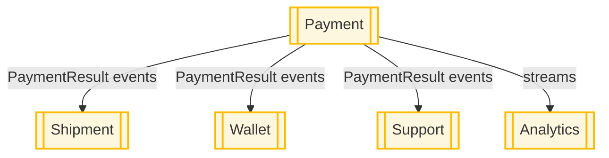
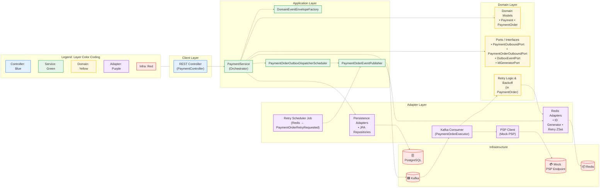
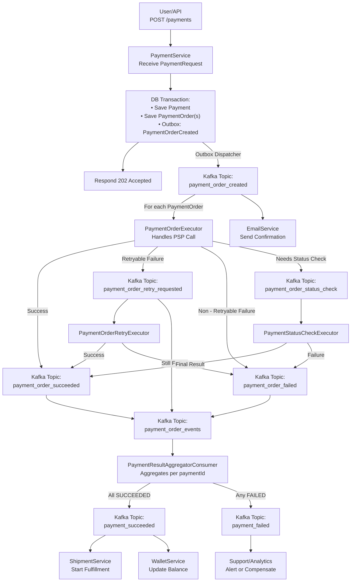

# ecommerce-platform-kotlin · Architecture Guide

\*Last updated: 2025‑06‑21 – maintained by \****Doğan Çağlar***

---

## Table of Contents

1. [Purpose & Audience](#1--purpose--audience)
2. [System Context](#2--system-context)
    1. [High‑Level Context Diagram](#21-highlevel-context-diagram)
    2. [Bounded Context Map](#22-bounded-context-map)
3. [Core Design Principles](#3--core-design-principles)
4. [Architectural Overview](#4--architectural-overview)
    1. [Layering & Hexagonal Architecture](#41-layering--hexagonal-architecture)
    2. [Service & Executor Landscape](#42-service--executor-landscape)
    3. [Payment‑Service Layer Diagram](#43-payment-service-layer-diagram)
    4. [Payment‑Service Layer Diagram (Alt)](#44-payment-service-layer-diagram-alt)
5. [Cross‑Cutting Concerns](#5--crosscutting-concerns)
    1. [Outbox Pattern](#51-outbox-pattern)
    2. [Retry & Status‑Check Strategy](#52-retry--statuscheck-strategy)
    3. [Idempotency](#53-idempotency)
    4. [Unique ID Generation](#54-unique-id-generation)
6. [Quality Attributes](#6--quality-attributes)
    1. [Observability](#61-observability)
    2. [Security](#62-security)
    3. [Cloud‑Native & Deployment](#63-cloudnative--deployment)
7. [Roadmap](#7--roadmap)
8. [Glossary](#8--glossary)
9. [References](#9--references)
10. [Changelog](#10--changelog)

---

## 1 · Purpose & Audience

This document is the **single source of truth** for the architectural design of the `ecommerce-platform-kotlin` backend.
It succinctly captures **why** and **how** we build a modular, event‑driven, cloud‑native platform that can scale to
multi‑seller, high‑throughput workloads while remaining observable, resilient, and easy to evolve.

- **Audience**: Backend engineers, SREs, architects, and any contributor who needs to understand the big picture.
- **Scope**: Everything that runs in the JVM, from REST APIs to async executors, and the infrastructure they rely on.

---

## 2 · System Context

### 2.1 High‑Level Context Diagram


### 2.2 Bounded Context Map



---

## 3 · Core Design Principles

| Principle                  | Application in the Codebase                                                                                                       |
|----------------------------|-----------------------------------------------------------------------------------------------------------------------------------|
| **Domain‑Driven Design**   | Clear bounded contexts (`payment`, `wallet`, `shipment`, …) with domain, application, adapter, and config layers in every module. |
| **Hexagonal Architecture** | Domain code depends on *ports* (interfaces); adapters implement them (JPA, Kafka, Redis, PSP, …).                                 |
| **Event‑Driven**           | Kafka is the backbone; every state change is emitted as an envelope `EventEnvelope<T>`.                                           |
| **Outbox Pattern**         | Events are written atomically with DB changes and reliably published by dispatchers.                                              |
| **Observability First**    | JSON logs with `traceId`, Prometheus metrics, and OpenTelemetry tracing (in progress).                                            |
| **Cloud‑Native Readiness** | Container images, Kubernetes manifests, profile‑based config, secrets management.                                                 |

---

## 4 · Architectural Overview

### 4.1 Layering & Hexagonal Architecture

All modules share a consistent 4‑layer structure:

```text
┌───────────────────────────┐
│        Config Layer       │  ➜ Spring Boot wiring, profiles, config classes
├───────────────────────────┤
│      Adapter Layer        │  ➜ JPA, Kafka, Redis, PSP, REST controllers
├───────────────────────────┤
│    Application Layer      │  ➜ Orchestration services, schedulers, dispatchers
├───────────────────────────┤
│       Domain Layer        │  ➜ Aggregates, value objects, domain services, ports
└───────────────────────────┘
```

*Only the Domain layer is allowed to know nothing about Spring, databases, or Kafka.*

### 4.2 Service & Executor Landscape




> **Target Evolution**: Each executor becomes an independently deployable Spring Boot app. All share the
`payment-domain` library to avoid code duplication and network latency.

### 4.3 Payment‑Service Layer Diagram

Paymentorder life cycle in the payment-service


