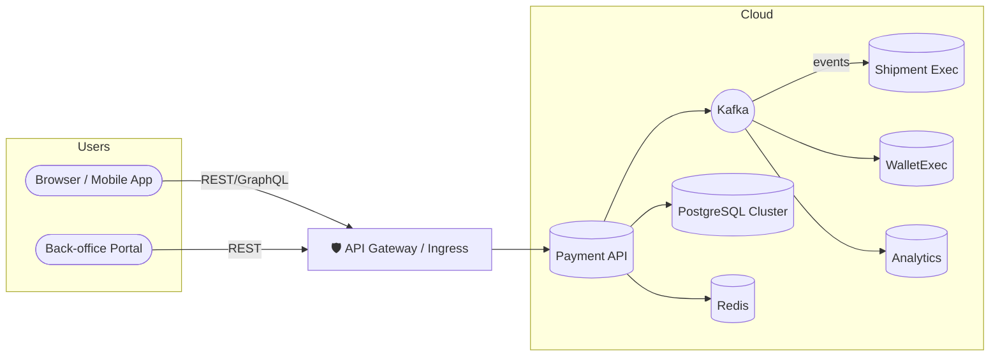
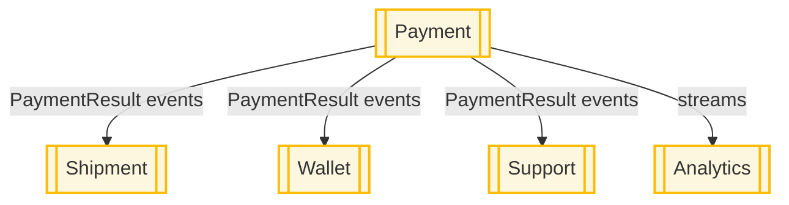
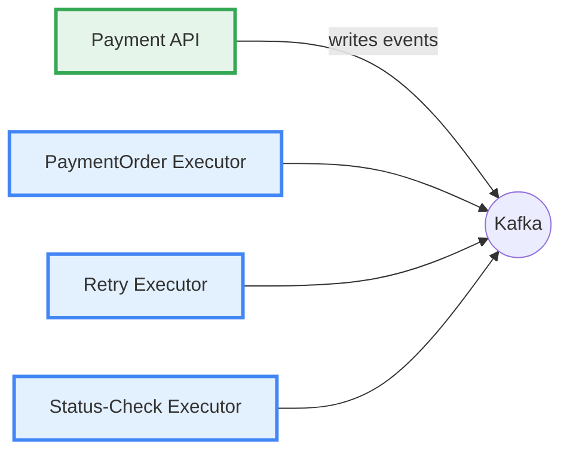
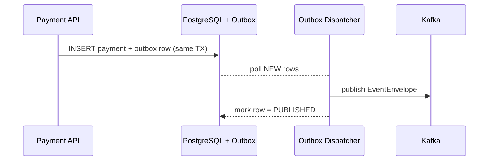

# ecommerce-platform-kotlin · Architecture Guide

*Last updated: 2025‑06‑21 – maintained by ****Doğan Çağlar***

---

## Table of Contents

1. [Purpose & Audience](#1--purpose--audience)
2. [System Context](#2--system-context)
1. [High‑Level Context Diagram](#21-highlevel-context-diagram)
2. [Bounded Context Map](#22-bounded-context-map)
3. [Core Design Principles](#3--core-design-principles)
4. [Architectural Overview](#4--architectural-overview)
1. [Layering & Hexagonal Architecture](#41-layering--hexagonal-architecture)
2. [Service & Executor Landscape](#42-service--executor-landscape)
5. [Cross‑Cutting Concerns](#5--crosscutting-concerns)
1. [Outbox Pattern](#51-outbox-pattern)
2. [Retry & Status‑Check Strategy](#52-retry--statuscheck-strategy)
3. [Idempotency](#53-idempotency)
4. [Unique ID Generation](#54-unique-id-generation)
6. [Quality Attributes](#6--quality-attributes)
1. [Observability](#61-observability)
2. [Security](#62-security)
3. [Cloud‑Native & Deployment](#63-cloudnative--deployment)
7. [Roadmap](#7--roadmap)
8. [Glossary](#8--glossary)
9. [References](#9--references)
10. [Changelog](#10--changelog)

---

## 1 · Purpose & Audience

This document is the **single source of truth** for the architectural design of the `ecommerce-platform-kotlin` backend.
It succinctly captures **why** and **how** we build a modular, event‑driven, cloud‑native platform that can scale to
multi‑seller, high‑throughput workloads while remaining observable, resilient, and easy to evolve.

- **Audience**: Backend engineers, SREs, architects, and any contributor who needs to understand the big picture.
- **Scope**: Everything that runs in the JVM, from REST APIs to async executors, and the infrastructure they rely on.

---

## 2 · System Context

### 2.1 High‑Level Context Diagram



### 2.2 Bounded Context Map



---

## 3 · Core Design Principles

| Principle                  | Application in the Codebase                                                                                                       |
|----------------------------|-----------------------------------------------------------------------------------------------------------------------------------|
| **Domain‑Driven Design**   | Clear bounded contexts (`payment`, `wallet`, `shipment`, …) with domain, application, adapter, and config layers in every module. |
| **Hexagonal Architecture** | Domain code depends on *ports* (interfaces); adapters implement them (JPA, Kafka, Redis, PSP, …).                                 |
| **Event‑Driven**           | Kafka is the backbone; every state change is emitted as an envelope `EventEnvelope<T>`.                                           |
| **Outbox Pattern**         | Events are written atomically with DB changes and reliably published by dispatchers.                                              |
| **Observability First**    | JSON logs with `traceId`, Prometheus metrics, and OpenTelemetry tracing (in progress).                                            |
| **Cloud‑Native Readiness** | Container images, Kubernetes manifests, profile‑based config, secrets management.                                                 |

---

## 4 · Architectural Overview

### 4.1 Layering & Hexagonal Architecture

All modules share a consistent 4‑layer structure:

```text
┌───────────────────────────┐
│        Config Layer       │  ➜ Spring Boot wiring, profiles, config classes
├───────────────────────────┤
│      Adapter Layer        │  ➜ JPA, Kafka, Redis, PSP, REST controllers
├───────────────────────────┤
│    Application Layer      │  ➜ Orchestration services, schedulers, dispatchers
├───────────────────────────┤
│       Domain Layer        │  ➜ Aggregates, value objects, domain services, ports
└───────────────────────────┘
```

*Only the Domain layer is allowed to know nothing about Spring, databases, or Kafka.*

### 4.2 Service & Executor Landscape



> **Target Evolution**: Each executor becomes an independently deployable Spring Boot app. All share the
`payment-domain` library to avoid code duplication and network latency.

---

## 5 · Cross‑Cutting Concerns

### 5.1 Outbox Pattern

Reliable event publication is achieved via **dual tables** and a polling dispatcher.



**Tables**

| Outbox Table           | Example Events        | Dispatcher Bean                |
|------------------------|-----------------------|--------------------------------|
| `outbox_payment`       | `PaymentCreated`      | `PaymentOutboxDispatcher`      |
| `outbox_payment_order` | `PaymentOrderCreated` | `PaymentOrderOutboxDispatcher` |

### 5.2 Retry & Status‑Check Strategy

| Scenario                 | Persistence                           | Trigger                | Action                                                          |
|--------------------------|---------------------------------------|------------------------|-----------------------------------------------------------------|
| **Transient PSP error**  | Redis ZSet `payment:retry`            | `PaymentOrderExecutor` | Exponential back‑off; republishes `PaymentOrderRetryRequested`. |
| **Pending PSP status**   | PG table `payment_order_status_check` | Scheduled job          | Publishes `PaymentOrderStatusCheckRequested`.                   |
| **Max retries exceeded** | DLQ topic                             | –                      | PaymentOrder marked `FAILED_FINALIZED`; alert emitted.          |

**Update Policy**

```
PaymentOrder is updated *only* when:
  • PSP result = SUCCESS
  • PSP result = FINALIZED_FAILED
  • Retries > = 5 (give‑up)
  • Status‑check result = SUCCESS or FINALIZED_FAILED

All finalized Payment results are first pushed to Redis (result queue).
A batch job drains this queue, persists rows in bulk, and publishes
`PaymentResult` events (Kafka & Redis) for downstream services.
```

### 5.3 Idempotency

- Duplicate outbox rows safely re‑published while `status!=PUBLISHED`.
- Kafka consumers skip a message when the aggregate is already in the expected state or `eventId` is known.
- Database constraints enforce uniqueness on natural keys.

```kotlin
if (order.status == SUCCESSFUL) return  // duplicate message
```

### 5.4 Unique ID Generation

Sequential cluster‑unique IDs are pre‑allocated via `Redis INCR`. At startup, a migrator seeds the counter from
`MAX(id)` in Postgres to avoid gaps.

- Stable IDs available for logs, foreign keys, and partition keys.
- Enables idempotent upserts and instant public IDs for clients.

---

## 6 · Quality Attributes

### 6.1 Observability

| Layer   | Tooling                                         |
|---------|-------------------------------------------------|
| Logs    | Logback ➜ Filebeat ➜ Elasticsearch ➜ **Kibana** |
| Metrics | Micrometer ➜ **Prometheus** ➜ Grafana           |
| Tracing | OpenTelemetry ➜ **Jaeger/Tempo** (planned)      |

Structured log fields: `traceId`, `eventId`, `parentEventId`, `aggregateId`.

### 6.2 Security

- Spring profiles: `local`, `k8s`, `prod`.
- Secrets: `.gitignored` Yaml files (local) vs. **Kubernetes Secrets** (k8s/prod).
- OAuth2 with **Keycloak** (planned).

### 6.3 Cloud‑Native & Deployment

- Container images published to GHCR.
- Helm charts per app; Kustomize overlays for environments.
- Horizontal Pod Autoscaling based on Kafka lag & Prometheus metrics.

---

## 7 · Roadmap

- **Q3 2025** – Split executors into standalone Spring Boot apps.
- **Q3 2025** – Extract `payment-domain` into a shared library.
- **Q4 2025** – Roll out OpenTelemetry tracing end‑to‑end.
- **Q4 2025** – Introduce fine‑grained Kubernetes resource limits & auto‑scaling policies.

---

## 8 · Glossary

| Term                  | Meaning                                                                   |
|-----------------------|---------------------------------------------------------------------------|
| **Aggregate**         | A cluster of domain objects treated as a single unit for data changes.    |
| **Executor**          | Stateless service that consumes Kafka events and executes business logic. |
| **Outbox Dispatcher** | Background worker that moves rows from DB outbox tables to Kafka.         |

---

## 9 · References

- Eric Evans – *Domain‑Driven Design*
- **Spring Boot**, **Spring Kafka**, **Micrometer** docs
- *Designing Event‑Driven Microservices* (Red Hat)
- OpenTelemetry specification

---

## 10 · Changelog

| Date       | Author    | Change                                                                                        |
|------------|-----------|-----------------------------------------------------------------------------------------------|
| 2025‑06‑21 | D. Çağlar | Document restructured, Table of Contents added, diagrams modularized, retry policy clarified. |
| 2025‑06‑01 | D. Çağlar | Initial draft.                                                                                |

