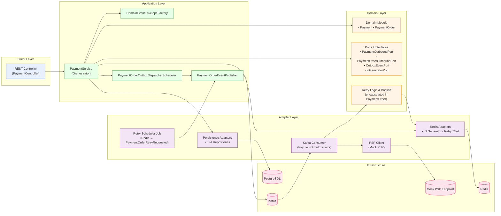
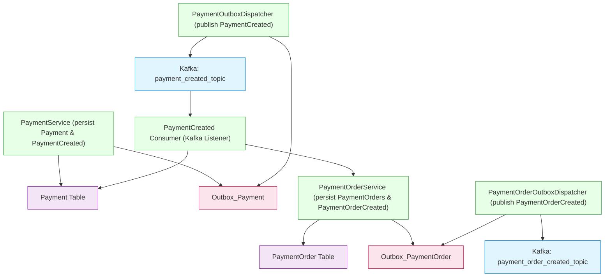

# Architecture Overview · `ecommerce-platform-kotlin`

_Last updated: 2025-06-01 – maintained by **Doğan Çağlar**_

---

## 1 · Purpose & Scope
This document is the single source of truth for the technical design of **ecommerce-platform-kotlin**.  
It explains **why** and **how** we build a modular, event-driven, cloud-ready backend that can scale to multi-seller, high-throughput workloads while remaining observable, resilient, and easy to extend.

---

## 2 · Key Design Principles

| Principle | How it’s applied |
|-----------|-----------------|
| **Domain-Driven Design** | Clear bounded contexts (`payment-service`, `wallet-service`, `shipment-service`, …). Domain, application, adapter, config layers in every module. |
| **Hexagonal Architecture** | Domain code depends on _ports_ (interfaces); adapters implement them (JPA, Kafka, Redis, Outbox, PSP, …). |
| **Event-Driven** | Kafka is the backbone; every state change is emitted as an event wrapped in `EventEnvelope<T>`. |
| **Outbox Pattern** | Events are written to an outbox table in the same TX as the aggregate change and reliably published. |
| **Observability First** | JSON logs with traceId/eventId, Prometheus metrics, (planned) OpenTelemetry tracing. |
| **Cloud-Native Readiness** | Early containerization, Kubernetes manifests, profile-based config, secret management. |

---

## 3 · Service Landscape (Target)

## Bounded Contexts Diagram



~~## 4 · Outbox Pattern – Dual Tables

| Table | Example Events                                          | Dispatcher                      |
|-------|---------------------------------------------------------|---------------------------------|
| `outbox_payment` | `PaymentCreated`,                                       | **PaymentOutboxDispatcher**     |
| `outbox_payment_order` | `PaymentOrderCreated`, | **PaymentCreatedEventConsumer** |


---

## 5 · Unique ID Generation

All aggregates receive a **sequential, cluster-unique ID _before_ persistence** via `Redis INCR`.  
If Redis restarts, an init routine seeds the counter from the DB’s current max to guarantee no gaps or duplicates.

**Benefits**

* Stable ID available for logs, foreign keys, and event keys.
* Enables idempotent upserts.
* Allows clients to receive a public ID immediately after creation.

---

## 6 · Retry & Status-Check Strategy

| Scenario | Storage | Trigger | Notes |
|----------|---------|---------|-------|
| **Transient PSP error** | Redis ZSet (`payment:retry`) | PaymentOrderExecutor schedules retry | Exponential back-off, polling job republishes `PaymentOrderRetryRequested`. |
| **Pending PSP status** | Postgres table (`payment_order_status_check`) | Scheduled job queries due rows | Publishes `PaymentOrderStatusCheckRequested`. |
| **Max retries exceeded** | DLQ Topic | – | PaymentOrder marked `FAILED_FINALIZED`, alert emitted. |

---

## 7 · Idempotency

Processing the same event/request twice must have no side-effects.

* _Outbox Dispatcher_ – safe re-publish if state not marked `SENT`.
* _Kafka Consumers_ – skip update if aggregate already in expected state or if `eventId` seen.
* _DB Constraints_ – natural keys unique; duplicates rejected.

```kotlin
if (order.status == SUCCESSFUL) {
    log.info("Duplicate PaymentOrderSucceeded – skipping")
    return
}
```

---

## 8 · Observability Stack

| Layer | Tool |
|-------|------|
| Logs | Logback JSON → Filebeat → Elasticsearch → **Kibana** |
| Metrics | Micrometer → **Prometheus** → Grafana |
| Tracing | OpenTelemetry → **Jaeger / Tempo** (planned) |

Structured log fields: `traceId`, `eventId`, `parentEventId`, `aggregateId`.

---

## 9 · Security & Profiles

* Spring profiles: `local`, `k8s`, `prod`.
* Secrets: `.gitignored` `secrets-local.yml` (dev) vs. Kubernetes Secrets (k8s/prod).
* **OAuth2 / Keycloak** integration planned for all APIs.

---

## 10 · Roadmap (June 2025)

## 🧠 Considerations for Future Architecture -1


---

## 🧠 Considerations for Future Architecture-2
 WE SHOULD UPDATE PAYMENTORDER ONLY WHEN IT'S FINALIZED_FAILED OR EXCEEDED 5 RETRY ATTEMPT
OR
PAYMENT IS SUCCESFUL
OR 
PAYMETN STATUS CHECK IS SUCCESFUL OR FINALIZED_FAILED OR MAX RETRY EXCEEDED

AND ALL FINALIZED PAYMENTS ARE FIRST PUSHED TO REDIS AND ANOTHER JOB GETFROOM REDIS_RESULT QUEUE AND SAVE IT

WE SHOULD PUBLISH TO PAYMENT_RESULT KAFKA OR REDIS , AND SOMEWHAT BATCH DATA AND SAVEALL

- **Independently Deployable Executors:**  
  Consider evolving each executor (e.g., payment-order, retry, status check) into its own Spring Boot application.  
  This enables independent scaling, tuning, and deployment for each workload.

- **Shared Domain Logic as a Library:**  
  Refactor `payment-service` as a pure domain library/module.  
  All executor apps (and optionally the REST API app) can import this library for business logic, enforcing DRY principles and eliminating network latency.

- **No Network or Serialization Overhead:**  
  With the domain logic shared as a library, all apps use direct JVM calls—no HTTP/gRPC/REST, zero network-induced latency or serialization cost.

- **Ultimate Flexibility and Testability:**  
  Executors stay stateless and focused, while domain rules are always consistent and easily testable.

> This design pattern mirrors the scalable event-driven backends of high-volume companies (e.g., Adyen, Stripe, Shopify).  
> **Not yet implemented, but under active consideration for later stages.**
---

## 11 · References
* Eric Evans, **Domain-Driven Design**
* Spring Boot, Spring Kafka, Micrometer documentation
* Apache Kafka & Kubernetes references
* OpenTelemetry specification
* Red Hat, **Building Event‑Driven Microservices**
