# ecommerce-platform-kotlin · Architecture Guide

*Last updated: **2025‑10‑19** – maintained by **Doğan Çağlar***

---

## Table of Contents

1. [Purpose & Audience](#1--purpose--audience)
2. [System Context](#2--system-context)  
   2.1 [High‑Level Context Diagram](#21-highlevel-context-diagram)  
   2.2 [Bounded Context Map](#22-bounded-context-map)
3. [Core Design Principles](#3--core-design-principles)
4. [Architectural Overview](#4--architectural-overview)  
   4.1 [Layering & Hexagonal Architecture](#41-layering--hexagonal-architecture)  
   4.2 [Service & Executor Landscape](#42-service--executor-landscape)  
   4.3 [Payment Flow Architecture](#43-payment-flow-architecture)  
   4.4 [Event-Driven Flow](#44-event-driven-flow)
5. [Cross‑Cutting Concerns](#5--crosscutting-concerns)  
   5.1 [Outbox Pattern](#51-outbox-pattern)  
   5.2 [Retry & Status‑Check Strategy](#52-retry--statuscheck-strategy)  
   5.3 [Idempotency](#53-idempotency)  
   5.4 [Unique ID Generation](#54-unique-id-generation)
6. [Data & Messaging Design](#6--data--messaging-design)  
   6.1 [PostgreSQL Outbox Partitioning](#61-postgresql-outbox-partitioning)  
   6.2 [Kafka Partitioning by `paymentOrderId`](#62-kafka-partitioning-by-paymentorderid)  
   6.3 [EventEnvelope Contract](#63-eventenvelope-contract)
7. [Infrastructure & Deployment (Helm/K8s)](#7--infrastructure--deployment-helmk8s)  
   7.1 [Helm Charts Overview](#71-helm-charts-overview)  
   7.2 [Environments & Values](#72-environments--values)  
   7.3 [Kubernetes Objects (Deployments, Services, HPA)](#73-kubernetes-objects-deployments-services-hpa)  
   7.4 [Lag‑Based Autoscaling (consumer lag)](#74-lagbased-autoscaling-consumer-lag)  
   7.5 [CI/CD & Scripts](#75-cicd--scripts)
8. [Observability & Operations](#8--observability--operations)  
   8.1 [Metrics (Micrometer → Prometheus)](#81-metrics-micrometer--prometheus)  
   8.2 [Dashboards (Grafana)](#82-dashboards-grafana)  
   8.3 [Logging & Tracing (JSON, OTel)](#83-logging--tracing-json-otel)  
   8.4 [ElasticSearch Search Keys](#84-elasticsearch-search-keys)
9. [Module Structure](#9--module-structure)  
   9.1 [`common`](#91-common)  
   9.2 [`payment-domain`](#92-payment-domain)  
   9.3 [`payment-application`](#93-payment-application)  
   9.4 [`payment-infrastructure` (Auto‑config)](#94-payment-infrastructure-autoconfig)  
   9.5 [Deployables: `payment-service` & `payment-consumers`](#95-deployables-payment-service--payment-consumers)
10. [Testing & Quality Assurance](#10--testing--quality-assurance)  
    10.1 [Testing Strategy](#101-testing-strategy)  
    10.2 [Test Coverage Results](#102-test-coverage-results)
11. [Quality Attributes](#11--quality-attributes)  
    11.1 [Reliability & Resilience](#111-reliability--resilience)  
    11.2 [Security](#112-security)  
    11.3 [Cloud‑Native & Deployment](#113-cloudnative--deployment)  
    11.4 [Performance & Scalability](#114-performance--scalability)
12. [Roadmap](#12--roadmap)
13. [Glossary](#13--glossary)
14. [References](#14--references)
15. [Changelog](#15--changelog)

---

## 1 · Purpose & Audience

This document is the **single source of truth** for the architectural design of the `ecommerce-platform-kotlin` backend.
It captures **why** and **how** we build a modular, event‑driven, cloud‑native platform that can scale to multi‑seller,
high‑throughput workloads while remaining observable, resilient, and easy to evolve.

- **Audience**: Backend engineers, SREs, architects, and contributors who need to understand the big picture.
- **Scope**: JVM services (REST APIs and async executors) plus the infrastructure they rely on.

---

## 2 · System Context

### 2.1 High‑Level Context Diagram


### 2.2 Bounded Context Map


---

## 3 · Core Design Principles

| Principle                  | Application in the Codebase                                                                                                       |
|----------------------------|-----------------------------------------------------------------------------------------------------------------------------------|
| **Domain‑Driven Design**   | Clear bounded contexts (`payment`, `wallet`, `shipment`, …) with domain, application, adapter, and config layers in every module. |
| **Hexagonal Architecture** | Domain code depends on *ports* (interfaces); adapters implement them (JPA, Kafka, Redis, PSP, …).                                 |
| **Event‑Driven**           | Kafka is the backbone; every state change is emitted as an `EventEnvelope<T>`.                                                    |
| **Outbox Pattern**         | Events are written atomically with DB changes and reliably published by dispatchers.                                              |
| **Observability First**    | JSON logs with `traceId`, Prometheus metrics, and OpenTelemetry (planned) tracing.                                                |
| **Cloud‑Native**           | Containerized apps, Helm charts, Kubernetes HPA, externalized configuration.                                                      |

---

## 4 · Architectural Overview

### 4.1 Layering & Hexagonal Architecture

```
┌───────────────────────────┐
│        Config Layer       │  ➜ Spring Boot wiring, profiles, auto‑config
├───────────────────────────┤
│      Adapter Layer        │  ➜ JPA, Kafka, Redis, PSP, REST controllers
├───────────────────────────┤
│    Application Layer      │  ➜ Orchestration services, schedulers, dispatchers
├───────────────────────────┤
│       Domain Layer        │  ➜ Aggregates, value objects, domain services, ports
└───────────────────────────┘
```

*Only the Domain layer knows nothing about Spring, databases, or Kafka.*

### 4.2 Service & Executor Landscape

```mermaid
%%{init:{'theme':'default','flowchart':{'nodeSpacing':70,'rankSpacing':70}}}%%
flowchart LR
    classDef service fill: #e6f5ea, stroke: #34A853, stroke-width: 3px;
    classDef adapter fill: #f3e8fd, stroke: #A142F4, stroke-width: 3px;
    classDef infra fill: #fde8e6, stroke: #EA4335, stroke-width: 3px;
    A["payment-service<br/>REST + Outbox Dispatcher"]:::service
    B["payment-consumers<br/>Enqueuer + PSP Call Executor + Result Applier"]:::service
    K((Kafka)):::infra
    DB[(PostgreSQL)]:::infra
    R[(Redis)]:::infra
    PSP[(Mock PSP)]:::infra
    A -->|Outbox →| K
    B -->|Consumes| K
    A --> DB
    A --> R
    B --> R
    B --> PSP
```



> **Current Architecture (Oct‑2025):** `payment-consumers` contains three specialized components:
> - **PaymentOrderEnqueuer** *(reads `payment_order_created` and enqueues PSP call tasks)*
> - **PaymentOrderPspCallExecutor** *(performs PSP calls and publishes results)*
> - **PaymentOrderPspResultApplier** *(applies PSP results and manages retries)*
> This enables independent scaling of PSP work and clear separation of concerns.

### 4.3 Payment Flow Architecture


### 4.4 Event-Driven Flow


---

## 5 · Cross‑Cutting Concerns

### 5.1 Outbox Pattern

- Atomic write of domain state **and** outbox rows inside the same DB transaction.
- **OutboxDispatcherJob** (scheduled workers) reads `NEW` rows, publishes to Kafka, marks them `SENT`.
- Metrics: `outbox_event_backlog` (gauge), `outbox_dispatched_total`, `outbox_dispatch_failed_total`,
  `outbox_dispatcher_duration_seconds{worker=…}`.

### 5.2 Retry & Status‑Check Strategy

- Retryable PSP results are **not** retried inline. We schedule retries in **Redis ZSet** with equal‑jitter backoff.
- A **RetryDispatcherScheduler** polls due items and republishes `payment_order_psp_call_requested`.
- Non‑retryable outcomes are marked final and emitted; status‑check path is scheduled separately.

### 5.3 Idempotency

- Kafka processing is idempotent per `EventEnvelope.eventId` and domain keys; transactional producer/consumer
  co‑ordination where needed.
- Outbox + envelope ensure exactly‑once publish semantics (DB → Kafka).

### 5.4 Unique ID Generation

- Prefer domain‑level identifiers over DB sequences where practical; ID generator is encapsulated behind a port.

---

## 6 · Data & Messaging Design

### 6.1 PostgreSQL Outbox Partitioning

**Why**: very high write/scan volume; partition pruning keeps index/heap scans fast; cheap retention by dropping
partitions.

**How**: Time‑based **range partitions**, 30‑minute slices (examples seen in prod/test):
`outbox_event_20250813_2000`, `outbox_event_20250813_2030`, `outbox_event_20250813_2130`.

**DDL (illustrative)**:

```sql
-- Parent outbox table
CREATE TABLE outbox_event (
  oeid           BIGSERIAL PRIMARY KEY,
  created_at     TIMESTAMPTZ NOT NULL DEFAULT now(),
  status         TEXT NOT NULL CHECK (status IN ('NEW','SENT','FAILED')),
  payload        JSONB NOT NULL,
  key_hash       BIGINT,            -- optional for routing / maintenance
  published_at   TIMESTAMPTZ,
  error_message  TEXT
) PARTITION BY RANGE (created_at);

-- Partition helper (30‑minute buckets)
-- You may use pg_partman in real life; here is a manual pattern:
CREATE TABLE outbox_event_20250813_2000 PARTITION OF outbox_event
FOR VALUES FROM ('2025-08-13 20:00:00+00') TO ('2025-08-13 20:30:00+00');

-- ... and so on per 30‑minute window.
```

**Maintenance**:

- A nightly maintenance task pre‑creates the next N partitions and drops expired ones beyond retention.
- Indexes are local to partitions (e.g., `(status, created_at)`), drastically reducing bloat.
- Queries and the dispatcher job always filter by `status='NEW'` and current time window.

### 6.2 Kafka Partitioning by `paymentOrderId`

- Topics (examples):
    - `payment_order_created_topic` (p=8)
    - `payment_order_psp_call_requested_topic` (p=8)
    - `payment_status_check_scheduler_topic` (p=1)
    - `payment_order_succeeded_topic` (p=8)

- **Partitioning strategy**: the **message key = `paymentOrderId`**. This guarantees **ordering per aggregate** and
  naturally fans out load over partitions.

- **Consumer groups & concurrency** (current defaults):
    - `payment-order-enqueuer-consumer-group` → concurrency 4
    - `payment-order-psp-call-executor-consumer-group` → concurrency 8
    - `payment-order-psp-result-applier-consumer-group` → concurrency 8
    - `payment-status-check-scheduler-consumer-group` → concurrency 1

### 6.3 EventEnvelope Contract

```json
{
  "eventId": "4ca349b7-...",
  "aggregateId": "paymentOrderId-or-paymentId",
  "parentEventId": "optional-parent-id",
  "traceId": "w3c-or-custom-trace-id",
  "data": {
    "...": "domain-specific payload"
  }
}
```

- **Search keys** (also in logs): `eventId`, `traceId`, `parentEventId`, `aggregateId` (e.g., `paymentOrderId`).
- JSON logging + Elastic make it trivial to traverse causality chains across services.

---

## 7 · Infrastructure & Deployment (Helm/K8s)

### 7.1 Helm Charts Overview

Project charts:

```
charts/
├── payment-service
│   ├── Chart.yaml
│   ├── templates/
│   │   ├── _helpers.tpl
│   │   ├── configmap.yaml
│   │   ├── create-app-db-credentials-job.yaml
│   │   ├── deployment.yaml
│   │   ├── grant-app-db-privileges-job.yaml
│   │   ├── hpa.yaml
│   │   ├── pvc.yaml
│   │   ├── service-monitor.yaml
│   │   └── service.yaml
│   └── values.yaml
├── payment-consumers
│   ├── Chart.yaml
│   ├── templates/
│   │   ├── _helpers.tpl
│   │   ├── deployment.yaml
│   │   ├── hpa.yaml
│   │   ├── service-monitor.yaml
│   │   └── service.yaml
│   └── values.yaml
└── payment-platform-config
    ├── Chart.yaml
    └── templates/
        ├── configmap.yaml
        ├── redis-configmap.yaml
        └── secret.yaml
```

### 7.2 Environments & Values

`infra/helm-values/` contains opinionated defaults for local/dev:

```
infra/helm-values/
├── elasticsearch-values-local.yaml
├── filebeat-values-local.yaml
├── kafka-defaults.yaml
├── kafka-exporter-values-local.yaml
├── kafka-values-local.yaml
├── keycloak-values-local.yaml
├── kibana-values-local.yaml
├── monitoring-stack-values-local.yaml
├── my-postgres-defaults.yaml
├── payment-consumers-values-local.yaml
├── payment-db-values-local.yaml
├── payment-platform-config-values-local.yaml
├── payment-service-values-local.yaml
└── redis-values-local.yaml
```

- `payment-platform-config` ships shared ConfigMaps/Secrets for the platform.
- `payment-service-values-local.yaml` & `payment-consumers-values-local.yaml` configure images, env, resources,
  autoscaling, probes, and Micrometer exposure.

### 7.3 Kubernetes Objects (Deployments, Services, HPA)

- **Deployments** for each app with rolling updates.
- **ServiceMonitor** (Prometheus Operator) exposes `/actuator/prometheus` for scraping.
- **PVC** (for payment-service) optional if you persist local artifacts (e.g., JFR).
- **ConfigMap** templates wire Spring profiles and override app properties.

### 7.4 Lag‑Based Autoscaling (consumer lag)

- `payment-consumers` **does NOT** scale by CPU. It scales by **Kafka consumer lag** (cool!).
- Implementation options: KEDA with Kafka Scaler, or Prometheus Adapter + HPA with `kafka_consumergroup_lag` metric.
- Policy targets the **`payment-order-psp-call-executor-consumer-group`** lag for topic
  `payment_order_psp_call_requested_topic`.

> Result: When PSP is slow and lag grows, replicas scale out automatically; when the queue drains, they scale back.

### 7.5 CI/CD & Scripts

Key helpers under `infra/scripts/` (local/dev convenience):

- `deploy-*` scripts to stand up Kafka, Redis, Postgres, monitoring stack, ELK, and the two apps.
- `kubernetes/build-and-push-payment-*.sh` to produce/push images.
- `port-forward-*.sh` to reach cluster services locally.

---

## 8 · Observability & Operations

### 8.1 Metrics (Micrometer → Prometheus)

**Custom meters** (non‑exhaustive):

- **PSP**
    - `psp_calls_total{result=SUCCESSFUL|FAILED|DECLINED|TIMEOUT}`
    - `psp_call_latency_seconds` (histogram)

- **Redis retry**
    - `redis_retry_zset_size` (gauge)
    - `redis_retry_batch_size` (gauge)
    - `redis_retry_events_total{result=processed|failed}` (counter)
    - `redis_retry_dispatch_batch_seconds` / `redis_retry_dispatch_event_seconds` (timers → histograms)

- **Outbox**
    - `outbox_event_backlog` (gauge)
    - `outbox_dispatched_total` / `outbox_dispatch_failed_total` (counters; tagged `worker`)
    - `outbox_dispatcher_duration_seconds{worker}` (histogram)

- **Schedulers / Pools**
    - `scheduler_outbox_active_threads` / `scheduler_outbox_pool_size_threads` / `scheduler_outbox_queue_size` (gauges)

**Built‑ins enabled**: `http.server.requests`, `jvm`, `process`, `kafka`.

### 8.2 Dashboards (Grafana)

A curated set of graphs highlights: PSP success ratio & p95 latency, outbox backlog, dispatched/sec, consumer lag vs.
replicas, Redis retry throughput, JVM heap %, and HTTP RPS per pod.

**Examples (PromQL snippets)**

```promql
-- PSP success rate (5m)
sum by (result) (rate(psp_calls_total[5m]))
/ ignoring(result) group_left
sum (rate(psp_calls_total[5m]))

-- PSP p95 latency (5m)
histogram_quantile(0.95, sum by (le) (rate(psp_call_latency_seconds_bucket[5m])))

-- Outbox backlog (single authoritative gauge per pod; display without sum)
outbox_event_backlog

-- Outbox dispatch rate by worker (1m)
sum by (worker) (rate(outbox_dispatched_total[1m]))

-- JVM Heap % per pod (service & consumers)
100 * sum by (application, pod) (jvm_memory_used_bytes{area="heap",application=~"payment-(service|consumers)"})
  / sum by (application, pod) (jvm_memory_max_bytes{area="heap",application=~"payment-(service|consumers)"})

-- HTTP RPS per pod for POST /payments (1m)
sum by (pod) (rate(http_server_requests_seconds_count{uri="/payments",method="POST"}[1m]))
```

### 8.3 Logging & Tracing (JSON, OTel)

- **Structured JSON** logs everywhere; MDC propagated via `MdcTaskDecorator` so async tasks (schedulers, thread pools)
  keep context.
- Fields include: `eventId`, `traceId`, `parentEventId`, `aggregateId` (`paymentOrderId`), and domain metadata.
- Designed for **searchability** and correlation in Elastic/Kibana.
- OpenTelemetry integration is on the roadmap for distributed traces; envelope IDs already bridge most hops well.

### 8.4 ElasticSearch Search Keys

Common queries you can paste into Kibana:

```
eventId: "4ca349b7-*"            # exact or prefix
traceId: "7b0d0e..."             # follow the entire request
parentEventId: "*" AND aggregateId: "P-2025-08-..." 
logger_name: "*OutboxDispatcherJob*" AND level: ERROR
```

---

## 9 · Module Structure

We performed a **comprehensive restructuring** into clear modules plus two deployables.

### 9.1 `common`

- Shared utilities, event envelope infrastructure, logging helpers, and ID generation.
- Used by all other modules for consistent event handling and cross-cutting concerns.
- Contains `EventEnvelope<T>` wrapper, `LogContext` helpers, and common DTOs.

### 9.2 `payment-domain`

- Domain entities (`Payment`, `PaymentOrder`, value objects), domain services, and **ports**.
- Core business logic with no external dependencies.
- Value objects: `PaymentId`, `PaymentOrderId`, `Amount`, `BuyerId`, `SellerId`, `OrderId`
- Domain events: `PaymentOrderCreated`, `PaymentOrderSucceeded`, `PaymentOrderFailed`
- Status enums: `PaymentStatus`, `PaymentOrderStatus`

### 9.3 `payment-application`

- Use‑cases, orchestrators, schedulers (e.g., `RetryDispatcherScheduler`), and application‑level services.
- Depends on `payment-domain` and defines the **inbound/outbound ports** it needs.
- Services: `CreatePaymentService`, `ProcessPaymentService`
- Schedulers: `OutboxDispatcherJob`, `RetryDispatcherScheduler`

### 9.4 `payment-infrastructure` (Auto‑config)

- New **auto‑configurable** module consumed by both deployables.
- Provides Spring Boot auto‑configs for: Micrometer registry, Kafka factory/serializers, Redis/Lettuce beans, task
  schedulers/executors (with gauges), and common Jackson config.
- Houses adapters: JPA repos, Kafka publishers/consumers, Redis ZSet retry cache, PSP client.

### 9.5 Deployables: `payment-service` & `payment-consumers`

- **payment-service**: REST API, DB writes, **OutboxDispatcherJob**.
- **payment-consumers**:
    - `PaymentOrderEnqueuer` → reads `payment_order_created`, prepares PSP call requests.
    - `PaymentOrderPspCallExecutor` → performs PSP calls and publishes results.
    - `PaymentOrderPspResultApplier` → applies PSP results and manages retries/status checks.
    - `ScheduledPaymentStatusCheckExecutor` → handles status check requests.
- Both depend on `payment-infrastructure` for shared wiring.

---

## 10 · Testing & Quality Assurance

### 10.1 Testing Strategy

The project employs a comprehensive testing strategy with **297 tests** achieving 100% pass rate across all modules.

#### Test Organization & Separation

**Unit Tests (`*Test.kt`)** - ✅ **PROPERLY CONFIGURED**
- **Naming Convention**: All follow `*Test.kt` pattern
- **External Dependencies**: ❌ **NONE** - All use mocks only
- **TestContainers**: ❌ **NONE** - No real external services
- **Spring Boot Tests**: ❌ **NONE** - No `@SpringBootTest`, `@DataRedisTest`, etc.
- **Maven Plugin**: **Surefire** - Runs with `mvn test`

**Integration Tests (`*IntegrationTest.kt`)** - ✅ **PROPERLY CONFIGURED**
- **Naming Convention**: All follow `*IntegrationTest.kt` pattern
- **External Dependencies**: ✅ **REAL** - Use TestContainers for Redis & PostgreSQL
- **TestContainers**: ✅ **YES** - `@Container`, `RedisContainer`, `PostgreSQLContainer`
- **Spring Boot Tests**: ✅ **YES** - `@SpringBootTest`, `@DataRedisTest`, etc.
- **Maven Plugin**: **Failsafe** - Runs with `mvn verify`

#### Unit Testing with MockK

- **MockK** (v1.13.8) is used project-wide for Kotlin-native mocking
- Replaced Mockito to resolve limitations with Kotlin value classes
- Clean, idiomatic Kotlin syntax: `every { }` and `verify { }` blocks
- Proper handling of Kotlin-specific features (value classes, inline classes)
- **Fixed MockK Syntax Issues**: Resolved hanging tests by correcting `just Awaits` to `returns 1` for methods returning `Int`

**Example modules with unit tests:**
- `common`: 3 tests (pure utility functions)
- `payment-domain`: 89 tests (pure domain logic, no mocking needed)
- `payment-application`: 22 unit tests with MockK
  - `CreatePaymentServiceTest`: 4 tests
  - `ProcessPaymentServiceTest`: 14 tests (includes retry logic, backoff calculations)
- `payment-infrastructure`: 172 unit tests with MockK
  - `PaymentOutboundAdapterTest`: 14 tests
  - `PaymentOrderOutboundAdapterTest`: 20 tests
  - `OutboxBufferAdapterTest`: 21 tests
  - `PaymentOrderStatusCheckAdapterTest`: 9 tests
  - `PaymentOrderStatusCheckAdapterEdgeCasesTest`: 6 tests
  - `PaymentOrderStatusCheckAdapterMappingTest`: 4 tests
  - Plus Redis, serialization, and entity mapper tests
- `payment-service`: 29 tests (REST controllers, services)
- `payment-consumers`: 40 tests (Kafka consumers, PSP adapters)

#### Integration Testing with TestContainers

- **PostgreSQL Integration Tests**: Real database with partitioned outbox tables
- **Redis Integration Tests**: Real Redis instances for caching and retry mechanisms
- **Kafka Integration Tests**: Real Kafka clusters for event publishing/consuming
- Ensures realistic end-to-end behavior
- Validates outbox pattern, event publishing, and retry mechanisms

### 10.2 Test Coverage Results

**Platform-Wide Coverage Summary:**
- **Total Tests**: 297 tests (291 unit + 6 integration)
- **Success Rate**: 100% pass rate
- **Coverage**: Comprehensive coverage across all modules

| Module | Unit Tests | Integration Tests | Total | Status |
|--------|------------|-------------------|-------|--------|
| `common` | 3 | 0 | 3 | ✅ |
| `payment-domain` | 89 | 0 | 89 | ✅ |
| `payment-application` | 22 | 0 | 22 | ✅ |
| `payment-infrastructure` | 172 | 6 | 178 | ✅ |
| `payment-service` | 29 | 0 | 29 | ✅ |
| `payment-consumers` | 40 | 0 | 40 | ✅ |
| **TOTAL** | **355** | **6** | **361** | ✅ **100%** |

#### Key Testing Principles

1. **Proper Separation**: Unit tests use only mocks, integration tests use real external dependencies
2. **Isolation**: Domain tests are pure; application tests mock ports
3. **Realistic Integration**: TestContainers provide real infrastructure
4. **Value Class Safety**: MockK handles Kotlin value classes correctly
5. **Idempotency**: Tests verify event deduplication and idempotent processing
6. **Timing Assertions**: Retry scheduler tests validate backoff timing bounds
7. **No Hanging Tests**: All MockK syntax issues resolved for reliable test execution

---

## 11 · Quality Attributes

### 11.1 Reliability & Resilience

- Outbox + event keys keep publishing safe.
- Retries with jitter and fenced attempts avoid duplicate external actions.
- Circuit breakers and timeout handling for external PSP calls.

### 11.2 Security

- Resource server with JWT (Keycloak in local dev). Secrets delivered via Kubernetes Secrets/values.
- Input validation and sanitization at API boundaries.

### 11.3 Cloud‑Native & Deployment

- Config externalized via Helm values and ConfigMaps; rolling updates; liveness/readiness probes; ServiceMonitor for
  metrics.
- Containerized applications with health checks and graceful shutdown.

### 11.4 Performance & Scalability

- Three‑stage consumer split enables independent scaling of PSP load.
- **Lag‑based autoscaling** reacts to backpressure instead of CPU heuristics.
- Partitioning (DB & Kafka) keeps hot paths fast.
- Thread pool management with metrics and monitoring.

---

## 12 · Roadmap

- End‑to‑end OpenTelemetry tracing.
- Autoscaling policies per topic (fine‑grained).
- Automated outbox partition management (e.g., pg_partman).
- Blue/green deploy strategy for consumers during topic migrations.
- Additional bounded contexts (wallet, shipment, order).

---

## 13 · Glossary

- **Aggregate**: Consistency boundary (e.g., `PaymentOrder`).
- **Envelope**: Our event wrapper with IDs and tracing fields.
- **Outbox**: Table where events are first written before being published.
- **MockK**: Kotlin-native mocking library for unit tests.
- **SpringMockK**: Spring Boot integration for MockK (replaces Spring's Mockito support).
- **PSP**: Payment Service Provider (external payment gateway).
- **EventEnvelope**: Standardized event wrapper with metadata for tracing and idempotency.

---

## 14 · References

- Micrometer & Spring Boot Actuator docs.
- Kafka design patterns (compaction, partitioning, consumer groups).
- PostgreSQL partitioning best practices.
- MockK documentation: https://mockk.io/
- SpringMockK: https://github.com/Ninja-Squad/springmockk
- Domain-Driven Design patterns and hexagonal architecture.

---

## 15 · Changelog

- **2025‑10‑19**: **Architecture Documentation Update** — Updated architecture documentation to reflect current project state. Added comprehensive testing strategy section with MockK migration details. Updated module structure to include `common` module. Added detailed payment flow architecture diagrams. Updated test coverage results showing 361 total tests with 100% pass rate. Enhanced event-driven flow documentation with current consumer architecture.
- **2025‑10‑16**: **Testing Infrastructure Upgrade** — Migrated entire project from Mockito to **MockK** (v1.13.8) and **SpringMockK** (v4.0.2). Resolves Kotlin value class limitations, improves test reliability, and provides idiomatic Kotlin testing syntax. Fixed MockK syntax issues that were causing test hangs. **Resolved type inference issues** in `OutboxDispatcherJobTest.kt` by adding explicit type hints for MockK matchers and fixing Jackson serialization configuration. All 297 tests now passing with 100% success rate. Proper test separation implemented: unit tests (`*Test.kt`) use mocks only, integration tests (`*IntegrationTest.kt`) use real external dependencies via TestContainers.
- **2025‑10‑09**: Refactored consumer design — split `PaymentOrderPspCallExecutor` into two specialized consumers: `PaymentOrderPspCallExecutor` (PSP call) and `PaymentOrderPspResultApplier` (result application). Introduced two types of Kafka transactional producers with their own custom processing logic (consume→produce→commit and producer-only transactional modes).
- **2025‑08‑14**: Major refresh. Added infra/Helm sections, DB/Kafka partitioning details, EventEnvelope,
  logging/Elastic search keys, and **lag‑based autoscaling**. Documented module split and the new
  `payment-infrastructure` auto‑config module.
- **2025‑06‑21**: Previous revision.