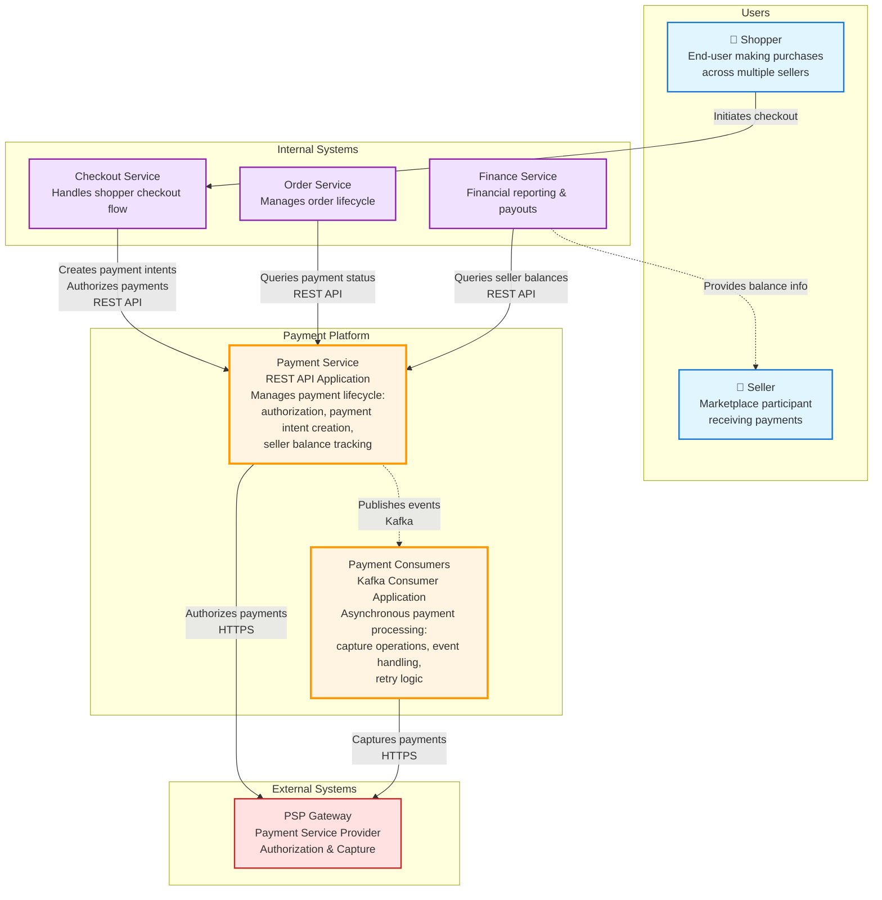
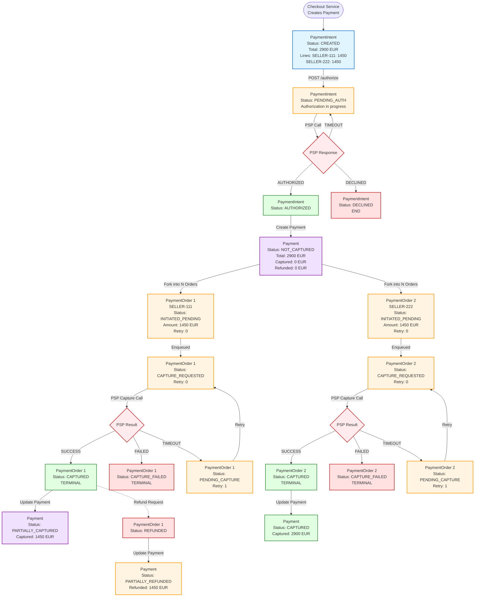
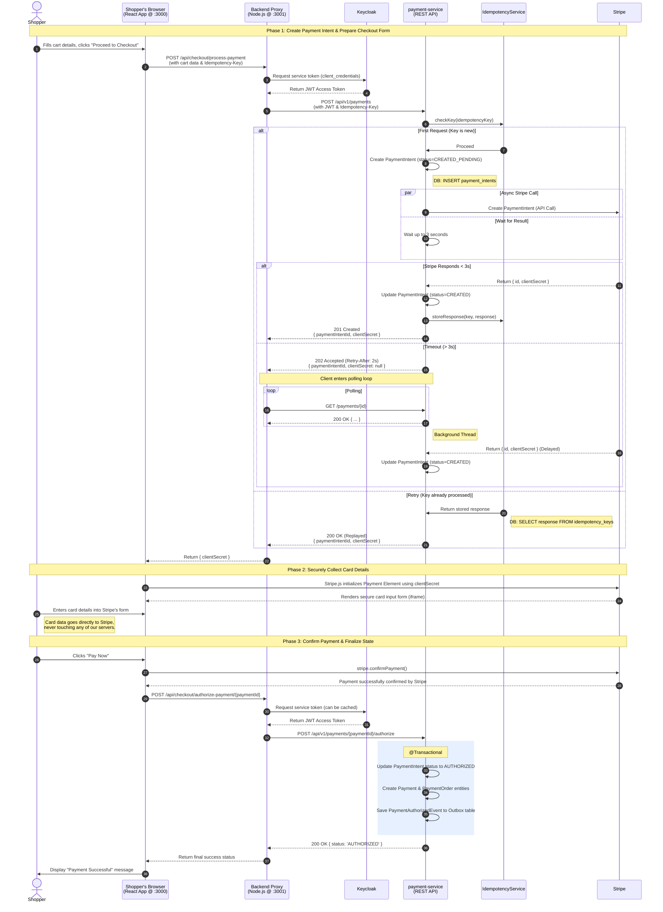
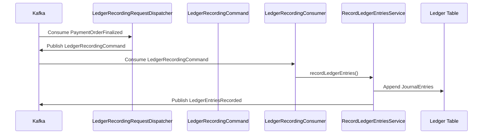
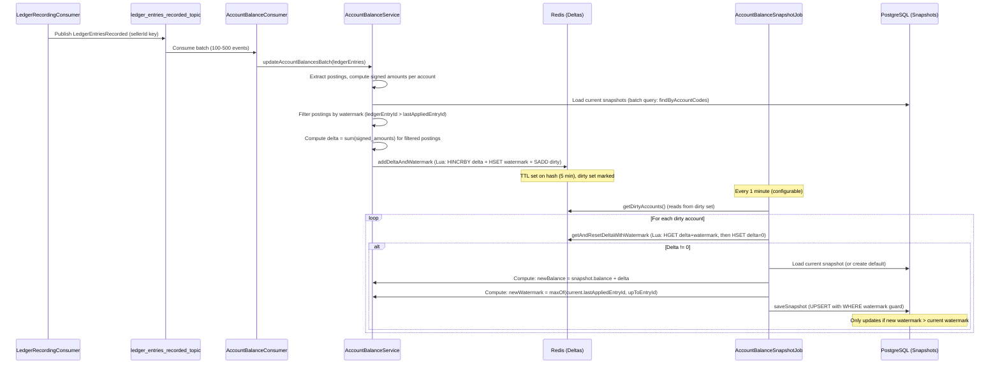

# 🟦 Event-Driven Payments & Ledger Infrastructure for Multi-Seller Platforms

This project represents a backend **payment platform for a Merchant-of-Record (MoR) environment**.  
Think of a multi-seller e-commerce marketplace where shoppers can buy items from different sellers in a single checkout.  
The platform manages the **full payment lifecycle**: synchronous authorization, multi-seller decomposition, seller-level operations, and internal financial accounting.

---

# 🟩 Key Clarifications (MoR Model)

### **1. Is the payment platform internal?**
Yes. The payment platform is an **internal backend domain service**, not exposed to shoppers directly.  
Checkout / Order Service calls it to create payments, decompose them into seller-specific PaymentOrders, and initiate payment authorization.

---

### **2. Do we perform authorization ourselves?**
No. We delegate authorization, capture, refund, and cancel operations to an external PSP via our gateway.  
From the PSP’s perspective, we appear as a **single merchant-of-record**; seller details remain internal.

---

### **3. Do we distribute funds to sellers internally?**
Yes. As the MoR, the platform manages all **fund allocation**, applies platform fees, credits seller balances, and schedules payouts.  
The PSP simply transfers funds into the MoR account.

---

### **4. Why authorize once but capture/refund per PaymentOrder?**
Authorization happens **once for the entire basket**, matching shopper intent.  
Captures, cancels, and refunds happen **per PaymentOrder**, since each seller’s fulfillment lifecycle is independent.

### **5. Why do we have payment intent, and payment seperately**

Separating PaymentIntent from Payment lets our system handle user interaction safely,money movement correctly,retry safely.

# 🟧 Functional Requirements
*(written using Shopper, Seller, and Internal Services as actors)*

## **For Shoppers**

### **FR1 — Shoppers should be able to make a payment for a multi-seller basket.**
- A shopper must be able to confirm checkout and initiate a payment for the total amount of their order.

### **FR2 — Shoppers should be able to see accurate payment authorization status.**
- Shoppers should be able to view whether their payment is authorized or declined

---

## **For Sellers**

### **FR3 — Sellers should be able to receive their portion of a shopper’s payment.**
- Each seller must receive the correctly allocated share of the total payment based on the items purchased from them.

### **FR4 — Sellers should be able to view their financial state.**
- Sellers should be able to access their balances, payable amounts, and payout summaries.

---

## **For Internal Services (Checkout / Order / Finance / Payouts)**

### **FR5 — Checkout/Order Service should be able to create a Payment.**
- It must be possible for the Order Service to create a Payment and obtain the generated Payment along with its seller-level PaymentOrders.

### **FR6 — Checkout/Order Service should be able to trigger authorization via PSP.**
- The system must allow Checkout to authorize the total payment amount through an external PSP.

### **FR7 — Internal services should be able to perform seller-level operations.**
- Internal services must be able to request captures, cancellations, and refunds *per PaymentOrder*.

### **FR8 — The system must maintain internal fund distribution for reporting and payouts.**
- Internal components (Finance, Payouts) must be able to retrieve seller payables, platform fees, and other financial allocations.

### **FR9 — Internal services should be able to retrieve real-time payment and ledger state.**
- Order, Finance, Risk, and Payout subsystems must be able to query payment status, PSP results, seller balances, and ledger entries.

### **FR10 — Treasury/Payout services should be able to receive payout instructions.**
- Out of Scope

---

# 🟥 Non-Functional Requirements
*(written using “The system should be…” statements)*

### **NFR1 — The system should be highly available.**
Payment creation and authorization must remain available during peak checkout traffic.

### **NFR2 — The system should ensure strong consistency for financial data.**
State transitions must never lead to incorrect balances or double charges.

### **NFR3 — The system should be secure.**
Sensitive financial data must be protected using proper authentication, authorization, and encryption.

### **NFR4 — The system should be observable.**
Logs, metrics, and tracing must allow operators to understand system behavior and diagnose issues.

### **NFR5 — The system should be scalable.**
It must support increasing transaction volumes, sellers, and asynchronous workflows without degradation.

### **NFR6 — The system must be correct under retries and failures.**
Even under retries, restarts, and network issues, financial outcomes must remain correct.

---

# 🟦 Architecture Summary (Non-Functional / Implementation Section)

The platform internally uses:
- **Event-driven architecture** for asynchronous flows for payment order and ledger
- **Kafka topics** for PaymentOrder creation, PSP calls, and ledger events
- **Idempotent state transitions** to ensure correctness under retries
- **Double-entry ledger** for immutable financial history
- **PSP gateway client** for authorization, capture, refund, and cancel operations
- **Internal balance tracking** for seller payables and platform revenues

---

🟦 Core Entities (Domain-Level)

These represent the nouns your system uses to satisfy the functional requirements.  
They define the **data model**, the **API vocabulary**, and the **business language** of the Merchant-of-Record payment platform.

---

## 🧍 Actors

### **Shopper**
The end-user making a purchase across one or multiple sellers.

### **Seller**
A marketplace participant who receives part of the shopper’s payment and later receives payouts.

### **Internal Services**
- Checkout / Order Service
- Finance

These actors perform operations on payments, orders, balances, and payouts.

---

# 🟩 Core Business Entities
These are the fundamental nouns of out Merchant-of-Record payment platform.

---

## **1. PaymentIntent**

Represents the **shopper's intent to pay** for a multi-seller basket.

**When it's created:**
- Step 1: Shopper initiates checkout → `POST /api/v1/payments` endpoint
- Created with status `CREATED_PENDING` (initially), then transitions to `CREATED` once Stripe ID is obtained.
- Contains: `buyerId`, `orderId`, `totalAmount`, `paymentOrderLines` (seller breakdown)

**Why it exists:**
- Separates "intent to pay" from "actual payment transaction"
- Allows authorization workflow to happen before committing to financial records
- Enables idempotent authorization attempts (prevents duplicate PSP calls)
- Supports retry logic for transient PSP failures

## **2. Payment**

Represents the **actual financial transaction** created after authorization succeeds

**When it's created:**
- when psp authorization response is authorized.

**Why it exists:**
- Models actual money movement (vs. PaymentIntent which is just "intent")
- Tracks aggregate-level financial state across all sellers
- Provides aggregate view: total captured, total refunded
- Links to `PaymentIntent` via `paymentIntentId` for traceability
- Enables financial reporting and reconciliation

## **3. PaymentOrder**
Represents the **per-seller financial component** of a Payment.

**When it's created:**
  When `Payment` is created
- One `PaymentOrder` per seller (from `Payment.paymentOrderLines`)
- Initial status: `INITIATED_PENDING`

**Why it exists:**
- Each seller has independent fulfillment lifecycle
- Sellers can be captured, refunded, or cancelled independently
- Enables per-seller financial tracking and payouts
- Supports retry logic per seller (if one seller's capture fails, others continue)
- Maps directly to seller-level accounting entries

---

## **4. LedgerEntry**

Represents a **single double-entry journal entry**.

Contains:
- Debit postings
- Credit postings
- JournalId
- Timestamp
- Business context (paymentOrderId, sellerId, etc.)

**Why it exists:**  
Ensures financial correctness, auditability, and immutable accounting history.

---

## **5. Posting (Debit / Credit)**

A component of a LedgerEntry.

- Refers to an account
- Contains a signed amount
- Reflects accounting direction (DR/CR)

**Why it exists:**  
LedgerEntries consist of multiple postings — always balanced.

---

## **6. Account**

Represents a **financial account** in the internal ledger, such as:

- PSP_RECEIVABLE
- SELLER_PAYABLE
- PLATFORM_FEE_REVENUE
- SCHEME_FEE_EXPENSE
- PLATFORM_CASH

**Why it exists:**  
Money moves internally between accounts, not as free-form variables.

---

## **7. Balance**

Represents the **current financial standing** of an account (e.g., seller’s accrued revenue).  
Derived from applied LedgerEntries.

**Why it exists:**  
Used for reporting, analytics, payouts, and consistency validation.

# 🟩 C4 Architecture Diagrams

This document contains C4 model diagrams for the payment service system at different levels of abstraction.

## Level 1: System Context Diagram

The System Context diagram shows the payment service system in its environment, illustrating users and external systems it interacts with.

### System Context Description

**Payment Platform** is an internal backend domain service that manages the complete payment lifecycle for a multi-seller marketplace platform. It operates as a Merchant-of-Record (MoR), handling all financial transactions between shoppers, sellers, and the platform. The platform consists of two main applications:

- **Payment Service**: REST API application that handles synchronous operations (payment intent creation, authorization, queries)
- **Payment Consumers**: Kafka consumer application that handles asynchronous operations (capture operations, event processing, retry logic)

### End to End payment flow

### Authorization/Idempotency Sequence Diagram

#### Ledger Record Sequence Flow

#### Balance Flow Sequence

## 🟦 Outbox Pattern Implementation

The system uses the **Transactional Outbox Pattern** to ensure reliable event publishing. When payment-related entities are created or updated within a database transaction, corresponding events are written to an `outbox_events` table atomically. The `OutboxDispatcherJob` then publishes these events to Kafka asynchronously.

### **OutboxDispatcherJob**

The `OutboxDispatcherJob` is a scheduled service that runs in the `payment-service` application and is responsible for reliably dispatching outbox events to Kafka.

**Key Responsibilities:**
- **Claims batches of outbox events** from the database (status: `NEW`)
- **Publishes events to Kafka** based on event type:
    - `payment_authorized` → Publishes `PaymentAuthorized` event to Kafka
    - `payment_order_created` → Publishes `PaymentOrderCreated` event to Kafka
- **Updates event status** to `SENT` after successful publication
- **Handles failures** by unclaiming failed events for retry
- **Reclaims stuck events** that were claimed but never completed (runs every 2 minutes)

**Operational Characteristics:**
- **Scheduled execution**: Runs every 5 seconds with configurable thread count (default: 2 workers)
- **Batch processing**: Processes configurable batch size (default: 250 events per batch)
- **Idempotent publishing**: Uses Kafka transactions to ensure exactly-once delivery
- **Metrics tracking**: Monitors backlog size, dispatch duration, success/failure counts
- **Backlog monitoring**: Maintains in-memory backlog counter, resyncs from database periodically (every 5 minutes)

**Workflow:**
1. **Claim**: Selects up to N `NEW` events and marks them as `PROCESSING` (atomically)
2. **Publish**: Deserializes event payloads and publishes to Kafka using atomic transactions
3. **Persist**: Updates successfully published events to `SENT` status
4. **Unclaim**: Returns failed events to `NEW` status for retry
5. **Reclaim**: Background job resets events stuck in `PROCESSING` status (older than 10 minutes)

**Why This Pattern:**
- **Guarantees at-least-once delivery**: Events are never lost even if Kafka is temporarily unavailable
- **Database consistency**: Event creation is part of the same transaction as domain changes
- **Decouples publishing**: Main request path doesn't wait for Kafka availability
- **Retry safety**: Failed publications are automatically retried without duplicate processing
