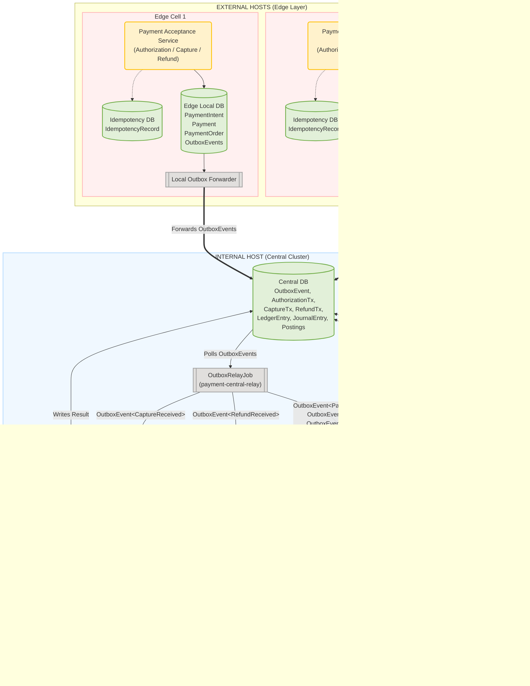
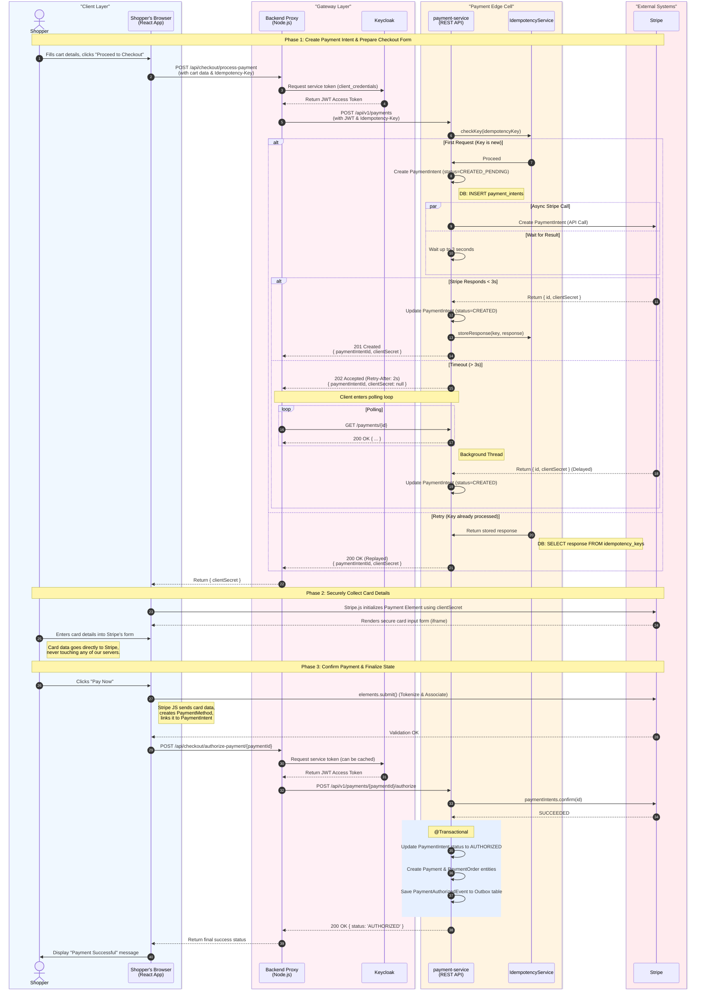
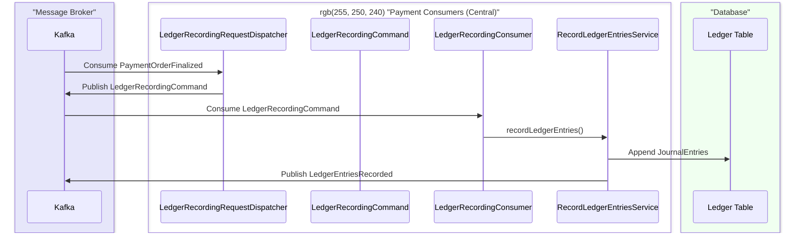
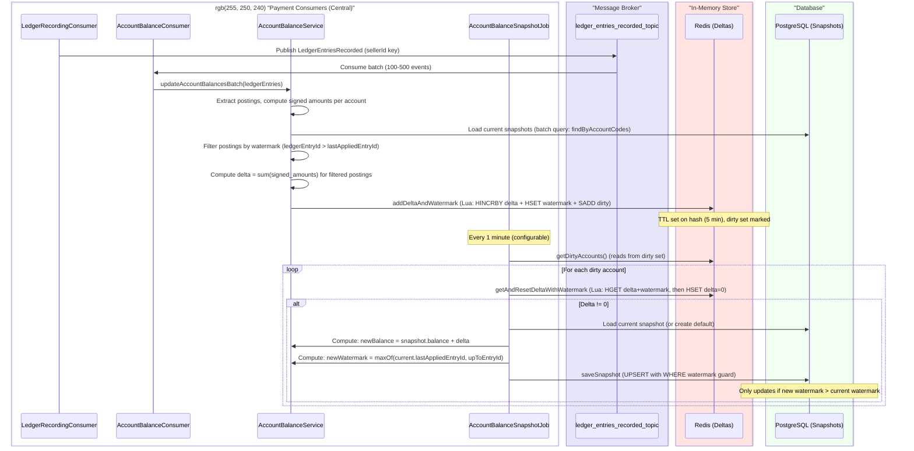

# 🟦 Event-Driven Payments & Ledger Infrastructure for Multi-Seller Platforms

This project represents a backend **payment platform for a Merchant-of-Record (MoR) environment**.  
Think of a multi-seller e-commerce marketplace where shoppers can buy items from different sellers in a single checkout.  
The platform manages the **full payment lifecycle**: synchronous authorization, multi-seller decomposition, seller-level operations, and internal financial accounting.

---

# 🟩 Key Clarifications (MoR Model)

### **1. Is the payment platform internal?**
Yes. The payment platform is an **internal backend domain service**, not exposed to shoppers directly.  
Checkout / Order Service calls it to create payments, decompose them into seller-specific PaymentOrders, and initiate payment authorization.

---

### **2. Do we perform authorization ourselves?**
No. We delegate authorization, capture, refund, and cancel operations to an external PSP via our gateway.  
From the PSP’s perspective, we appear as a **single merchant-of-record**; seller details remain internal.

---

### **3. Do we distribute funds to sellers internally?**
Yes. As the MoR, the platform manages all **fund allocation**, applies platform fees, credits seller balances, and schedules payouts.  
The PSP simply transfers funds into the MoR account.

---

### **4. Why authorize once but capture/refund per PaymentOrder?**
Authorization happens **once for the entire basket**, matching shopper intent.  
Captures, cancels, and refunds happen **per PaymentOrder**, since each seller’s fulfillment lifecycle is independent.

### **5. Why do we have payment intent, and payment seperately**

Separating PaymentIntent from Payment lets our system handle user interaction safely,money movement correctly,retry safely.

# 🟧 Functional Requirements
*(written using Shopper, Seller, and Internal Services as actors)*

## **For Shoppers**

### **FR1 — Shoppers should be able to make a payment for a multi-seller basket.**
- A shopper must be able to confirm checkout and initiate a payment for the total amount of their order.

### **FR2 — Shoppers should be able to see accurate payment authorization status.**
- Shoppers should be able to view whether their payment is authorized or declined

---

## **For Sellers**

### **FR3 — Sellers should be able to receive their portion of a shopper’s payment.**
- Each seller must receive the correctly allocated share of the total payment based on the items purchased from them.

### **FR4 — Sellers should be able to view their financial state.**
- Sellers should be able to access their balances, payable amounts, and payout summaries.

---

## **For Internal Services (Checkout / Order / Finance / Payouts)**

### **FR5 — Checkout/Order Service should be able to create a Payment.**
- It must be possible for the Order Service to create a Payment and obtain the generated Payment along with its seller-level PaymentOrders.

### **FR6 — Checkout/Order Service should be able to trigger authorization via PSP.**
- The system must allow Checkout to authorize the total payment amount through an external PSP.

### **FR7 — Internal services should be able to perform seller-level operations.**
- Internal services must be able to request captures, cancellations, and refunds *per PaymentOrder*.

### **FR8 — The system must maintain internal fund distribution for reporting and payouts.**
- Internal components (Finance, Payouts) must be able to retrieve seller payables, platform fees, and other financial allocations.

### **FR9 — Internal services should be able to retrieve real-time payment and ledger state.**
- Order, Finance, Risk, and Payout subsystems must be able to query payment status, PSP results, seller balances, and ledger entries.

### **FR10 — Treasury/Payout services should be able to receive payout instructions.**
- Out of Scope

---

# 🟥 Non-Functional Requirements
*(written using “The system should be…” statements)*

### **NFR1 — The system should be highly available.**
Payment creation and authorization must remain available during peak checkout traffic.

### **NFR2 — The system should ensure strong consistency for financial data.**
State transitions must never lead to incorrect balances or double charges.

### **NFR3 — The system should be secure.**
Sensitive financial data must be protected using proper authentication, authorization, and encryption.

### **NFR4 — The system should be observable.**
Logs, metrics, and tracing must allow operators to understand system behavior and diagnose issues.

### **NFR5 — The system should be scalable.**
It must support increasing transaction volumes, sellers, and asynchronous workflows without degradation.

### **NFR6 — The system must be correct under retries and failures.**
Even under retries, restarts, and network issues, financial outcomes must remain correct.

---

# 🟦 Architecture Summary (Non-Functional / Implementation Section)

The platform internally uses:
- **Event-driven architecture** for asynchronous flows for payment order and ledger
- **Kafka topics** for PaymentOrder creation, PSP calls, and ledger events
- **Idempotent state transitions** to ensure correctness under retries
- **Double-entry ledger** for immutable financial history
- **PSP gateway client** for authorization, capture, refund, and cancel operations
- **Internal balance tracking** for seller payables and platform revenues

---

🟦 Core Entities (Domain-Level)

These represent the nouns your system uses to satisfy the functional requirements.  
They define the **data model**, the **API vocabulary**, and the **business language** of the Merchant-of-Record payment platform.

---

## 🧍 Actors

### **Shopper**
The end-user making a purchase across one or multiple sellers.

### **Seller**
A marketplace participant who receives part of the shopper’s payment and later receives payouts.

### **Internal Services**
- Checkout / Order Service
- Finance

These actors perform operations on payments, orders, balances, and payouts.

---

# 🟩 Core Business Entities
These are the fundamental nouns of out Merchant-of-Record payment platform.

---

## **1. PaymentIntent**

Represents the **shopper's intent to pay** for a multi-seller basket.

**When it's created:**
- Step 1: Shopper initiates checkout → `POST /api/v1/payments` endpoint
- Created with status `CREATED_PENDING` (initially), then transitions to `CREATED` once Stripe ID is obtained.
- Contains: `buyerId`, `orderId`, `totalAmount`, `paymentOrderLines` (seller breakdown)

**Why it exists:**
- Separates "intent to pay" from "actual payment transaction"
- Allows authorization workflow to happen before committing to financial records
- Enables idempotent authorization attempts (prevents duplicate PSP calls)
- Supports retry logic for transient PSP failures

## **2. Payment**

Represents the **actual financial transaction** created after authorization succeeds

**When it's created:**
- when psp authorization response is authorized.

**Why it exists:**
- Models actual money movement (vs. PaymentIntent which is just "intent")
- Tracks aggregate-level financial state across all sellers
- Provides aggregate view: total captured, total refunded
- Links to `PaymentIntent` via `paymentIntentId` for traceability
- Enables financial reporting and reconciliation

## **3. PaymentOrder**
Represents the **per-seller financial component** of a Payment.

**When it's created:**
  When `Payment` is created
- One `PaymentOrder` per seller (from `Payment.paymentOrderLines`)
- Initial status: `CAPTURE_REQUESTED`

**Why it exists:**
- Each seller has independent fulfillment lifecycle
- Sellers can be captured, refunded, or cancelled independently
- Enables per-seller financial tracking and payouts
- Supports retry logic per seller (if one seller's capture fails, others continue)
- Maps directly to seller-level accounting entries

---

## **4. Payment transaction**

Represents the **current financial standing** of an account (e.g., seller’s accrued revenue).  
Derived from applied LedgerEntries.

**Why it exists:**  
Used for reporting, analytics, payouts, and consistency validation.

## **4. LedgerEntry**

Represents a **single double-entry journal entry**.

Contains:
- Debit postings
- Credit postings
- JournalId
- Timestamp
- Business context (paymentOrderId, sellerId, etc.)

**Why it exists:**  
Ensures financial correctness, auditability, and immutable accounting history.

---

## **5. Posting (Debit / Credit)**

A component of a LedgerEntry.

- Refers to an account
- Contains a signed amount
- Reflects accounting direction (DR/CR)

**Why it exists:**  
LedgerEntries consist of multiple postings — always balanced.

---

## **6. Account**

Represents a **financial account** in the internal ledger, such as:

- PSP_RECEIVABLE
- SELLER_PAYABLE
- PLATFORM_FEE_REVENUE
- SCHEME_FEE_EXPENSE
- PLATFORM_CASH

**Why it exists:**  
Money moves internally between accounts, not as free-form variables.

---

## **7. Balance**

Represents the **current financial standing** of an account (e.g., seller’s accrued revenue).  
Derived from applied LedgerEntries.

**Why it exists:**  
Used for reporting, analytics, payouts, and consistency validation.

# 🟩 C4 Architecture Diagrams

This document contains C4 model diagrams for the payment service system at different levels of abstraction.

## Level 1: System Context Diagram

The System Context diagram shows the payment service system in its environment, illustrating users and external systems it interacts with.

```mermaid
graph TD
    %% Styles
    classDef edgeCell fill:#fff0f0,stroke:#ffbaba,stroke-width:2px,color:#333
    classDef internalHost fill:#f0f8ff,stroke:#baddff,stroke-width:2px,color:#333
    classDef db fill:#e2f0d9,stroke:#70ad47,stroke-width:2px,color:#333
    classDef service fill:#fff2cc,stroke:#ffc000,stroke-width:2px,color:#333
    classDef job fill:#e1dfdd,stroke:#a6a6a6,stroke-width:2px,color:#333
    classDef topic fill:#e8d1ff,stroke:#b160ff,stroke-width:2px,color:#333
    classDef consumer fill:#ffe6cc,stroke:#f4b183,stroke-width:2px,color:#333

    subgraph ExternalLayer["EXTERNAL HOSTS (Edge Layer)"]
        direction LR
        
        subgraph Edge1["Edge Cell 1"]
            direction TB
            API1("Payment Acceptance Service<br/>(Authorization / Capture / Refund)")
            IdemDB1[("Idempotency DB<br/>IdempotencyRecord")]
            EdgeDB1[("Edge Local DB<br/>PaymentIntent<br/>Payment<br/>PaymentOrder<br/>OutboxEvents")]
            Fwd1[["Local Outbox Forwarder"]]
            
            API1 -.-> IdemDB1
            API1 --> EdgeDB1
            EdgeDB1 --> Fwd1
        end

        subgraph Edge2["Edge Cell 2"]
            direction TB
            API2("Payment Acceptance Service<br/>(Authorization / Capture / Refund)")
            IdemDB2[("Idempotency DB<br/>IdempotencyRecord")]
            EdgeDB2[("Edge Local DB<br/>PaymentIntent<br/>Payment<br/>PaymentOrder<br/>OutboxEvents")]
            Fwd2[["Local Outbox Forwarder"]]
            
            API2 -.-> IdemDB2
            API2 --> EdgeDB2
            EdgeDB2 --> Fwd2
        end
    end

    subgraph InternalLayer["INTERNAL HOST (Central Cluster)"]
        direction TB
        
        CentralDB[("Central DB<br/>OutboxEvent, AuthorizationTx,<br/>CaptureTx, RefundTx,<br/>LedgerEntry, JournalEntry, Postings")]
        
        Relay[["OutboxRelayJob<br/>(payment-central-relay)"]]
        
        subgraph Topics["Kafka Topics"]
            direction LR
            CapTopic>"Capture Topic"]
            RefTopic>"Refund Topic"]
            ResTopic>"PSP-Result Topic<br/>(Accepted: PaymentAuthorized,<br/>PaymentCaptured, PaymentRefunded)"]
        end
        
        CentralDB -->|Polls OutboxEvents| Relay
        
        Relay -->|OutboxEvent&lt;CaptureReceived&gt;| CapTopic
        Relay -->|OutboxEvent&lt;RefundReceived&gt;| RefTopic
        Relay -->|OutboxEvent&lt;PaymentAuthorized&gt;<br/>OutboxEvent&lt;Captured&gt;<br/>OutboxEvent&lt;Refunded&gt;| ResTopic
        
        subgraph Consumers["Payment Consumers (payment-consumers)"]
            direction TB
            CapCons("PSP CAPTURE EXECUTOR<br/>Calls psp.capture()<br/>Stores OutboxEvent&lt;Captured&gt;")
            RefCons("PSP REFUND EXECUTOR<br/>Calls psp.refund()<br/>Stores OutboxEvent&lt;Refunded&gt;")
            
            ResCons("PSP RESULT CONSUMER<br/><b>PaymentAuthorized</b> -> createAuthTx, createAuthJournal<br/><b>PaymentCaptured</b> -> createCaptureTx, createCaptureJournals<br/><b>PaymentRefunded</b> -> createRefundTx, createRefundJournals<br/><i>*All store OutboxEvent&lt;JournalsPosted&gt;*</i>")
        end
        
        CapTopic --> CapCons
        RefTopic --> RefCons
        ResTopic --> ResCons
        
        CapCons -->|Writes Result| CentralDB
        RefCons -->|Writes Result| CentralDB
        ResCons -->|Stores Txs & Journals| CentralDB
    end

    %% Network Links
    Fwd1 ===>|Forwards OutboxEvents| CentralDB
    Fwd2 ===>|Forwards OutboxEvents| CentralDB

    %% Assign Classes
    class Edge1,Edge2 edgeCell
    class InternalLayer internalHost
    class IdemDB1,EdgeDB1,IdemDB2,EdgeDB2,CentralDB db
    class API1,API2 service
    class Fwd1,Fwd2,Relay job
    class CapTopic,RefTopic,ResTopic topic
    class CapCons,RefCons,ResCons consumer
```

**Payment Platform** is an internal backend domain service that manages the complete payment lifecycle for a multi-seller marketplace platform. It operates as a Merchant-of-Record (MoR), handling all financial transactions between shoppers, sellers, and the platform. The platform is divided into three highly available tiers:

- **The Edge Cell (Payment Service Pod)**: A strictly coupled Kubernetes Sidecar pattern that acts as an atomic "Machine". Each Pod contains the REST API for synchronous operations (authorization, intent creation), an isolated local Postgres database for zero-latency outbox commits, and a background worker (`payment-edge-workers`) for async forwarding to the Central DB. These containers must run on the exact same host to share storage and local networking loopback.
- **Payment Central Relay (Central Node)**: A dedicated, non-blocking scheduler service (`payment-central-relay`) hosting the `OutboxRelayJob`. It polls the Central DB via `CentralOutboxRelayPort` up to the globally safe `T_Safe` watermark and publishes outbox events in-order to Kafka. **This workload does NOT apply the sidecar pattern** and is physically isolated from the consumers to ensure independent uptime; if the relay job fails, consumers continue running unaffected.
- **Payment Consumers (Central Node)**: Purely asynchronous consumer application (`payment-consumers`) that handles global asynchronous operations (capture/refund execution, event processing, retry logic, and double-entry ledger bookkeeping). **This workload does NOT apply the sidecar pattern** and is scheduled on separate, independent physical hosts/pods to preserve asynchronous isolation and independent scaling.

### End to End payment flow

```mermaid
graph TD
    classDef intentPending fill:#fff4e1,stroke:#ffb74d,stroke-width:2px,color:#333
    classDef intentSuccess fill:#e8f5e9,stroke:#81c784,stroke-width:2px,color:#333
    classDef intentFailed fill:#ffebee,stroke:#e57373,stroke-width:2px,color:#333
    classDef payment fill:#f3e5f5,stroke:#ba68c8,stroke-width:2px,color:#333
    classDef order fill:#e3f2fd,stroke:#64b5f6,stroke-width:2px,color:#333
    classDef consumer fill:#fff9c4,stroke:#fbc02d,stroke-width:2px,color:#333
    classDef psp fill:#fce4ec,stroke:#f06292,stroke-width:2px,color:#333
    classDef idem fill:#e0f7fa,stroke:#00bcd4,stroke-width:2px,color:#333

    Start([Checkout Service<br/>Initiates Payment]) --> IdemCheck{Idempotency<br/>Key Exists?}
    
    IdemCheck -->|Yes| ReturnStored[Return Stored<br/>PaymentIntent]
    
    IdemCheck -->|No| PI0[PaymentIntent<br/>Status: CREATED_PENDING<br/>Total: 2900 EUR]
    
    subgraph IntentPhase ["Payment Intent Phase (Synchronous)"]
        direction TB
        PI0 -->|POST /api/v1/payments| PSP_Create{PSP Create<br/>Intent}
        PSP_Create -->|SUCCESS| PI1[PaymentIntent<br/>Status: CREATED]
        PSP_Create -.->|TIMEOUT| PI0
    end
    
    subgraph AuthPhase ["Authorization Phase (Synchronous)"]
        direction TB
        PI1 -->|POST /authorize| PI2[PaymentIntent<br/>Status: PENDING_AUTH]
        PI2 -->|PSP Confirm| PSP_Auth{PSP Response}
        PSP_Auth -->|AUTHORIZED| PI3[PaymentIntent<br/>Status: AUTHORIZED]
        PSP_Auth -->|DECLINED| PI4[PaymentIntent<br/>Status: DECLINED<br/>END]
        PSP_Auth -.->|TIMEOUT| PI2
    end

    subgraph PaymentPhase ["Order Fulfillment Phase (Asynchronous)"]
        direction TB
        PI3 -->|Create Payment| P1[Payment<br/>Status: NOT_CAPTURED<br/>Captured: 0 EUR]
        
        P1 -->|Fork into Orders| PO1[PaymentOrder 1<br/>SELLER-111<br/>Status: CAPTURE_RECEIVED]
        P1 -->|Fork into Orders| PO2[PaymentOrder 2<br/>SELLER-222<br/>Status: CAPTURE_RECEIVED]
    end

    subgraph ExecutionPhase ["Execution & Consumers"]
        direction TB
        PO1 -->|Relayed to topic| PO1A("PspCaptureExecutorConsumer")
        PO2 -->|Relayed to topic| PO2A("PspCaptureExecutorConsumer")
        
        PO1A -->|PSP Capture Call| PSP1{PSP Result}
        PO2A -->|PSP Capture Call| PSP2{PSP Result}
        
        PSP1 -->|SUCCESS/FAILED| PO1B[OutboxEvent: psp_result_updated]
        PSP2 -->|SUCCESS/FAILED| PO2B[OutboxEvent: psp_result_updated]
        
        PO1B -->|Relayed| PO1C("PspResultConsumer")
        PO2B -->|Relayed| PO2C("PspResultConsumer")
    end

    PO1C -->|Updates Ledger| P2[Payment<br/>Status: PARTIALLY_CAPTURED]
    PO2C -->|Updates Ledger| P3[Payment<br/>Status: CAPTURED]
    
    P3 -.->|Refund Request| REF1[PaymentOrder 1<br/>Status: REFUND_RECEIVED]
    REF1 -->|Relayed to topic| REF2("PspRefundExecutorConsumer")
    REF2 -->|PSP Refund Call| PSP3{PSP Result}
    PSP3 -->|SUCCESS/FAILED| REF3[OutboxEvent: psp_result_updated]
    REF3 -->|Relayed| REF4("PspResultConsumer")
    REF4 -->|Updates Ledger| P4[Payment<br/>Status: PARTIALLY_REFUNDED]

    class IdemCheck,ReturnStored idem
    class PI0,PI1,PI2 intentPending
    class PI3 intentSuccess
    class PI4 intentFailed
    class P1,P2,P3,P4 payment
    class PO1,PO2,REF1,PO1B,PO2B,REF3 order
    class PO1A,PO2A,PO1C,PO2C,REF2,REF4 consumer
    class PSP_Create,PSP_Auth,PSP1,PSP2,PSP3 psp
```

### Simplified Consumer Architecture

A new simplified Kafka consumer architecture has been introduced to streamline PSP operations and double-entry bookkeeping.

**Why we moved away from the "Consume-Process-Publish" pattern:**
Historically, consumers would read an event, process it (e.g. call a PSP), and then immediately publish a new event using Kafka Transactions. This attempted to achieve "exactly-once" delivery semantics but caused significant issues:
- **Abusing Kafka as a Database**: Relying on Kafka transactions to guarantee state consistency across external API calls and database commits led to fragile, blocking architectures.
- **Blocking Calls in Transactions**: External PSP calls (which can be slow) held open Kafka transactions, reducing throughput and risking transaction timeouts.
- **Unrealistic Exactly-Once Guarantees**: Achieving true exactly-once semantics across a database, an external HTTP API, and Kafka is impossible without distributed locks or 2PC (Two-Phase Commit).

**The New Pattern (Outbox-Driven Consumers):**
1. **Intents (Capture/Refund Received)**: `payment_order_capture_received` and `payment_order_refund_received` events denote that an intent to capture or refund has been recorded in the database.
2. **Executors (`PspCaptureExecutorConsumer` / `PspRefundExecutorConsumer`)**: These components listen to `capture_topic` and `refund_topic` respectively. They perform the synchronous call to the external PSP Gateway. Upon receiving a terminal or retryable result, they **do not publish back to Kafka directly**. Instead, they write a `PaymentOrderPspResultUpdated` event into the Central Database Outbox.
3. **Outbox Relay**: The `OutboxRelayJob` reads these results from the database outbox and publishes them asynchronously to the `psp_result_topic`.
4. **Result Processing (`PspResultConsumer`)**: Listens to the `psp_result_topic` to apply the results to the central database, finalize payment statuses, and trigger internal double-entry ledger bookkeeping.

### Authorization/Idempotency Sequence Diagram

```mermaid
sequenceDiagram
    autonumber

    box rgb(240, 248, 255) "Client Layer"
        actor Shopper
        participant Browser as Shopper's Browser<br/>(React App)
    end

    box rgb(255, 240, 245) "Gateway Layer"
        participant Proxy as Backend Proxy<br/>(Node.js)
        participant Keycloak
    end

    box rgb(255, 244, 225) "Payment Edge Cell"
        participant PaymentSvc as payment-service<br/>(REST API)
        participant IdemSvc as IdempotencyService
    end

    box rgb(255, 235, 238) "External Systems"
        participant Stripe
    end

    %% Step 1: Create Payment Intent
    Note over Shopper, Stripe: Phase 1: Create Payment Intent & Prepare Checkout Form

    Shopper->>Browser: Fills cart details, clicks "Proceed to Checkout"
    Browser->>Proxy: POST /api/checkout/process-payment<br/>(with cart data & Idempotency-Key)
    
    Proxy->>Keycloak: Request service token (client_credentials)
    Keycloak-->>Proxy: Return JWT Access Token

    Proxy->>PaymentSvc: POST /api/v1/payments<br/>(with JWT & Idempotency-Key)
    
    %% --- IDEMPOTENCY FLOW ---
    PaymentSvc->>IdemSvc: checkKey(idempotencyKey)
    alt First Request (Key is new)
        IdemSvc->>PaymentSvc: Proceed
        PaymentSvc->>PaymentSvc: Create PaymentIntent (status=CREATED_PENDING)
        note right of PaymentSvc: DB: INSERT payment_intents
        
        par Async Stripe Call
            PaymentSvc->>Stripe: Create PaymentIntent (API Call)
        and Wait for Result
            PaymentSvc->>PaymentSvc: Wait up to 3 seconds
        end

        alt Stripe Responds < 3s
            Stripe-->>PaymentSvc: Return { id, clientSecret }
            PaymentSvc->>PaymentSvc: Update PaymentIntent (status=CREATED)
            PaymentSvc->>IdemSvc: storeResponse(key, response)
            PaymentSvc-->>Proxy: 201 Created<br/>{ paymentIntentId, clientSecret }
        else Timeout (> 3s)
            PaymentSvc-->>Proxy: 202 Accepted (Retry-After: 2s)<br/>{ paymentIntentId, clientSecret: null }
            
            Note over Proxy, PaymentSvc: Client enters polling loop
            
            loop Polling
                Proxy->>PaymentSvc: GET /payments/{id}
                PaymentSvc-->>Proxy: 200 OK { ... }
            end

            Note right of PaymentSvc: Background Thread
            Stripe-->>PaymentSvc: Return { id, clientSecret } (Delayed)
            PaymentSvc->>PaymentSvc: Update PaymentIntent (status=CREATED)
        end

    else Retry (Key already processed)
        IdemSvc->>PaymentSvc: Return stored response
        note right of IdemSvc: DB: SELECT response FROM idempotency_keys
        PaymentSvc-->>Proxy: 200 OK (Replayed)<br/>{ paymentIntentId, clientSecret }
    end
    %% --- END IDEMPOTENCY FLOW ---

    Proxy-->>Browser: Return { clientSecret }

    %% Step 2: Collect Card Details via Stripe Element
    Note over Shopper, Stripe: Phase 2: Securely Collect Card Details

    Browser->>Stripe: Stripe.js initializes Payment Element using clientSecret
    Stripe-->>Browser: Renders secure card input form (iframe)
    
    Shopper->>Browser: Enters card details into Stripe's form
    Note right of Shopper: Card data goes directly to Stripe,<br/>never touching any of our servers.

    %% Step 3: Confirm Payment with Stripe and Authorize Internally
    Note over Shopper, Stripe: Phase 3: Confirm Payment & Finalize State

    Shopper->>Browser: Clicks "Pay Now"
    Browser->>Stripe: elements.submit() (Tokenize & Associate)
    Note right of Browser: Stripe JS sends card data,<br/>creates PaymentMethod,<br/>links it to PaymentIntent
    Stripe-->>Browser: Validation OK
    Browser->>Proxy: POST /api/checkout/authorize-payment/{paymentId}
    
    Proxy->>Keycloak: Request service token (can be cached)
    Keycloak-->>Proxy: Return JWT Access Token

    Proxy->>PaymentSvc: POST /api/v1/payments/{paymentId}/authorize
    
    PaymentSvc->>Stripe: paymentIntents.confirm(id)
    Stripe-->>PaymentSvc: SUCCEEDED

    rect rgb(230, 240, 255)
        note over PaymentSvc: @Transactional
        PaymentSvc->>PaymentSvc: Update PaymentIntent status to AUTHORIZED
        PaymentSvc->>PaymentSvc: Create Payment & PaymentOrder entities
        PaymentSvc->>PaymentSvc: Save PaymentAuthorizedEvent to Outbox table
    end

    PaymentSvc-->>Proxy: 200 OK { status: 'AUTHORIZED' }
    Proxy-->>Browser: Return final success status
    Browser->>Shopper: Display "Payment Successful" message
```

#### Ledger Record Sequence Flow

```mermaid
sequenceDiagram
    box rgb(230, 230, 250) "Message Broker"
        participant Kafka
    end

    box rgb(255, 250, 240) "Payment Consumers (Central)"
        participant Dispatcher as LedgerRecordingRequestDispatcher
        participant Command as LedgerRecordingCommand
        participant Consumer as LedgerRecordingConsumer
        participant Service as RecordLedgerEntriesService
    end

    box rgb(240, 255, 240) "Database"
        participant LedgerDB as Ledger Table
    end

    Kafka->>Dispatcher: Consume PaymentOrderFinalized
    Dispatcher->>Kafka: Publish LedgerRecordingCommand
    Kafka->>Consumer: Consume LedgerRecordingCommand
    Consumer->>Service: recordLedgerEntries()
    Service->>LedgerDB: Append JournalEntries
    Service->>Kafka: Publish LedgerEntriesRecorded
```

#### Balance Flow Sequence

```mermaid
sequenceDiagram
    box rgb(255, 250, 240) "Payment Consumers (Central)"
        participant Ledger as LedgerRecordingConsumer
        participant Consumer as AccountBalanceConsumer
        participant Service as AccountBalanceService
        participant Job as AccountBalanceSnapshotJob
    end

    box rgb(230, 230, 250) "Message Broker"
        participant Kafka as ledger_entries_recorded_topic
    end

    box rgb(255, 228, 225) "In-Memory Store"
        participant Redis as Redis (Deltas)
    end

    box rgb(240, 255, 240) "Database"
        participant DB as PostgreSQL (Snapshots)
    end

    Ledger->>Kafka: Publish LedgerEntriesRecorded (sellerId key)
    Kafka->>Consumer: Consume batch (100-500 events)
    Consumer->>Service: updateAccountBalancesBatch(ledgerEntries)
    Service->>Service: Extract postings, compute signed amounts per account
    Service->>DB: Load current snapshots (batch query: findByAccountCodes)
    Service->>Service: Filter postings by watermark (ledgerEntryId > lastAppliedEntryId)
    Service->>Service: Compute delta = sum(signed_amounts) for filtered postings
    Service->>Redis: addDeltaAndWatermark (Lua: HINCRBY delta + HSET watermark + SADD dirty)
    Note over Redis: TTL set on hash (5 min), dirty set marked
    
    Note over Job: Every 1 minute (configurable)
    Job->>Redis: getDirtyAccounts() (reads from dirty set)
    loop For each dirty account
        Job->>Redis: getAndResetDeltaWithWatermark (Lua: HGET delta+watermark, then HSET delta=0)
        alt Delta != 0
            Job->>DB: Load current snapshot (or create default)
            Job->>Service: Compute: newBalance = snapshot.balance + delta
            Job->>Service: Compute: newWatermark = maxOf(current.lastAppliedEntryId, upToEntryId)
            Job->>DB: saveSnapshot (UPSERT with WHERE watermark guard)
            Note over DB: Only updates if new watermark > current watermark
        end
    end
```

# 🟦 System Design & Modular Architecture

The platform follows a **Hexagonal (Ports & Adapters)** pattern to separate business policy from technical details, ensuring high availability (NFR1) and consistency (NFR2).

### **1. `payment-domain` (Core Business Logic)**
- **Role**: Pure Kotlin business rules and data models.
- **Components**: Entities (`Payment`, `PaymentIntent`), Value Objects, and Domain Events.
- **Traits**: Zero dependencies on Spring or MyBatis. Implements **Double-entry ledger** logic and **Idempotent state transitions**.

### **2. `payment-application` (Orchestration & Ports)**
- **Role**: Implements Use Cases, coordinates business flows, and defines Ports.
- **Components**: Inbound Ports (Use Cases), Outbound Ports (Database/Kafka interfaces), and Core Domain Services.
- **Logic**: Manages internal fund distribution, platform fees, and retry policies for PSP operations.

### **3. `common-db` (Shared Database Infrastructure)**
- **Role**: Reusable MyBatis utilities, JSON typehandlers, and base configuration templates.
- **Traits**: Provides `mybatis-config-template.xml` and standard JSONb handling across the platform.

### **4. `common-kafka` (Shared Messaging Infrastructure)**
- **Role**: Reusable Kafka utilities, generic event envelopes, and Jackson ser/deser configurations.
- **Traits**: Ensures type safety and consistent payload formatting for all Kafka producers and consumers.

### **5. `payment-infrastructure` (Shared Technical Adapters)**
- **Role**: General utility implementations like the Snowflake ID Generator.
- **Traits**: Contains only truly common infrastructure utilities, completely decoupled from database entities or Kafka topics.

### **4. `payment-service` (API & Edge Cell Inbound Adapter)**
- **Role**: Composition root and API gateway for the Edge Cell Pod.
- **REST API**: Spring Web MVC controllers exposed to internal checkout/order services for synchronous payments and intents.
- **Ports & Adapters**: Implements local database storage using `LocalOutboxWriterPort` to guarantee transaction safety.
- **Wiring**: Manages local Edge Cell lifecycle, thread pools, and local database connection.

### **5. `payment-edge-workers` (Local Sidecar Forwarder)**
- **Role**: Background sidecar runner that bridges the Edge Cell to the Central Node.
- **Outbox Forwarding**: Runs `LocalOutboxForwarderJob` asynchronously to claim local outbox events using `LocalOutboxEdgePort` and forward them to the Central consolidated DB using `CentralOutboxEdgePort`.
- **Fault Isolation**: Runs in its own container within the Edge Cell Pod, ensuring that outbox forwarding never steals API resources or gets blocked by network latency.

### **6. `payment-central-relay` (Central Outbox Publisher)**
- **Role**: Centralized high-performance scheduler that publishes events to Kafka.
- **Resilient Relaying**: Hosts the global `OutboxRelayJob` which queries eligible events from the Central DB outbox using `CentralOutboxRelayPort` and a safe watermark (`T_Safe`).
- **Kafka Publishing**: Uses an isolated thread pool and `PaymentEventPublisher` to publish events strictly in-order to Kafka with guaranteed at-least-once delivery.

### **7. `payment-consumers` (Asynchronous Workers & Ledger Processors)**
- **Role**: Central asynchronous consumer engine.
- **Kafka Listeners**: Hosts all `@KafkaListener` components for capture, refund, PSP results, ledger recording, and balance updates.
- **Workloads**: Coordinates heavy asynchronous tasks like calling external PSP Gateways and executing double-entry ledger bookkeeping.

## 🟦 Outbox Pattern Implementation (Two-Stage Edge-to-Central)

The system uses a **Two-Stage Transactional Outbox Pattern** to ensure reliable event publishing from distributed stateless edge nodes to a highly available central relay, which ultimately publishes to Kafka.

### **Stage 1: Edge Node (The Atomic "Machine" Edge Cell)**

The Edge layer is responsible for synchronous payment acceptance (Stripe integration, intent creation) and local outbox creation. To achieve zero-latency communication and perfectly linear horizontal scaling (akin to a bare-metal "Machine" model), the Edge layer is deployed using the **Kubernetes Sidecar Pattern**.

**The Edge Cell Pod (Strict 1:1:1 Ratio):**
A single Edge Cell is represented as a single Kubernetes Pod containing exactly three isolated containers:
1. **`payment-service` (Web API)**: Handles high-throughput synchronous checkouts and creates `OutboxEvent` records.
2. **`local-edge-db` (Local State)**: A dedicated, isolated PostgreSQL container attached to a Persistent Volume (PVC) so data is never lost during a Pod restart.
3. **`payment-edge-workers` (Local Forwarder)**: A background worker that polls the local DB for `NEW` outbox events and pushes them to the **Central DB**.

**Fault Tolerance Hardening:**
- **Zero Latency**: Because they share a Pod, the API and Worker connect to the database via `localhost:5432`.
- **Guaranteed QoS (Noisy Neighbor Prevention)**: In Kubernetes, simply setting a "CPU Limit" does not reserve CPU; it only caps it. If containers have `requests` lower than `limits`, they fight over unreserved CPU cycles (the `Burstable` QoS class). By setting `requests` **exactly equal** to `limits` for all three containers, Kubernetes elevates the Pod to the `Guaranteed` QoS class. This physically isolates and reserves dedicated CPU cores exclusively for the database, preventing the Web API from stealing its CPU cycles during traffic spikes.
- **Topology Spread Constraints**: The Edge Cells are mathematically forced to spread evenly across Cloud Availability Zones to survive datacenter outages.

### **Stage 2: Central Node (payment-central-relay & payment-consumers)**

The Central layer acts as the global system of record, ledger orchestrator, and Kafka publisher/consumer. It is divided into two highly available, autonomous modules to preserve separate scaling and thread/resource isolation boundaries:

- **`payment-central-relay`**: A dedicated, non-blocking service containing the global `OutboxRelayJob` and the `PaymentEventPublisher`. It continuously polls the Central DB's `outbox_event` table based on a globally safe `T_Safe` watermark (derived from all edge nodes) and publishes outbox events strictly in-order to Kafka using an isolated `resilientExecutor` thread pool.
- **`payment-consumers`**: Purely asynchronous consumer application containing all Kafka `@KafkaListener` event handlers. It consumes event streams from Kafka topics, handles PSP capture/refund execution, manages terminal result updates, and coordinates double-entry ledger bookkeeping and Redis balance-cache updates.

**Host Deployment, Fault Isolation, and Non-Sidecar Pattern:**
Unlike the Edge Cell which strictly enforces the Kubernetes Sidecar pattern (forcing the API, the local PostgreSQL database, and the local edge worker to reside in the same Pod to share localhost-based low-latency networking and co-located physical disk storage), **the Central Cluster components do NOT apply the sidecar pattern**. 

Since this represents an asynchronous processing path, **`payment-central-relay` and `payment-consumers` must NOT be co-located in the same Pod or physical host node**. Instead, they are completely decoupled asynchronously via Kafka to maximize durability and high availability:
- **Fault Domain Isolation**: If `payment-central-relay` (the outbox relay job) crashes or experiences an outage, `payment-consumers` remains fully operational. It continues to process, execute, and settle any backlog of payment events already stored in the Kafka cluster without interruption.
- **Resource Independence**: If the consumer layer experiences high latency due to slow external PSP gateway responses or intensive batch ledger writes, it will not steal CPU resources, memory, or DB connections from `payment-central-relay`, preventing cascading failures.
- **Anti-Affinity Scheduling**: Kubernetes deployments utilize **Pod Anti-Affinity rules** to physically separate `payment-central-relay` and `payment-consumers` onto different physical compute nodes and Availability Zones.

**Why This Topology:**
- **High Availability**: Edge cells can continue accepting payments and writing to their local Postgres databases even if the Central DB or Kafka goes down entirely.
- **Resource & Fault Isolation**: The outbox publishing scheduler run-loop is isolated in `payment-central-relay` with its own thread pool, ensuring that heavy consumer processing (e.g. slow PSP gateway calls or batch ledger updates in `payment-consumers`) can never block or exhaust the outbox publishing thread allocation.
- **Independent Scaling & Topology Separation**: Edge Cells can be scaled out linearly to handle localized high checkout volumes. Meanwhile, the central `payment-consumers` and `payment-central-relay` scale independently on separate compute hosts to handle global asynchronous workloads without constraints on co-location.
- **Guaranteed At-Least-Once Delivery**: Events are durably stored in the local outboxes first, forwarded to the central consolidated outbox, and only marked as dispatched upon a successful Kafka ack.

### **Stage 3: Outbox Port Architecture & Flow Control**

To maintain a strict **Hexagonal (Ports & Adapters)** design and prevent architectural pollution, outbox capabilities are split into four highly specialized outbound ports with clean, distinct responsibilities:

1. **`LocalOutboxWriterPort`**:
   - **Declared in**: `payment-application` / `ports/outbound`
   - **Used by**: `payment-service` (Web API)
   - **Responsibility**: Invoked within the local Edge transaction boundary to write `OutboxEvent` records directly into the local postgres database (`local-edge-db`).
2. **`LocalOutboxEdgePort`**:
   - **Declared in**: `payment-application` / `ports/outbound`
   - **Used by**: `payment-edge-workers` (Local Sidecar Forwarder)
   - **Responsibility**: Reads, claims, and marks local outbox events as dispatched. Declares specific methods such as `findEligible(batchSize, workerId)` and `markDispatched(events)`.
3. **`CentralOutboxEdgePort`**:
   - **Declared in**: `payment-application` / `ports/outbound`
   - **Used by**: `payment-edge-workers` (Local Sidecar Forwarder)
   - **Responsibility**: Acts as a bridge between edge node container and the consolidated Central DB cluster. Invoked by the local forwarder to insert batches of claimed edge events (`insertBatch(edgeNodeId, entries)`) into the central `outbox_event` table.
4. **`CentralOutboxRelayPort`**:
   - **Declared in**: `payment-application` / `ports/outbound`
   - **Used by**: `payment-central-relay` (Central Outbox Publisher)
   - **Responsibility**: Provides the read/write API for the central consolidated outbox table. Exposes `findEligible(tSafe, batchSize)` to query unclaimed events safely behind the watermark `T_Safe`, and `markDispatched(oeid)` to finalize publication upon successful Kafka broker acknowledgment.

### **Stage 4: Database Connection URLs & Role-Based Credentials**

In line with strict security and network isolation principles, **there is no shared database configuration or connection account**. Each runtime component is allocated a dedicated PostgreSQL user role with the minimum privileges required to perform its specific task.

#### **1. Edge Database Access (Local Edge Cell)**
- **Scope**: Local transactions, high throughput, low latency.
- **Config Variable**: `EDGE_DB_URL`
- **JDBC Connection URL**: `jdbc:postgresql://localhost:5432/edge-db?options=-c%20timezone=UTC`
- **Component Credentials**:
  * **`payment-service`**:
    * **Username Key**: `EDGE_DB_PAYMENT_SERVICE_USERNAME`
    * **Username**: `edge_db_payment_service_username`
  * **`payment-edge-workers`**:
    * **Username Key**: `EDGE_DB_PAYMENT_EDGE_WORKERS_USERNAME`
    * **Username**: `edge_db_payment_edge_workers_username`

#### **2. Central Database Access (Global Consolidated State)**
- **Scope**: Multi-seller consolidated outbox, double-entry ledger bookkeeping, and global account balance snapshots.
- **Config Variable**: `CENTRAL_DB_URL` (mapped internally to `SPRING_DATASOURCE_URL` or resolved locally via `SPRING_DATASOURCE_CENTRAL_URL`).
- **JDBC Connection URLs**:
  - **Kubernetes / Containerized Production**:
    `jdbc:postgresql://central-db-postgresql:5432/central-db?options=-c%20timezone=UTC`
  - **Local Development Environment**:
    `jdbc:postgresql://localhost:5432/central-db?options=-c%20timezone=UTC`
- **Component Credentials**:
  * **`payment-consumers`**:
    * **Username Key**: `CENTRAL_DB_PAYMENT_CONSUMERS_USERNAME`
    * **Username**: `central_db_payment_consumers_username`
  * **`payment-edge-workers`** (when writing to central outbox):
    * **Username Key**: `CENTRAL_DB_PAYMENT_EDGE_WORKERS_USERNAME`
    * **Username**: `central_db_payment_edge_workers_username`
  * **`payment-central-relay`** (when relaying central outbox to Kafka):
    * **Username Key**: `CENTRAL_DB_PAYMENT_CENTRAL_RELAY_USERNAME`
    * **Username**: `central_db_payment_central_relay_username`

---

## 🟦 Kafka Event Typology & Type Verification

To satisfy strict financial auditability and message correctness (NFR2/NFR6), the platform implements **strict compile-time type-safety** and **declarative runtime serialization**. 

### 1. The Kafka Event and Command Topology

The following catalog defines every event and command passing through Kafka, including their exact topic mappings, event type strings, payload envelope classes, publishers, and consumers:

| No. | Logical Event / Command | Event Type String (`eventType`) | Envelope Payload Class | Kafka Topic | Publisher Module & Class | Consumer Module & Class | Consumer Group ID | Container Factory Bean |
|---|---|---|---|---|---|---|---|---|
| **1** | **Payment Authorized Event** | `"payment_authorized"` | `EventEnvelope<PaymentAuthorized>` | `payment_authorized_topic` | `payment-central-relay` `OutboxRelayJob` | `payment-consumers` `PaymentAuthorizedConsumer` | `payment-authorized-processor-consumer-group` | `payment_authorized_topic-factory` |
| **2** | **Payment Order Capture Received** | `"payment_order_capture_received"` | `EventEnvelope<PaymentOrderCaptureReceived>` | `payment_order_created_topic` | `payment-central-relay` `OutboxRelayJob` | `payment-consumers` `PaymentOrderEnqueuer` | `payment-order-enqueuer-consumer-group` | `payment_order_created_topic-factory` |
| **3** | **Payment Order Capture Command** | `"payment_order_capture_requested"` | `EventEnvelope<PaymentOrderCaptureCommand>` | `capture_topic` | `payment-consumers` `PaymentOrderEnqueuer` | `payment-consumers` `PaymentOrderCaptureExecutor` | `psp-capture-executor-consumer-group` | `capture_topic-factory` |
| **4** | **Payment Order Refund Received** | `"payment_order_refund_received"` | `EventEnvelope<PaymentOrderRefundReceived>` | `refund_topic` | `payment-central-relay` `OutboxRelayJob` | `payment-consumers` `PspRefundExecutorConsumer` | `psp-refund-executor-consumer-group` | `refund_topic-factory` |
| **5** | **PSP Transaction Result Updated** | `"payment_order_psp_result_updated"` | `EventEnvelope<PaymentOrderPspResultUpdated>` | `psp_result_topic` | `payment-consumers` `PaymentOrderCaptureExecutor` & `PspRefundExecutorConsumer` | `payment-consumers` `PaymentOrderPspResultApplier` | `payment-order-psp-result-updated-consumer-group` | `payment_order_psp_result_updated_topic-factory` |
| **6** | **Payment Order Finalized** | `"payment_order_finalized"` | `EventEnvelope<PaymentOrderFinalized>` | `payment_order_finalized_topic` | `payment-consumers` `PaymentOrderPspResultApplier` | `payment-consumers` `LedgerRecordingRequestDispatcher` | `ledger-recording-request-dispatcher-consumer-group` | `payment_order_finalized_topic-factory` |
| **7** | **Ledger Recording Request Command** | `"ledger_recording_requested"` | `EventEnvelope<LedgerRecordingCommand>` | `ledger_record_request_queue_topic` | `payment-consumers` `LedgerRecordingRequestDispatcher` | `payment-consumers` `LedgerRecordingConsumer` | `ledger-recording-consumer-group` | `ledger_record_request_queue_topic-factory` |
| **8** | **Ledger Entries Recorded Event** | `"ledger_entries_recorded"` | `EventEnvelope<LedgerEntriesRecorded>` | `ledger_entries_recorded_topic` | `payment-consumers` `LedgerRecordingConsumer` | `payment-consumers` `AccountBalanceConsumer` | `account-balance-consumer-group` | `ledger_entries_recorded_topic-factory` |

---

### 2. Strict Type Safety & Generics Preservation

#### Avoidance of Type Erasure
In early iterations, generic event envelopes were sometimes cast to a raw `EventEnvelope<Event>` base wrapper. This degraded runtime type signatures and stripped Jackson of the concrete metadata needed to map and deserialize nested JSON sub-structures correctly. 

To harden this, the system strictly implements **concrete type preservation** across both publication and consumption:
1. **At Publication (`OutboxRelayJob` & `PaymentEventPublisher`)**:
   Instead of calling `publishBatchAtomically<Event>`, the relay job parses the internal outbox event type and casts the envelope to its exact, concrete compile-time generic class (e.g. `EventEnvelope<PaymentAuthorized>`, `EventEnvelope<PaymentOrderCaptureReceived>`, or `EventEnvelope<PaymentOrderRefundReceived>`).
2. **At Serialization (`JacksonSerializationAdapter` & `EventEnvelopeKafkaSerializer`)**:
   The serialization adapter preserves the complete generic structure, appending the event's fully-qualified class details and type metadata into the JSON payload and Kafka headers (e.g., `traceId`, `eventId`, `eventType`).

#### Runtime Deserialization Binding
Kafka messages are consumed using Spring Kafka's `ErrorHandlingDeserializer` delegating to our custom `EventEnvelopeKafkaDeserializer`. 
- **The Metadata Catalog (`PaymentEventMetadataCatalog`)**:
  Maintains a registry mapping each event class to a specific `TypeReference<EventEnvelope<T>>`.
- **Deserializer Resolution**:
  When a byte array is pulled from a topic, the deserializer resolves the topic's corresponding `TypeReference` from the catalog and calls `objectMapper.readValue(data, typeRef)`. This forces Jackson to reconstruct the exact nested type (e.g. `PaymentOrderCaptureCommand`) instead of falling back to a raw map or base class.
- **Type Filtering**:
  At the container listener level (`KafkaTypedConsumerFactoryConfig`), the container factory is registered with a `RecordFilterStrategy` matching the class's exact expected event type. This ensures that any malformed or unexpected events are filtered or routed to the DLQ immediately without crashing the consumer.

