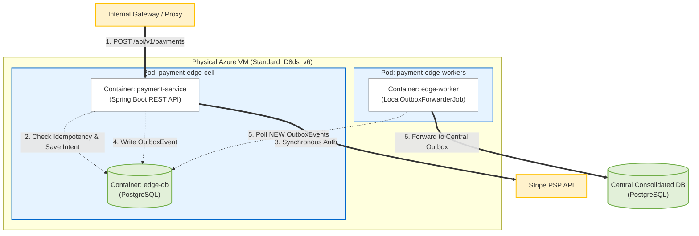
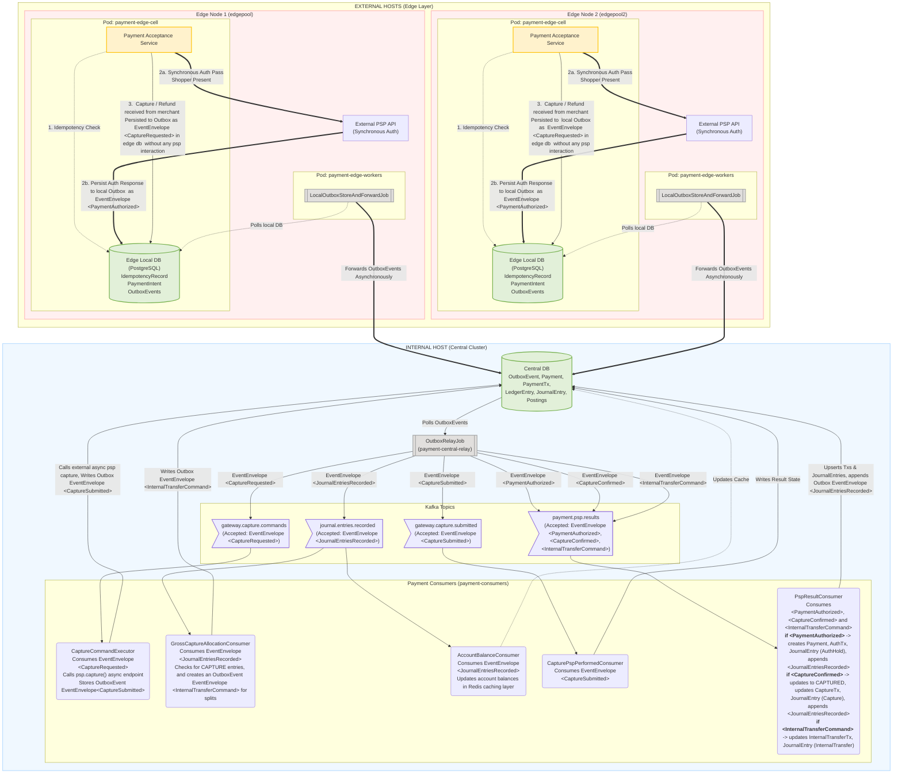
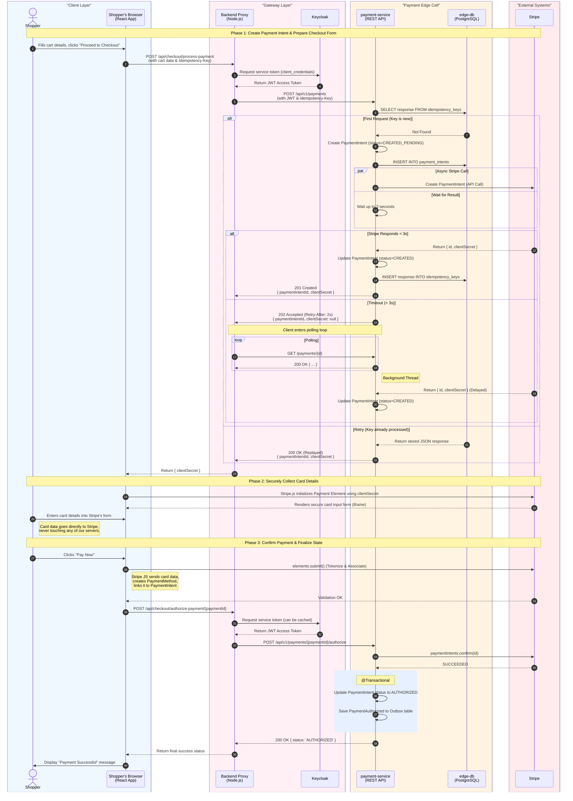

# 🟦 Event-Driven Payments & Ledger Infrastructure for Multi-Seller Platforms

This project represents a backend **payment platform for  Merchant-of-Record (MoR) environment**.  
Think of a multi-seller e-commerce marketplace where shoppers can buy items from different sellers in a single checkout.  
The platform manages the **full payment lifecycle**: synchronous authorization, multi-seller decomposition, seller-level operations, and internal financial accounting.

---

# 🟦   High Level Plaform Arhictecture 

### Edge Cell Physical Topology

```mermaid
graph TD
    classDef pod fill:#e6f3ff,stroke:#0066cc,stroke-width:2px,color:#333
    classDef container fill:#fff,stroke:#666,stroke-width:1px,color:#333
    classDef db fill:#e2f0d9,stroke:#70ad47,stroke-width:2px,color:#333
    classDef external fill:#fff2cc,stroke:#ffc000,stroke-width:2px,color:#333

    subgraph EdgeNode["Physical Azure VM (Standard_D8ds_v6)"]
        direction TB
        
        subgraph PodEdgeCell["Pod: payment-edge-cell"]
            direction TB
            API["Container: payment-service<br/>(Spring Boot REST API)"]
            DB[("Container: edge-db<br/>(PostgreSQL)")]
        end
        
        subgraph PodEdgeWorkers["Pod: payment-edge-workers"]
            Worker["Container: edge-worker<br/>(LocalOutboxForwarderJob)"]
        end
    end
    
    Proxy["Internal Gateway / Proxy"]
    Stripe["Stripe PSP API"]
    CentralDB[("Central Consolidated DB<br/>(PostgreSQL)")]
    
    Proxy == "1. POST /api/v1/payments" ==> API
    API -. "2. Check Idempotency & Save Intent" .-> DB
    API == "3. Synchronous Auth" ==> Stripe
    API -. "4. Write OutboxEvent" .-> DB
    
    Worker -. "5. Poll NEW OutboxEvents" .-> DB
    Worker == "6. Forward to Central Outbox" ==> CentralDB

    class PodEdgeCell,PodEdgeWorkers pod
    class API,Worker container
    class DB,CentralDB db
    class Proxy,Stripe external
```

### Full System Context Diagram

```mermaid
graph TD
    %% Styles
    classDef edgeCell fill:#fff0f0,stroke:#ffbaba,stroke-width:2px,color:#333
    classDef internalHost fill:#f0f8ff,stroke:#baddff,stroke-width:2px,color:#333
    classDef db fill:#e2f0d9,stroke:#70ad47,stroke-width:2px,color:#333
    classDef service fill:#fff2cc,stroke:#ffc000,stroke-width:2px,color:#333
    classDef job fill:#e1dfdd,stroke:#a6a6a6,stroke-width:2px,color:#333
    classDef topic fill:#e8d1ff,stroke:#b160ff,stroke-width:2px,color:#333
    classDef consumer fill:#ffe6cc,stroke:#f4b183,stroke-width:2px,color:#333

    subgraph ExternalLayer["EXTERNAL HOSTS (Edge Layer)"]
        direction LR
        
        subgraph Edge1["Edge Node 1 (edgepool)"]
            direction TB
            subgraph PodEdgeCell1["Pod: payment-edge-cell"]
                direction TB
                API1["Payment Acceptance Service"]
                EdgeDB1[("Edge Local DB (PostgreSQL)<br/>IdempotencyRecord<br/>PaymentIntent<br/>OutboxEvents")]
            end
            
            subgraph PodEdgeWorkers1["Pod: payment-edge-workers"]
                Fwd1[["LocalOutboxStoreAndForwardJob"]]
            end
            
            PSP_Edge1["External PSP API<br/>(Synchronous Auth)"]
            
            %% Flow Splits inside Edge
            API1 -.->|1. Idempotency Check| EdgeDB1
            API1 ===>|2a. Synchronous Auth Pass<br/>Shopper Present| PSP_Edge1
            PSP_Edge1 ===>|2b. Persist Auth Response to local Outbox  as  EventEnvelope &lt;PaymentAuthorized&gt; | EdgeDB1
            API1 -->|3.  Capture / Refund received from merchant <br/>Persisted to Outbox as  EventEnvelope &lt;CaptureRequested&gt; in edge db  without any psp interaction| EdgeDB1
            Fwd1 -.->|Polls local DB| EdgeDB1
        end

        subgraph Edge2["Edge Node 2 (edgepool2)"]
            direction TB
            subgraph PodEdgeCell2["Pod: payment-edge-cell"]
                direction TB
                API2["Payment Acceptance Service"]
                EdgeDB2[("Edge Local DB (PostgreSQL)<br/>IdempotencyRecord<br/>PaymentIntent<br/>OutboxEvents")]
            end
            
            subgraph PodEdgeWorkers2["Pod: payment-edge-workers"]
                Fwd2[["LocalOutboxStoreAndForwardJob"]]
            end
            
            PSP_Edge2["External PSP API<br/>(Synchronous Auth)"]
            
            %% Flow Splits inside Edge
            API2 -.->|1. Idempotency Check| EdgeDB2
            API2 ===>|2a. Synchronous Auth Pass<br/>Shopper Present| PSP_Edge2
            PSP_Edge2 ===>|2b. Persist Auth Response to local Outbox  as  EventEnvelope &lt;PaymentAuthorized&gt; | EdgeDB2
            API2 -->|3.  Capture / Refund received from merchant <br/>Persisted to  local Outbox as  EventEnvelope &lt;CaptureRequested&gt; in edge db  without any psp interaction| EdgeDB2
            Fwd2 -.->|Polls local DB| EdgeDB2
        end
    end

    subgraph InternalLayer["INTERNAL HOST (Central Cluster)"]
        direction TB
        
        CentralDB[("Central DB<br/>OutboxEvent, Payment, PaymentTx,<br/>LedgerEntry, JournalEntry, Postings")]
        
        Relay[["OutboxRelayJob<br/>(payment-central-relay)"]]
        
        subgraph Topics["Kafka Topics"]
            direction LR
            CAPTURE_COMMANDS_TOPIC>"gateway.capture.commands<br/>(Accepted: EventEnvelope &lt;CaptureRequested&gt;)"]
            JOURNAL_ENTRIES_RECORDED_TOPIC>"journal.entries.recorded<br/>(Accepted: EventEnvelope &lt;JournalEntriesRecorded&gt;)"]
            CAPTURE_SUBMITTED_ACKS_TOPIC>"gateway.capture.submitted<br/>(Accepted: EventEnvelope &lt;CaptureSubmitted&gt;)"]
            PSP_RESULTS_TOPIC>"payment.psp.results<br/>(Accepted: EventEnvelope &lt;PaymentAuthorized&gt;, &lt;CaptureConfirmed&gt;, &lt;InternalTransferCommand&gt;)"]
        end
        
        CentralDB -->|Polls OutboxEvents| Relay
        
        Relay -->|EventEnvelope &lt;CaptureRequested&gt;| CAPTURE_COMMANDS_TOPIC
        Relay -->|EventEnvelope &lt;CaptureSubmitted&gt;| CAPTURE_SUBMITTED_ACKS_TOPIC
        Relay -->|EventEnvelope &lt;PaymentAuthorized&gt;| PSP_RESULTS_TOPIC
        Relay -->|EventEnvelope &lt;CaptureConfirmed&gt;| PSP_RESULTS_TOPIC
        Relay -->|EventEnvelope &lt;JournalEntriesRecorded&gt;| JOURNAL_ENTRIES_RECORDED_TOPIC
        Relay -->|EventEnvelope &lt;InternalTransferCommand&gt;| PSP_RESULTS_TOPIC

        
        subgraph Consumers["Payment Consumers (payment-consumers)"]
            direction TB
            CaptureCommandExecutor("CaptureCommandExecutor<br/> Consumes EventEnvelope &lt;CaptureRequested&gt;<br/>Calls psp.capture() async endpoint<br/>Stores OutboxEvent EventEnvelope&lt;CaptureSubmitted&gt;")
            GrossCaptureAllocationConsumer("GrossCaptureAllocationConsumer<br/> Consumes EventEnvelope &lt;JournalEntriesRecorded&gt;<br/>Checks for CAPTURE entries, and creates an OutboxEvent EventEnvelope &lt;InternalTransferCommand&gt; for splits")
            AccountBalanceConsumer("AccountBalanceConsumer<br/> Consumes EventEnvelope &lt;JournalEntriesRecorded&gt;<br/>Updates account balances in Redis caching layer")
            CapturePspPerformedConsumer("CapturePspPerformedConsumer<br/> Consumes EventEnvelope &lt;CaptureSubmitted&gt;")
     
            PspResultConsumer("PspResultConsumer<br/> Consumes &lt;PaymentAuthorized&gt;, &lt;CaptureConfirmed&gt; and &lt;InternalTransferCommand&gt;<br/><b>if &lt;PaymentAuthorized&gt;</b> -> creates Payment, AuthTx, JournalEntry (AuthHold), appends &lt;JournalEntriesRecorded&gt;<br/><b>if &lt;CaptureConfirmed&gt;</b> -> updates to CAPTURED, updates CaptureTx, JournalEntry (Capture), appends &lt;JournalEntriesRecorded&gt;<br/><b>if &lt;InternalTransferCommand&gt;</b> -> updates InternalTransferTx, JournalEntry (InternalTransfer)")
        end
        
        CAPTURE_COMMANDS_TOPIC --> CaptureCommandExecutor
        CAPTURE_SUBMITTED_ACKS_TOPIC --> CapturePspPerformedConsumer
        JOURNAL_ENTRIES_RECORDED_TOPIC --> GrossCaptureAllocationConsumer 
        JOURNAL_ENTRIES_RECORDED_TOPIC --> AccountBalanceConsumer 
        PSP_RESULTS_TOPIC --> PspResultConsumer
        
        CaptureCommandExecutor -->|Calls external async psp capture, Writes Outbox EventEnvelope &lt;CaptureSubmitted&gt; | CentralDB
        GrossCaptureAllocationConsumer -->|Writes Outbox EventEnvelope &lt;InternalTransferCommand&gt;| CentralDB
        AccountBalanceConsumer -.->|Updates Cache| CentralDB
        PspResultConsumer -->|Upserts Txs & JournalEntries, appends Outbox EventEnvelope &lt;JournalEntriesRecorded&gt; | CentralDB
        CapturePspPerformedConsumer -->|Writes Result State| CentralDB

    end

    %% Network Links
    Fwd1 ===>|Forwards OutboxEvents Asynchronously| CentralDB
    Fwd2 ===>|Forwards OutboxEvents Asynchronously| CentralDB

    %% Assign Classes
    class Edge1,Edge2 edgeCell
    class InternalLayer internalHost
    class IdemDB1,EdgeDB1,IdemDB2,EdgeDB2,CentralDB db
    class API1,API2 service
    class Fwd1,Fwd2,Relay job
    class CapTopic,TransTopic,ResTopic topic
    class CapCons,TransCons,ResCons consumer
```

# 🟩 Key Clarifications (MoR Model)

### **1. Is the payment platform internal?**
Yes. The payment platform is an **internal backend domain service**, not exposed to shoppers directly. While it provides endpoints like `POST /api/v1/payments/{paymentId}/authorize`, these are meant to be called by your own internal proxies or checkout services, never directly by the shopper's browser.

---

### **2. Do we perform the actual financial authorization ourselves?**
No. Even though we expose an `/authorize` endpoint to orchestrate the flow, we do not perform the actual financial authorization. We simply act as a gateway to trigger and record the authorization happening at an external PSP (like Stripe).  
From the PSP’s perspective, we appear as a **single merchant-of-record**; seller details remain completely internal to our ledger.

---

### **3. Do we distribute funds to sellers internally?**
Yes. As the MoR, the platform manages all **fund allocation**, applies platform fees, credits seller balances, and schedules payouts.  
The PSP simply transfers funds into the MoR account.

---

### **4. Why separate PaymentIntent and Payment?**
PaymentIntent is just a domain entity living in edge layer and edge db so its not a global entity,but Payment is part of central cluster and it is the real entity created after a financial ionteraction with external world

# 🟧 Functional Requirements
*(written using Shopper, Seller, and Internal Services as actors)*

## **For Shoppers**

### **FR1 — Shoppers should be able to make a payment for a multi-seller basket.**
- A shopper must be able to proceed to checkout page(cretePaymentIntent), and then pay via clicking pay button on checkout page(authorize endpoint)

### **FR2 — Shoppers should be able to see accurate payment authorization status.**
- Shoppers should be able to view whether their payment is authorized or declined, its a syncronous psp call, and shoppers can see payment status via the paymentintent

---

Authorization Flow

```mermaid
sequenceDiagram
    autonumber

    box rgb(240, 248, 255) "Client Layer"
        actor Shopper
        participant Browser as Shopper's Browser<br/>(React App)
    end

    box rgb(255, 240, 245) "Gateway Layer"
        participant Proxy as Backend Proxy<br/>(Node.js)
        participant Keycloak
    end

    box rgb(255, 244, 225) "Payment Edge Cell"
        participant PaymentSvc as payment-service<br/>(REST API)
        participant EdgeDB as edge-db<br/>(PostgreSQL)
    end

    box rgb(255, 235, 238) "External Systems"
        participant Stripe
    end

    %% Step 1: Create Payment Intent
    Note over Shopper, Stripe: Phase 1: Create Payment Intent & Prepare Checkout Form

    Shopper->>Browser: Fills cart details, clicks "Proceed to Checkout"
    Browser->>Proxy: POST /api/checkout/process-payment<br/>(with cart data & Idempotency-Key)
    
    Proxy->>Keycloak: Request service token (client_credentials)
    Keycloak-->>Proxy: Return JWT Access Token

    Proxy->>PaymentSvc: POST /api/v1/payments<br/>(with JWT & Idempotency-Key)
    
    %% --- IDEMPOTENCY FLOW ---
    PaymentSvc->>EdgeDB: SELECT response FROM idempotency_keys
    alt First Request (Key is new)
        EdgeDB-->>PaymentSvc: Not Found
        PaymentSvc->>PaymentSvc: Create PaymentIntent (status=CREATED_PENDING)
        PaymentSvc->>EdgeDB: INSERT INTO payment_intents
        
        par Async Stripe Call
            PaymentSvc->>Stripe: Create PaymentIntent (API Call)
        and Wait for Result
            PaymentSvc->>PaymentSvc: Wait up to 3 seconds
        end

        alt Stripe Responds < 3s
            Stripe-->>PaymentSvc: Return { id, clientSecret }
            PaymentSvc->>PaymentSvc: Update PaymentIntent (status=CREATED)
            PaymentSvc->>EdgeDB: INSERT response INTO idempotency_keys
            PaymentSvc-->>Proxy: 201 Created<br/>{ paymentIntentId, clientSecret }
        else Timeout (> 3s)
            PaymentSvc-->>Proxy: 202 Accepted (Retry-After: 2s)<br/>{ paymentIntentId, clientSecret: null }
            
            Note over Proxy, PaymentSvc: Client enters polling loop
            
            loop Polling
                Proxy->>PaymentSvc: GET /payments/{id}
                PaymentSvc-->>Proxy: 200 OK { ... }
            end

            Note right of PaymentSvc: Background Thread
            Stripe-->>PaymentSvc: Return { id, clientSecret } (Delayed)
            PaymentSvc->>PaymentSvc: Update PaymentIntent (status=CREATED)
        end

    else Retry (Key already processed)
        EdgeDB-->>PaymentSvc: Return stored JSON response
        PaymentSvc-->>Proxy: 200 OK (Replayed)<br/>{ paymentIntentId, clientSecret }
    end
    %% --- END IDEMPOTENCY FLOW ---

    Proxy-->>Browser: Return { clientSecret }

    %% Step 2: Collect Card Details via Stripe Element
    Note over Shopper, Stripe: Phase 2: Securely Collect Card Details

    Browser->>Stripe: Stripe.js initializes Payment Element using clientSecret
    Stripe-->>Browser: Renders secure card input form (iframe)
    
    Shopper->>Browser: Enters card details into Stripe's form
    Note right of Shopper: Card data goes directly to Stripe,<br/>never touching any of our servers.

    %% Step 3: Confirm Payment with Stripe and Authorize Internally
    Note over Shopper, Stripe: Phase 3: Confirm Payment & Finalize State

    Shopper->>Browser: Clicks "Pay Now"
    Browser->>Stripe: elements.submit() (Tokenize & Associate)
    Note right of Browser: Stripe JS sends card data,<br/>creates PaymentMethod,<br/>links it to PaymentIntent
    Stripe-->>Browser: Validation OK
    Browser->>Proxy: POST /api/checkout/authorize-payment/{paymentId}
    
    Proxy->>Keycloak: Request service token (can be cached)
    Keycloak-->>Proxy: Return JWT Access Token

    Proxy->>PaymentSvc: POST /api/v1/payments/{paymentId}/authorize
    
    PaymentSvc->>Stripe: paymentIntents.confirm(id)
    Stripe-->>PaymentSvc: SUCCEEDED

    rect rgb(230, 240, 255)
        note over PaymentSvc: @Transactional
        PaymentSvc->>PaymentSvc: Update PaymentIntent status to AUTHORIZED
        PaymentSvc->>PaymentSvc: Save PaymentAuthorized to Outbox table
    end

    PaymentSvc-->>Proxy: 200 OK { status: 'AUTHORIZED' }
    Proxy-->>Browser: Return final success status
    Browser->>Shopper: Display "Payment Successful" message
```

## **For Sellers**

### **FR3 — Sellers should be able to receive their portion of a shopper’s payment if defined in splits array
- Each seller must receive the correctly allocated share of the total payment based on the items purchased from them.

### **FR4 — Sellers should be able to view their financial state.**
- Sellers should be able to access their balances, payable amounts, and payout summaries via projected views

---

## **For Internal Services (Checkout / Order / Finance / Payouts)**

### **FR5 — Checkout/Order Service should be able to create a PaymentIntent.**
- It must be possible for the Order Service to create a PaymentIntent and obtain the generated Intent along with its seller-level PaymentSplits.

### **FR6 — Checkout/Order Service should be able to trigger authorization via PSP.**
- The system must allow Checkout to authorize the total payment amount through an external PSP.

### **FR7 — Internal services should be able to perform operations.**
- Internal services must be able to request captures, cancellations, and refunds *per Payment*.

### **FR8 — The system must maintain internal fund distribution for reporting and payouts.**
- Internal components (Finance, Payouts) must be able to retrieve seller payables, platform fees, and other financial allocations.

---

# 🟥 Non-Functional Requirements
*(written using “The system should be…” statements)*

### **NFR1 — The system should be highly available.**
Payment creation and authorization must remain available during peak checkout traffic.

### **NFR2 — The system should ensure strong consistency for financial data.**
State transitions must never lead to incorrect balances or double charges.

### **NFR3 — The system should be secure.**
Sensitive financial data must be protected using proper authentication, authorization, and encryption.

### **NFR4 — The system should be observable.**
Logs, metrics, and tracing must allow operators to understand system behavior and diagnose issues.

### **NFR5 — The system should be scalable.**
It must support increasing transaction volumes, sellers, and asynchronous workflows without degradation.

### **NFR6 — The system must be correct under retries and failures.**
Even under retries, restarts, and network issues, financial outcomes must remain correct.

---

# 🟦 Architecture Summary (Non-Functional / Implementation Section)

The platform internally uses:
- **Event-driven architecture** for asynchronous flows for payments and the ledger
- **Kafka topics** for execution queuing and PSP results
- **Idempotent state transitions** to ensure correctness under retries
- **Double-entry ledger** for immutable financial history
- **PSP gateway client** for authorization, capture, refund, and cancel operations
- **Internal balance tracking** for seller payables and platform revenues

---

# 🟦 Core Entities (Domain-Level)

These represent the nouns our system uses to satisfy the functional requirements.  
They define the **data model**, the **API vocabulary**, and the **business language** of the Merchant-of-Record payment platform.

---

## 🧍 Actors

### **Shopper**
The end-user making a purchase across one or multiple sellers.

### **Seller**
A marketplace participant who receives part of the shopper’s payment and later receives payouts.

### **Internal Services**
- Checkout / Order Service
- Finance

These actors perform operations on payments, orders, balances, and payouts.

---

# 🟩 Core Business Entities
Here you can see t journey of a paymentintent -> pamyent- > capture/refund/ settle/ payout/ split transaction

These are the fundamental nouns of our Merchant-of-Record payment platform.

---

## **1. PaymentIntent**

Represents the **shopper's intent to pay** for a multi-seller basket.

**When it's created:**
- Step 1: Shopper initiates checkout → `POST /api/v1/payments` endpoint
- Created with status `CREATED_PENDING` (initially), then transitions to `CREATED` once Stripe ID is obtained.
- Contains: `buyerId`, `orderId`, `totalAmount`, `paymentSplits` (seller breakdown)

**Why it exists:**
- Separates "intent to pay"(living in its own edge) from "actual payment transaction(payment-living in the central cluster)"
- Enables idempotent authorization attempts (prevents duplicate PSP calls)
- Supports retry logic for transient PSP failures

## **2. Payment**

Represents the **actual financial transaction** created after authorization succeeds

**When it's created:**
- Created centrally by the `PspResultConsumer` when the PSP authorization response is `AUTHORIZED`.

**Why it exists:**
- Models actual money movement (vs. PaymentIntent which is just "intent")
- Tracks aggregate-level financial state across all sellers
- Provides aggregate view: total captured, total refunded
- Links to `PaymentIntent` via `paymentIntentId` for traceability
- Enables financial reporting and reconciliation

## **3. OutboxEvent**
Represents **immutable integration events** stored locally on edge or centrally, it simply stores the deserilazed byte of an any EventEnvelope<Event>

**When it's created:**
  When intent mutations or external network results are received.

**Why it exists:**
- Guarantees exactly-once publishing through the database transaction.
- Eliminates dual-write vulnerabilities between DB and Kafka.

---

## **4. Payment Transaction (Tx)**

Represents an **individual interaction with an external PSP** executed against a Payment (e.g., `AuthorizationTx`, `CaptureTx`, `RefundTx`, `SettleTx`). 

**When it's created:**
  - Whenever an operation is requested and executed against the external PSP (e.g., when we successfully call external psp capture api, a `CaptureTx` is recorded).

**Why it exists:**
  - **Audit & History:** While the `Payment` aggregate tracks the *cumulative total* (e.g., "This payment has 100 EUR captured"), the `Tx` tracks the *individual external psp interactions* ("We did call external psp capture api with this parameters, and this was the response from them").
  - **External PSP Linking:** It stores the external network identifiers (like the PSP's acquirer reference) to trace exactly which network call caused the balance change.
  - **JournalEntry record Bridging to actual external PSP interaction:** It actually is the proof of the transaction when we look at our JournalEntry and understand why we have this journal entry in our system,because of this external interaction with psp

## **5. JournalEntry**
Represents a **single double-entry journal entry**.It is always true that sum of the debit and credit postings are equal

Contains:
- Debit postings
- Credit postings
- JournalId
- Timestamp
- TxId(which is the linking this JournalEntry  to the exact external psp interaction record ) (paymentIntentId, txId, sellerId, etc.)

**Why it exists:**  
Ensures financial correctness, auditability, and immutable accounting history.

---

## **6. Posting (Debit / Credit)**

A component of a LedgerEntry.

- Refers to an account
- Contains a signed amount
- Reflects accounting direction (DR/CR)

**Why it exists:**  
JournalEntries consist of multiple postings — always balanced.

---

## **7. Account**

Represents a **financial account** in the internal ledger, such as:

- PLATFORM_CASH
- PSP_RECEIVABLES
- AUTH_RECEIVABLE
- AUTH_LIABILITY
- MERCHANT_GROSS_CAPTURE_SUSPENSE
- BALANCE_ACCOUNT
- PLATFORM_COMMISSION_ESCROW
- PLATFORM_OPERATIONAL_REVENUE
- PSP_FEE_EXPENSE

**Why it exists:**  
Money moves internally between accounts, not as free-form variables.

---

## **8. Balance**

Represents the **current financial standing** of an account (e.g., seller’s accrued revenue).  
Derived from applied LedgerEntries.

**Why it exists:**  
Used for reporting, analytics, payouts, and consistency validation.

## Sequnce Diagrams

TYou can see here sequence diagram  of shopper a, and payment journey end to end, also global idempotency hanlding 

### Simplified Consumer Architecture

A new simplified Kafka consumer architecture has been introduced to streamline PSP operations and double-entry bookkeeping.

**Why we moved away from the "Consume-Process-Publish" pattern:**
Historically, consumers would read an event, process it (e.g. call a PSP), and then immediately publish a new event using Kafka Transactions. This attempted to achieve "exactly-once" delivery semantics but caused significant issues:
- **Abusing Kafka as a Database**: Relying on Kafka transactions to guarantee state consistency across external API calls and database commits led to fragile, blocking architectures.
- **Blocking Calls in Transactions**: External PSP calls (which can be slow) held open Kafka transactions, reducing throughput and risking transaction timeouts.
- **Unrealistic Exactly-Once Guarantees**: Achieving true exactly-once semantics across a database, an external HTTP API, and Kafka is impossible without distributed locks or 2PC (Two-Phase Commit).

**The New Pattern (Outbox-Driven Consumers):**
1. **Intents (Capture/Refund Received)**: `CaptureReceived` events denote that an intent to capture has been recorded in the database edge outbox.
2. **Executors (`CaptureCommandExecutor`)**: These components listen to `capture-execution-queue`. They perform the synchronous call to the external PSP Gateway. Upon receiving a terminal or retryable result, they **do not publish back to Kafka directly**. Instead, they write a `ExternalAsyncCaptureToPspPerformed` event into the Central Database Outbox.
3. **Outbox Relay**: The `OutboxRelayJob` reads these results from the database outbox and publishes them asynchronously to their respective Kafka topics (e.g., `psp-result-queue`, `capture-execution-queue`, `internal-transfer-queue`, `journal.entries.recorded`) based on the event type.
4. **Result Processing (`PspResultConsumer`)**: Listens to the `psp-result-queue` to apply the results to the central database, finalize payment statuses, trigger internal double-entry ledger bookkeeping, and schedule any required internal transfers.

### Authorization/Idempotency Sequence Diagram

# 🟦 System Design & Modular Architecture

The platform follows a **Hexagonal (Ports & Adapters)** pattern to separate business policy from technical details, ensuring high availability (NFR1) and consistency (NFR2).

### **1. `payment-domain` (Core Business Logic)**
- **Role**: Pure Kotlin business rules and data models.
- **Components**: Entities (`Payment`, `PaymentIntent`), Value Objects, and Domain Events.
- **Traits**: Zero dependencies on Spring or MyBatis. Implements **Double-entry ledger** logic and **Idempotent state transitions**.

### **2. `payment-application` (Orchestration & Ports)**
- **Role**: Implements Use Cases, coordinates business flows, and defines Ports.
- **Components**: Inbound Ports (Use Cases), Outbound Ports (Database/Kafka interfaces), and Core Domain Services.
- **Logic**: Manages internal fund distribution, platform fees, and retry policies for PSP operations.

### **3. `common-db` (Shared Database Infrastructure)**
- **Role**: Reusable MyBatis utilities, JSON typehandlers, and base configuration templates.
- **Traits**: Provides `mybatis-config-template.xml` and standard JSONb handling across the platform.

### **4. `common-kafka` (Shared Messaging Infrastructure)**
- **Role**: Reusable Kafka utilities, generic event envelopes, and Jackson ser/deser configurations.
- **Traits**: Ensures type safety and consistent payload formatting for all Kafka producers and consumers.

### **5. `payment-infrastructure` (Shared Technical Adapters)**
- **Role**: General utility implementations like the Snowflake ID Generator.
- **Traits**: Contains only truly common infrastructure utilities, completely decoupled from database entities or Kafka topics.

### **4. `payment-service` (API & Edge Cell Inbound Adapter)**
- **Role**: Composition root and API gateway for the Edge Cell Pod.
- **REST API**: Spring Web MVC controllers exposed to internal checkout/order services for synchronous payments and intents.
- **Ports & Adapters**: Implements local database storage using `LocalOutboxWriterPort` to guarantee transaction safety.
- **Wiring**: Manages local Edge Cell lifecycle, thread pools, and local database connection.

### **5. `payment-edge-workers` (Standalone Outbox Forwarder)**
- **Role**: Background worker that bridges the Edge Cell to the Central Node.
- **Outbox Forwarding**: Runs `LocalOutboxForwarderJob` asynchronously to claim local outbox events using `LocalOutboxEdgePort` and forward them to the Central consolidated DB using `CentralOutboxEdgePort`.
- **Fault Isolation**: Deployed in its own isolated Pod on the same edge node. If the worker encounters issues, crashes, or requires maintenance, it can be restarted by Kubernetes without taking down the entire synchronous Web API and local database.

### **6. `payment-central-relay` (Central Outbox Publisher)**
- **Role**: Centralized high-performance scheduler that publishes events to Kafka.
- **Resilient Relaying**: Hosts the global `OutboxRelayJob` which queries eligible events from the Central DB outbox using `CentralOutboxRelayPort` and a safe watermark (`T_Safe`).
- **Kafka Publishing**: Uses an isolated thread pool and `PaymentEventPublisher` to publish events strictly in-order to Kafka with guaranteed at-least-once delivery.

### **7. `payment-consumers` (Asynchronous Workers & Ledger Processors)**
- **Role**: Central asynchronous consumer engine.
- **Kafka Listeners**: Hosts all `@KafkaListener` components for capture, refund, PSP results, ledger recording, and balance updates.
- **Workloads**: Coordinates heavy asynchronous tasks like calling external PSP Gateways and executing double-entry ledger bookkeeping.

## 🟦 Outbox Pattern Implementation (Two-Stage Edge-to-Central)

The system uses a **Two-Stage Transactional Outbox Pattern** to ensure reliable event publishing from distributed stateless edge nodes to a highly available central relay, which ultimately publishes to Kafka.

### **Stage 1: Edge Node (The Edge Cell Topology)**

The Edge layer is responsible for synchronous payment acceptance (Stripe integration, intent creation) and local outbox creation. To achieve low-latency communication and perfectly linear horizontal scaling, the Edge layer components are scheduled together using strict **Kubernetes Node Affinity**, but deployed as **separate Pods** for lifecycle fault isolation.

**The Edge Components (Strict Co-location Ratio):**
A single Edge Cell ecosystem runs on an isolated `edgepool` node and consists of separate Pods communicating over the internal cluster network:
1. **`payment-service` Pod (Web API)**: Handles high-throughput synchronous checkouts and creates `OutboxEvent` records.
2. **`local-edge-db` (Local State)**: A dedicated PostgreSQL container running within the `payment-edge-cell` Pod, attached to a Persistent Volume (PVC).
3. **`payment-edge-workers` Pod (Forwarder)**: A background worker running in its own standalone Pod that polls the `edge-db` for `NEW` outbox events and pushes them to the **Central DB**.

**Fault Tolerance Hardening:**
- **Lifecycle Fault Isolation**: Previously, the worker and API shared the same Pod (the Sidecar pattern). However, if the worker crashed or required a restart, Kubernetes would forcefully terminate the entire Pod, bringing down the healthy Web API and Database with it. By separating them into independent Pods, a worker maintenance cycle or crash has zero impact on the synchronous Web API's uptime.
- **Co-Located Scheduling**: Even though they are separate Pods, strict `nodeSelector` rules force them to land on the exact same physical `edgepool` Virtual Machine, minimizing network latency while maximizing fault isolation.
- **Topology Spread Constraints**: The Edge Cells are mathematically forced to spread evenly across Cloud Availability Zones to survive datacenter outages.

### **Stage 2: Central Node (payment-central-relay & payment-consumers)**

The Central layer acts as the global system of record, ledger orchestrator, and Kafka publisher/consumer. It is divided into two highly available, autonomous modules to preserve separate scaling and thread/resource isolation boundaries:

- **`payment-central-relay`**: A dedicated, non-blocking service containing the global `OutboxRelayJob` and the `PaymentEventPublisher`. It continuously polls the Central DB's `outbox_event` table based on a globally safe `T_Safe` watermark (derived from all edge nodes) and publishes outbox events strictly in-order to Kafka using an isolated `resilientExecutor` thread pool.
- **`payment-consumers`**: Purely asynchronous consumer application containing all Kafka `@KafkaListener` event handlers. It consumes event streams from Kafka topics, handles PSP capture/refund execution, manages terminal result updates, and coordinates double-entry ledger bookkeeping and Redis balance-cache updates.

**Host Deployment, Fault Isolation, and Non-Sidecar Pattern:**
Unlike the Edge Cell which strictly enforces the Kubernetes Sidecar pattern (forcing the API, the local PostgreSQL database, and the local edge worker to reside in the same Pod to share localhost-based low-latency networking and co-located physical disk storage), **the Central Cluster components do NOT apply the sidecar pattern**. 

Since this represents an asynchronous processing path, **`payment-central-relay` and `payment-consumers` must NOT be co-located in the same Pod or physical host node**. Instead, they are completely decoupled asynchronously via Kafka to maximize durability and high availability:
- **Fault Domain Isolation**: If `payment-central-relay` (the outbox relay job) crashes or experiences an outage, `payment-consumers` remains fully operational. It continues to process, execute, and settle any backlog of payment events already stored in the Kafka cluster without interruption.
- **Resource Independence**: If the consumer layer experiences high latency due to slow external PSP gateway responses or intensive batch ledger writes, it will not steal CPU resources, memory, or DB connections from `payment-central-relay`, preventing cascading failures.
- **Anti-Affinity Scheduling**: Kubernetes deployments utilize **Pod Anti-Affinity rules** to physically separate `payment-central-relay` and `payment-consumers` onto different physical compute nodes and Availability Zones.

**Why This Topology:**
- **High Availability**: Edge cells can continue accepting payments and writing to their local Postgres databases even if the Central DB or Kafka goes down entirely.
- **Resource & Fault Isolation**: The outbox publishing scheduler run-loop is isolated in `payment-central-relay` with its own thread pool, ensuring that heavy consumer processing (e.g. slow PSP gateway calls or batch ledger updates in `payment-consumers`) can never block or exhaust the outbox publishing thread allocation.
- **Independent Scaling & Topology Separation**: Edge Cells can be scaled out linearly to handle localized high checkout volumes. Meanwhile, the central `payment-consumers` and `payment-central-relay` scale independently on separate compute hosts to handle global asynchronous workloads without constraints on co-location.
- **Guaranteed At-Least-Once Delivery**: Events are durably stored in the local outboxes first, forwarded to the central consolidated outbox, and only marked as dispatched upon a successful Kafka ack.

### **Stage 3: Outbox Port Architecture & Flow Control**

To maintain a strict **Hexagonal (Ports & Adapters)** design and prevent architectural pollution, outbox capabilities are split into four highly specialized outbound ports with clean, distinct responsibilities:

1. **`LocalOutboxWriterPort`**:
   - **Declared in**: `payment-application` / `ports/outbound`
   - **Used by**: `payment-service` (Web API)
   - **Responsibility**: Invoked within the local Edge transaction boundary to write `OutboxEvent` records directly into the local postgres database (`local-edge-db`).
2. **`LocalOutboxEdgePort`**:
   - **Declared in**: `payment-application` / `ports/outbound`
   - **Used by**: `payment-edge-workers` (Local Sidecar Forwarder)
   - **Responsibility**: Reads, claims, and marks local outbox events as dispatched. Declares specific methods such as `findEligible(batchSize, workerId)` and `markDispatched(events)`.
3. **`CentralOutboxEdgePort`**:
   - **Declared in**: `payment-application` / `ports/outbound`
   - **Used by**: `payment-edge-workers` (Local Sidecar Forwarder)
   - **Responsibility**: Acts as a bridge between edge node container and the consolidated Central DB cluster. Invoked by the local forwarder to insert batches of claimed edge events (`insertBatch(edgeNodeId, entries)`) into the central `outbox_event` table.
4. **`CentralOutboxRelayPort`**:
   - **Declared in**: `payment-application` / `ports/outbound`
   - **Used by**: `payment-central-relay` (Central Outbox Publisher)
   - **Responsibility**: Provides the read/write API for the central consolidated outbox table. Exposes `findEligible(tSafe, batchSize)` to query unclaimed events safely behind the watermark `T_Safe`, and `markDispatched(oeid)` to finalize publication upon successful Kafka broker acknowledgment.

### **Stage 4: Database Connection URLs & Role-Based Credentials**

In line with strict security and network isolation principles, **there is no shared database configuration or connection account**. Each runtime component is allocated a dedicated PostgreSQL user role with the minimum privileges required to perform its specific task.

#### **1. Edge Database Access (Local Edge Cell)**
- **Scope**: Local transactions, high throughput, low latency.
- **Config Variable**: `EDGE_DB_URL`
- **JDBC Connection URL**: `jdbc:postgresql://localhost:5432/edge-db?options=-c%20timezone=UTC`
- **Component Credentials**:
  * **`payment-service`**:
    * **Username Key**: `EDGE_DB_PAYMENT_SERVICE_USERNAME`
    * **Username**: `edge_db_payment_service_username`
  * **`payment-edge-workers`**:
    * **Username Key**: `EDGE_DB_PAYMENT_EDGE_WORKERS_USERNAME`
    * **Username**: `edge_db_payment_edge_workers_username`

#### **2. Central Database Access (Global Consolidated State)**
- **Scope**: Multi-seller consolidated outbox, double-entry ledger bookkeeping, and global account balance snapshots.
- **Config Variable**: `CENTRAL_DB_URL` (mapped internally to `SPRING_DATASOURCE_URL` or resolved locally via `SPRING_DATASOURCE_CENTRAL_URL`).
- **JDBC Connection URLs**:
  - **Kubernetes / Containerized Production**:
    `jdbc:postgresql://central-db-postgresql:5432/central-db?options=-c%20timezone=UTC`
  - **Local Development Environment**:
    `jdbc:postgresql://localhost:5432/central-db?options=-c%20timezone=UTC`
- **Component Credentials**:
  * **`payment-consumers`**:
    * **Username Key**: `CENTRAL_DB_PAYMENT_CONSUMERS_USERNAME`
    * **Username**: `central_db_payment_consumers_username`
  * **`payment-edge-workers`** (when writing to central outbox):
    * **Username Key**: `CENTRAL_DB_PAYMENT_EDGE_WORKERS_USERNAME`
    * **Username**: `central_db_payment_edge_workers_username`
  * **`payment-central-relay`** (when relaying central outbox to Kafka):
    * **Username Key**: `CENTRAL_DB_PAYMENT_CENTRAL_RELAY_USERNAME`
    * **Username**: `central_db_payment_central_relay_username`

---

## 🟦 Kafka Event Typology & Type Verification

To satisfy strict financial auditability and message correctness (NFR2/NFR6), the platform implements **strict compile-time type-safety** and **declarative runtime serialization**. 

### 1. The Kafka Event and Command Topology

The following catalog defines every event and command passing through Kafka, including their exact topic mappings, event type strings, payload envelope classes, publishers, and consumers:

| No. | Logical Event / Command | Event Type String (`eventType`) | Envelope Payload Class | Kafka Topic | Publisher Module & Class | Consumer Module & Class | Consumer Group ID | Container Factory Bean |
|---|---|---|---|---|---|---|---|---|
| **1** | **Payment Authorized Event** | `"payment_authorized"` | `EventEnvelope<PaymentAuthorized>` | `payment.psp.results` | `payment-central-relay` `OutboxRelayJob` | `payment-consumers` `PspResultConsumer` | `payment-core.psp-result-consumer` | `payment-core.psp-result-consumer-factory` |
| **2** | **Capture Requested Event** | `"capture_requested"` | `EventEnvelope<CaptureRequested>` | `gateway.capture.commands` | `payment-central-relay` `OutboxRelayJob` | `payment-consumers` `CaptureCommandExecutor` | `gateway-workers.capture-command-executor` | `gateway-workers.capture-command-executor-factory` |
| **3** | **Capture Submitted Event** | `"capture_submitted"` | `EventEnvelope<CaptureSubmitted>` | `gateway.capture.submitted` | `payment-central-relay` `OutboxRelayJob` | `payment-consumers` `CapturePspPerformedConsumer` | `payment-core.capture-submitted` | `payment-core.capture-submitted-factory` |
| **4** | **Capture Confirmed Event** | `"capture_confirmed"` | `EventEnvelope<CaptureConfirmed>` | `payment.psp.results` | `payment-central-relay` `OutboxRelayJob` | `payment-consumers` `PspResultConsumer` | `payment-core.psp-result-consumer` | `payment-core.psp-result-consumer-factory` |
| **5** | **Internal Transfer Command** | `"internal_transfer_command"` | `EventEnvelope<InternalTransferCommand>` | `payment.psp.results` | `payment-central-relay` `OutboxRelayJob` | `payment-consumers` `PspResultConsumer` | `payment-core.psp-result-consumer` | `payment-core.psp-result-consumer-factory` |
| **6** | **Journal Entries Recorded** | `"journal_entries_recorded"` | `EventEnvelope<JournalEntriesRecorded>` | `journal.entries.recorded` | `payment-consumers` `ProcessPspResultUseCase` | `payment-consumers` `GrossCaptureAllocationConsumer` `AccountBalanceConsumer` `SimulatedSdrStreamingProcessorConsumer` | `payment.gross-capture-allocation-consumer-group` `ledger-engine.account-balance-consumer` `ledger-engine.simulated-settlement-consumer` | `...-factory` |
| **7** | **Settlement Received Event** | `"settlement_received_by_psp"` | `EventEnvelope<SettlementReceived>` | `payment.psp.results` | `payment-central-relay` `OutboxRelayJob` | `payment-consumers` `PspResultConsumer` | `payment-core.psp-result-consumer` | `payment-core.psp-result-consumer-factory` |

---

### 2. Strict Type Safety & Generics Preservation

#### Avoidance of Type Erasure
In early iterations, generic event envelopes were sometimes cast to a raw `EventEnvelope<Event>` base wrapper. This degraded runtime type signatures and stripped Jackson of the concrete metadata needed to map and deserialize nested JSON sub-structures correctly. 

To harden this, the system strictly implements **concrete type preservation** across both publication and consumption:
1. **At Publication (`OutboxRelayJob` & `PaymentEventPublisher`)**:
   Instead of calling `publishBatchAtomically<Event>`, the relay job parses the internal outbox event type and casts the envelope to its exact, concrete compile-time generic class (e.g. `EventEnvelope<PaymentAuthorized>`, `EventEnvelope<CaptureReceived>`, or `EventEnvelope<RefundReceived>`).
2. **At Serialization (`JacksonSerializationAdapter` & `EventEnvelopeKafkaSerializer`)**:
   The serialization adapter preserves the complete generic structure, appending the event's fully-qualified class details and type metadata into the JSON payload and Kafka headers (e.g., `traceId`, `eventId`, `eventType`).

#### Runtime Deserialization Binding
Kafka messages are consumed using Spring Kafka's `ErrorHandlingDeserializer` delegating to our custom `EventEnvelopeKafkaDeserializer`. 
- **The Metadata Catalog (`PaymentEventMetadataCatalog`)**:
  Maintains a registry mapping each event class to a specific `TypeReference<EventEnvelope<T>>`.
- **Deserializer Resolution**:
  When a byte array is pulled from a topic, the deserializer resolves the topic's corresponding `TypeReference` from the catalog and calls `objectMapper.readValue(data, typeRef)`. This forces Jackson to reconstruct the exact nested type (e.g. `CaptureReceived`) instead of falling back to a raw map or base class.
- **Type Filtering**:
  At the container listener level (`KafkaTypedConsumerFactoryConfig`), the container factory is registered with a `RecordFilterStrategy` matching the class's exact expected event type. This ensures that any malformed or unexpected events are filtered or routed to the DLQ immediately without crashing the consumer.

