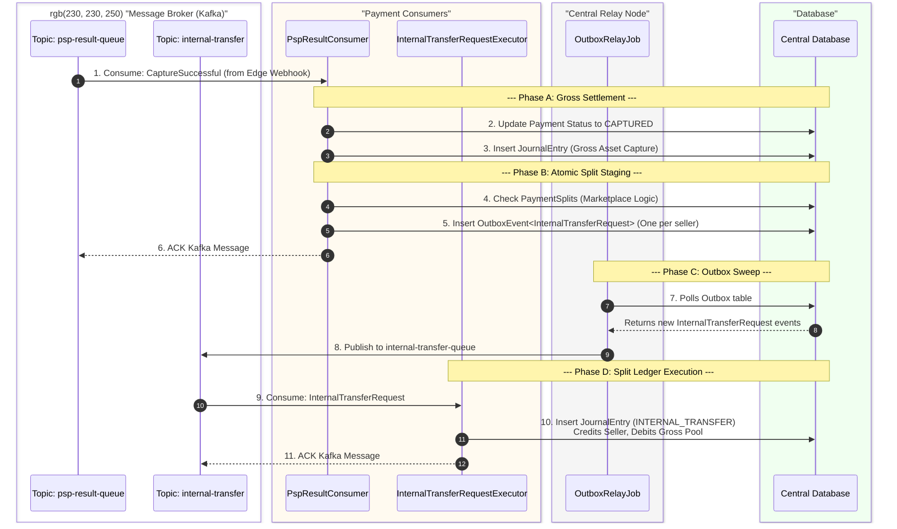
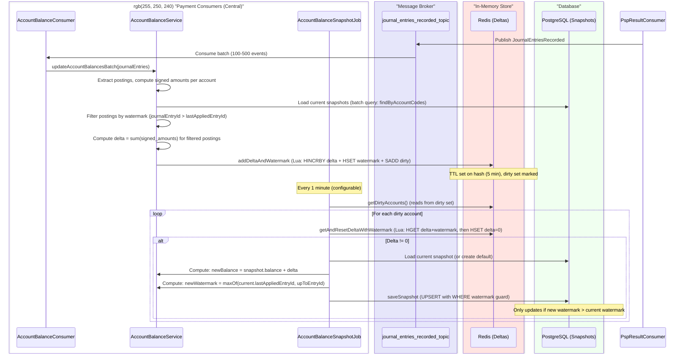

payment platform context diafram
```mermaid
graph TD
    %% Styles
    classDef edgeCell fill:#fff0f0,stroke:#ffbaba,stroke-width:2px,color:#333
    classDef internalHost fill:#f0f8ff,stroke:#baddff,stroke-width:2px,color:#333
    classDef db fill:#e2f0d9,stroke:#70ad47,stroke-width:2px,color:#333
    classDef service fill:#fff2cc,stroke:#ffc000,stroke-width:2px,color:#333
    classDef job fill:#e1dfdd,stroke:#a6a6a6,stroke-width:2px,color:#333
    classDef topic fill:#e8d1ff,stroke:#b160ff,stroke-width:2px,color:#333
    classDef consumer fill:#ffe6cc,stroke:#f4b183,stroke-width:2px,color:#333

    subgraph ExternalLayer["EXTERNAL HOSTS (Edge Layer)"]
        direction LR
        
        subgraph Edge1["Edge Cell 1"]
            direction TB
            API1["Payment Acceptance Service"]
            IdemDB1[("Idempotency DB<br/>IdempotencyRecord")]
            EdgeDB1[("Edge Local DB<br/>PaymentIntent<br/>OutboxEvents")]
            Fwd1[["LocalOutboxStoreAndForwardJob"]]
            PSP_Edge1["External PSP API<br/>(Synchronous Auth)"]
            
            %% Flow Splits inside Edge
            API1 -.->|1. Idempotency Check| IdemDB1
            API1 ===>|2a. Synchronous Auth Pass<br/>Shopper Present| PSP_Edge1
            PSP_Edge1 ===>|2b. Persist Auth Response to local Outbox  as  EventEnvelope &lt;PaymentAuthorized&gt; | EdgeDB1
            API1 -->|3.  Capture / Refund received from merchant <br/>Persisted to Outbox as  EventEnvelope &lt;CaptureRequested&gt; in edge db  without any psp interaction| EdgeDB1
            EdgeDB1 --> Fwd1
        end

        subgraph Edge2["Edge Cell 2"]
            direction TB
            API2["Payment Acceptance Service"]
            IdemDB2[("Idempotency DB<br/>IdempotencyRecord")]
            EdgeDB2[("Edge Local DB<br/>PaymentIntent<br/>OutboxEvents")]
            Fwd2[["LocalOutboxStoreAndForwardJob"]]
            PSP_Edge2["External PSP API<br/>(Synchronous Auth)"]
            
            %% Flow Splits inside Edge
            API2 -.->|1. Idempotency Check| IdemDB2
            API2 ===>|2a. Synchronous Auth Pass<br/>Shopper Present| PSP_Edge2
            PSP_Edge2 ===>|2b. Persist Auth Response to local Outbox  as  EventEnvelope &lt;PaymentAuthorized&gt; | EdgeDB2
            API2 -->|3.  Capture / Refund received from merchant <br/>Persisted to  local Outbox as  EventEnvelope &lt;CaptureRequested&gt; in edge db  without any psp interaction| EdgeDB2
            EdgeDB2 --> Fwd2
        end
    end

    subgraph InternalLayer["INTERNAL HOST (Central Cluster)"]
        direction TB
        
        CentralDB[("Central DB<br/>OutboxEvent, Payment, PaymentTx,<br/>LedgerEntry, JournalEntry, Postings")]
        
        Relay[["OutboxRelayJob<br/>(payment-central-relay)"]]
        
        subgraph Topics["Kafka Topics"]
            direction LR
            CAPTURE_COMMANDS_TOPIC>"gateway.capture.commands<br/>(Accepted: EventEnvelope &lt;CaptureRequested&gt;)"]
            JOURNAL_ENTRIES_RECORDED_TOPIC>"journal.entries.recorded<br/>(Accepted: EventEnvelope &lt;JournalEntriesRecorded&gt;)"]
            CAPTURE_SUBMITTED_ACKS_TOPIC>"gateway.capture.submitted<br/>(Accepted: EventEnvelope &lt;CaptureSubmitted&gt;)"]
            PSP_RESULTS_TOPIC>"payment.psp.results<br/>(Accepted: EventEnvelope &lt;PaymentAuthorized&gt;, &lt;CaptureConfirmed&gt;, &lt;InternalTransferCommand&gt;)"]
        end
        
        CentralDB -->|Polls OutboxEvents| Relay
        
        Relay -->|EventEnvelope &lt;CaptureRequested&gt;| CAPTURE_COMMANDS_TOPIC
        Relay -->|EventEnvelope &lt;CaptureSubmitted&gt;| CAPTURE_SUBMITTED_ACKS_TOPIC
        Relay -->|EventEnvelope &lt;PaymentAuthorized&gt;| PSP_RESULTS_TOPIC
        Relay -->|EventEnvelope &lt;CaptureConfirmed&gt;| PSP_RESULTS_TOPIC
        Relay -->|EventEnvelope &lt;JournalEntriesRecorded&gt;| JOURNAL_ENTRIES_RECORDED_TOPIC
        Relay -->|EventEnvelope &lt;InternalTransferCommand&gt;| PSP_RESULTS_TOPIC

        
        subgraph Consumers["Payment Consumers (payment-consumers)"]
            direction TB
            CaptureCommandExecutor("CaptureCommandExecutor<br/> Consumes EventEnvelope &lt;CaptureRequested&gt;<br/>Calls psp.capture() async endpoint<br/>Stores OutboxEvent EventEnvelope&lt;CaptureSubmitted&gt;")
            GrossCaptureAllocationConsumer("GrossCaptureAllocationConsumer<br/> Consumes EventEnvelope &lt;JournalEntriesRecorded&gt;<br/>Checks for CAPTURE entries, and creates an OutboxEvent EventEnvelope &lt;InternalTransferCommand&gt; for splits")
            AccountBalanceConsumer("AccountBalanceConsumer<br/> Consumes EventEnvelope &lt;JournalEntriesRecorded&gt;<br/>Updates account balances in Redis caching layer")
            CapturePspPerformedConsumer("CapturePspPerformedConsumer<br/> Consumes EventEnvelope &lt;CaptureSubmitted&gt;")
     
            PspResultConsumer("PspResultConsumer<br/> Consumes &lt;PaymentAuthorized&gt;, &lt;CaptureConfirmed&gt; and &lt;InternalTransferCommand&gt;<br/><b>if &lt;PaymentAuthorized&gt;</b> -> creates Payment, AuthTx, JournalEntry (AuthHold), appends &lt;JournalEntriesRecorded&gt;<br/><b>if &lt;CaptureConfirmed&gt;</b> -> updates to CAPTURED, updates CaptureTx, JournalEntry (Capture), appends &lt;JournalEntriesRecorded&gt;<br/><b>if &lt;InternalTransferCommand&gt;</b> -> updates InternalTransferTx, JournalEntry (InternalTransfer)")
        end
        
        CAPTURE_COMMANDS_TOPIC --> CaptureCommandExecutor
        CAPTURE_SUBMITTED_ACKS_TOPIC --> CapturePspPerformedConsumer
        JOURNAL_ENTRIES_RECORDED_TOPIC --> GrossCaptureAllocationConsumer 
        JOURNAL_ENTRIES_RECORDED_TOPIC --> AccountBalanceConsumer 
        PSP_RESULTS_TOPIC --> PspResultConsumer
        
        CaptureCommandExecutor -->|Calls external async psp capture, Writes Outbox EventEnvelope &lt;CaptureSubmitted&gt; | CentralDB
        GrossCaptureAllocationConsumer -->|Writes Outbox EventEnvelope &lt;InternalTransferCommand&gt;| CentralDB
        AccountBalanceConsumer -.->|Updates Cache| CentralDB
        PspResultConsumer -->|Upserts Txs & JournalEntries, appends Outbox EventEnvelope &lt;JournalEntriesRecorded&gt; | CentralDB
        CapturePspPerformedConsumer -->|Writes Result State| CentralDB

    end

    %% Network Links
    Fwd1 ===>|Forwards OutboxEvents Asynchronously| CentralDB
    Fwd2 ===>|Forwards OutboxEvents Asynchronously| CentralDB

    %% Assign Classes
    class Edge1,Edge2 edgeCell
    class InternalLayer internalHost
    class IdemDB1,EdgeDB1,IdemDB2,EdgeDB2,CentralDB db
    class API1,API2 service
    class Fwd1,Fwd2,Relay job
    class CapTopic,TransTopic,ResTopic topic
    class CapCons,TransCons,ResCons consumer

 ### End to End payment flow


IDEMPOTENCY HANDLING

```mermaid
sequenceDiagram
    autonumber

    box rgb(240, 248, 255) "Client Layer"
        actor Shopper
        participant Browser as Shopper's Browser<br/>(React App)
    end

    box rgb(255, 240, 245) "Gateway Layer"
        participant Proxy as Backend Proxy<br/>(Node.js)
        participant Keycloak
    end

    box rgb(255, 244, 225) "Payment Edge Cell"
        participant PaymentSvc as payment-service<br/>(REST API)
        participant IdemSvc as IdempotencyService
    end

    box rgb(255, 235, 238) "External Systems"
        participant Stripe
    end

    %% Step 1: Create Payment Intent
    Note over Shopper, Stripe: Phase 1: Create Payment Intent & Prepare Checkout Form

    Shopper->>Browser: Fills cart details, clicks "Proceed to Checkout"
    Browser->>Proxy: POST /api/checkout/process-payment<br/>(with cart data & Idempotency-Key)
    
    Proxy->>Keycloak: Request service token (client_credentials)
    Keycloak-->>Proxy: Return JWT Access Token

    Proxy->>PaymentSvc: POST /api/v1/payments<br/>(with JWT & Idempotency-Key)
    
    %% --- IDEMPOTENCY FLOW ---
    PaymentSvc->>IdemSvc: checkKey(idempotencyKey)
    alt First Request (Key is new)
        IdemSvc->>PaymentSvc: Proceed
        PaymentSvc->>PaymentSvc: Create PaymentIntent (status=CREATED_PENDING)
        note right of PaymentSvc: DB: INSERT payment_intents
        
        par Async Stripe Call
            PaymentSvc->>Stripe: Create PaymentIntent (API Call)
        and Wait for Result
            PaymentSvc->>PaymentSvc: Wait up to 3 seconds
        end

        alt Stripe Responds < 3s
            Stripe-->>PaymentSvc: Return { id, clientSecret }
            PaymentSvc->>PaymentSvc: Update PaymentIntent (status=CREATED)
            PaymentSvc->>IdemSvc: storeResponse(key, response)
            PaymentSvc-->>Proxy: 201 Created<br/>{ paymentIntentId, clientSecret }
        else Timeout (> 3s)
            PaymentSvc-->>Proxy: 202 Accepted (Retry-After: 2s)<br/>{ paymentIntentId, clientSecret: null }
            
            Note over Proxy, PaymentSvc: Client enters polling loop
            
            loop Polling
                Proxy->>PaymentSvc: GET /payments/{id}
                PaymentSvc-->>Proxy: 200 OK { ... }
            end

            Note right of PaymentSvc: Background Thread
            Stripe-->>PaymentSvc: Return { id, clientSecret } (Delayed)
            PaymentSvc->>PaymentSvc: Update PaymentIntent (status=CREATED)
        end

    else Retry (Key already processed)
        IdemSvc->>PaymentSvc: Return stored response
        note right of IdemSvc: DB: SELECT response FROM idempotency_keys
        PaymentSvc-->>Proxy: 200 OK (Replayed)<br/>{ paymentIntentId, clientSecret }
    end
    %% --- END IDEMPOTENCY FLOW ---

    Proxy-->>Browser: Return { clientSecret }

    %% Step 2: Collect Card Details via Stripe Element
    Note over Shopper, Stripe: Phase 2: Securely Collect Card Details

    Browser->>Stripe: Stripe.js initializes Payment Element using clientSecret
    Stripe-->>Browser: Renders secure card input form (iframe)
    
    Shopper->>Browser: Enters card details into Stripe's form
    Note right of Shopper: Card data goes directly to Stripe,<br/>never touching any of our servers.

    %% Step 3: Confirm Payment with Stripe and Authorize Internally
    Note over Shopper, Stripe: Phase 3: Confirm Payment & Finalize State

    Shopper->>Browser: Clicks "Pay Now"
    Browser->>Stripe: elements.submit() (Tokenize & Associate)
    Note right of Browser: Stripe JS sends card data,<br/>creates PaymentMethod,<br/>links it to PaymentIntent
    Stripe-->>Browser: Validation OK
    Browser->>Proxy: POST /api/checkout/authorize-payment/{paymentId}
    
    Proxy->>Keycloak: Request service token (can be cached)
    Keycloak-->>Proxy: Return JWT Access Token

    Proxy->>PaymentSvc: POST /api/v1/payments/{paymentId}/authorize
    
    PaymentSvc->>Stripe: paymentIntents.confirm(id)
    Stripe-->>PaymentSvc: SUCCEEDED

    rect rgb(230, 240, 255)
        note over PaymentSvc: @Transactional
        PaymentSvc->>PaymentSvc: Update PaymentIntent status to AUTHORIZED
        PaymentSvc->>PaymentSvc: Save PaymentAuthorized to Outbox table
    end

    PaymentSvc-->>Proxy: 200 OK { status: 'AUTHORIZED' }
    Proxy-->>Browser: Return final success status
    Browser->>Shopper: Display "Payment Successful" message
```

#### Ledger Finalization & Split Execution Flow (NOT UPTODATE KAFKA FLOW)



#### Balance Flow Sequence



