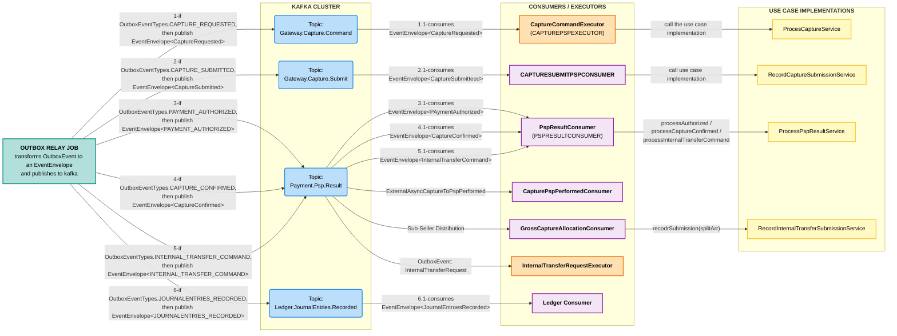

# Outbox Relay to Kafka Cluster Flow

This diagram captures the complete flow happening between the Outbox Relay Job, the Kafka Cluster topics, all of the consumers, and the downstream services, exactly as presented in the SVG.

